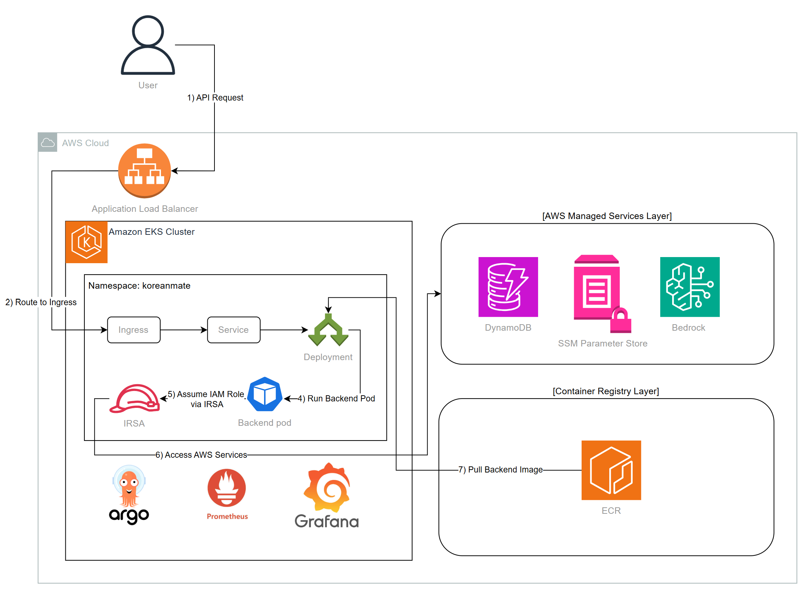
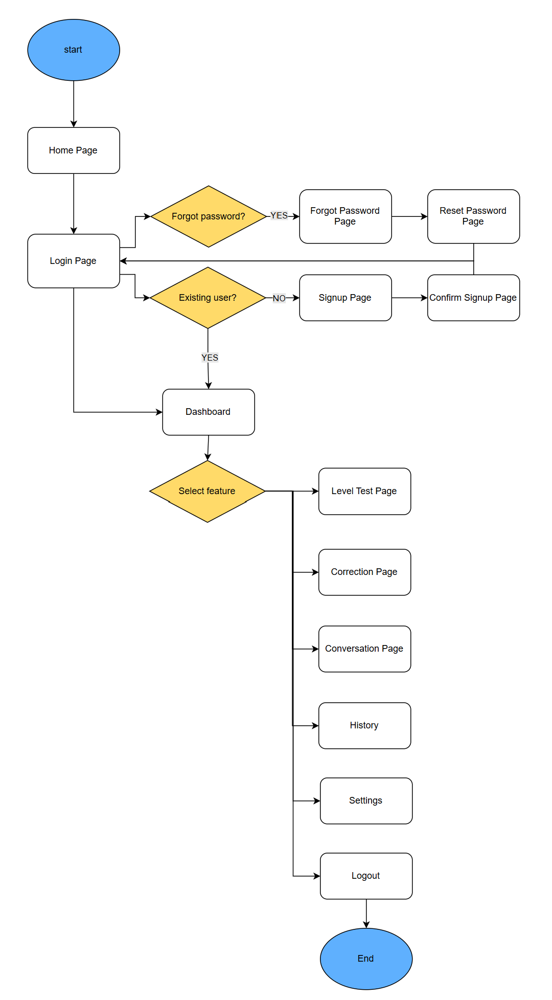
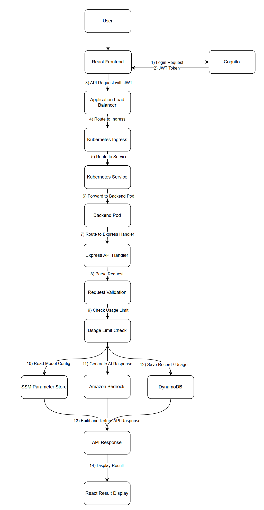
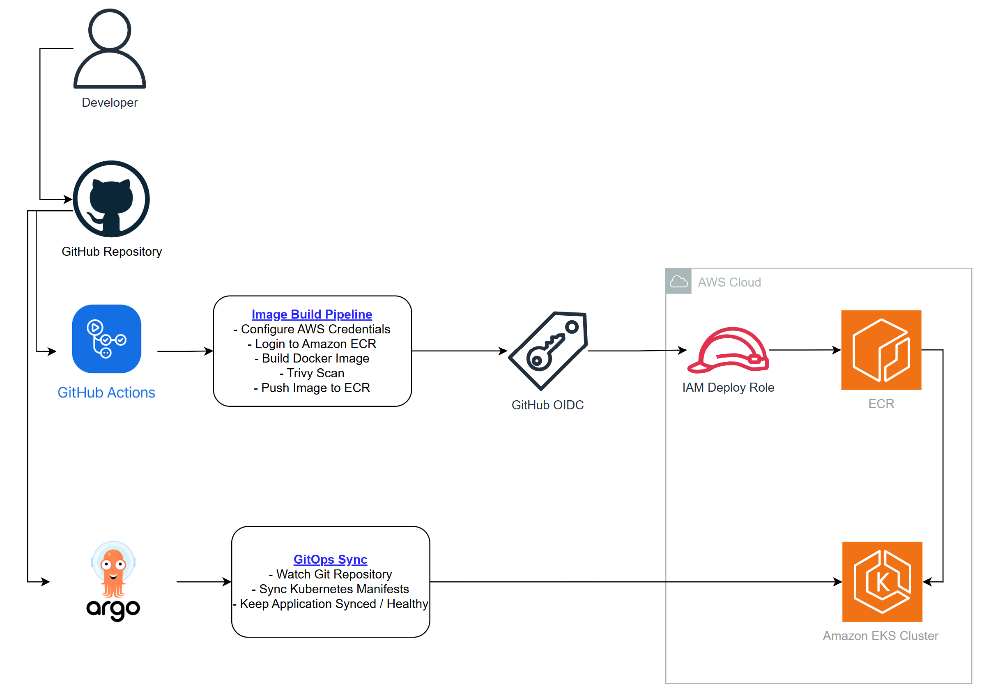

# KoreanMate EKS Design

> 목적: KoreanMate EKS 버전의 설계 의도, Kubernetes 리소스 구성, 요청 처리 흐름, GitOps 배포 흐름, IRSA 기반 AWS 권한 제어, 관측성/보안/비용 관리 전략을 면접과 포트폴리오 설명에 맞게 정리한다.  
> 기준 환경: AWS Seoul Region `ap-northeast-2`, EKS `dev` 환경, Terraform 기반 IaC

---

## 1. Project Overview

KoreanMate EKS 버전은 KoreanMate 백엔드를 컨테이너 기반으로 실행하고, Amazon EKS 위에서 Kubernetes 운영 구조를 검증하기 위한 아키텍처다.

사용자는 React Frontend에서 로그인한 뒤 글쓰기 교정, 상황별 회화 생성, 레벨 테스트 기능을 사용할 수 있다. API 요청은 JWT를 포함하여 Application Load Balancer로 전달되고, Kubernetes Ingress, Service를 거쳐 Backend Pod로 라우팅된다. Backend Pod는 IRSA를 통해 DynamoDB, SSM Parameter Store, Amazon Bedrock에 접근한다.

이 설계의 핵심은 단순히 애플리케이션을 컨테이너로 실행하는 것이 아니라, **EKS 기반 배포**, **ALB Ingress**, **IRSA 권한 분리**, **GitOps**, **컨테이너 이미지 보안 스캔**, **Kubernetes 관측성**을 하나의 운영 흐름으로 구성하는 것이다.

주요 기술 구성은 다음과 같다.

| 영역 | 기술 |
|---|---|
| Frontend | React, Vite |
| Auth | Amazon Cognito |
| Backend | Node.js, TypeScript, Express |
| Container | Docker |
| Image Registry | Amazon ECR |
| Orchestration | Amazon EKS |
| Kubernetes | Namespace, ServiceAccount, Deployment, Service, Ingress |
| Load Balancing | AWS Load Balancer Controller, Application Load Balancer |
| AWS Access Control | IAM, IRSA |
| AI | Amazon Bedrock |
| Data | DynamoDB |
| Config | SSM Parameter Store |
| CI/CD | GitHub Actions, GitHub OIDC |
| Security Scan | Trivy |
| GitOps | Argo CD |
| Observability | Prometheus, Grafana, kube-state-metrics, node-exporter |
| IaC | Terraform |

**왜 EKS 기반 구조로 설계했는가?**

KoreanMate EKS 버전은 Kubernetes 운영 역량을 보여주는 것이 목적이다. 그래서 Backend를 Express 기반 HTTP 서버로 컨테이너화하고, EKS Cluster, NodeGroup, Service, Ingress, IRSA, GitOps, Monitoring Stack까지 연결했다. 이 구조는 Kubernetes에서 실제 운영 시 자주 다루는 배포, 네트워크, 권한, 관측성 문제를 직접 설명할 수 있게 해준다.

---

## 2. Design Goals

이 설계의 목표는 다음과 같다.

| 목표 | 설계 반영 |
|---|---|
| Kubernetes 기반 운영 구조 검증 | EKS Cluster, Managed NodeGroup, Deployment, Service, Ingress 구성 |
| 컨테이너 실행 환경 표준화 | Backend Dockerfile과 ECR Image 기반 배포 |
| 외부 API 접근 제공 | AWS Load Balancer Controller를 통한 ALB Ingress 구성 |
| Pod 단위 AWS 권한 제어 | Backend ServiceAccount와 IRSA Role 연결 |
| 장기 AWS Access Key 제거 | Pod 내부에 Access Key를 저장하지 않고 WebIdentity 기반 임시 자격 증명 사용 |
| 이미지 배포 자동화 | GitHub Actions에서 Docker Build, Trivy Scan, ECR Push 수행 |
| Git 기준 배포 상태 관리 | Argo CD Application으로 Kubernetes manifest 동기화 |
| Kubernetes 관측성 확보 | Prometheus와 Grafana로 Cluster, Namespace, Pod metrics 확인 |
| 비용 통제 | 검증 완료 후 NodeGroup 축소 또는 EKS 리소스 삭제 |

**왜 설계 목표를 운영 단위로 나누었는가?**

EKS는 단일 리소스가 아니라 Cluster, Node, Pod, Service, Ingress, IAM, CI/CD, Monitoring이 함께 동작해야 의미가 있다. 따라서 목표도 “배포 성공” 하나로 두지 않고, 컨테이너 이미지 생성, 외부 트래픽 처리, AWS 권한 연결, GitOps 동기화, metrics 확인까지 운영 단위별로 나누었다.

---

## 3. Architecture Overview



전체 아키텍처는 다음 계층으로 나뉜다.

| Layer | 구성 요소 | 역할 |
|---|---|---|
| Client Layer | User, React Frontend | 사용자 입력, 로그인, API 요청 전송 |
| Authentication Layer | Amazon Cognito | 로그인 처리, JWT 발급 |
| Load Balancing Layer | Application Load Balancer | 외부 HTTP 요청을 EKS Ingress로 전달 |
| Kubernetes Network Layer | Ingress, Service | ALB 요청을 Backend Pod로 라우팅 |
| Workload Layer | Deployment, Backend Pod | Express 기반 Backend API 실행 |
| AWS Managed Services Layer | DynamoDB, SSM Parameter Store, Bedrock | 데이터 저장, 설정 관리, AI 응답 생성 |
| Container Registry Layer | Amazon ECR | Backend Docker Image 저장 |
| IAM Layer | IRSA, IAM Role | Pod 단위 AWS API 접근 제어 |
| GitOps Layer | Argo CD | Git repository 기준 Kubernetes manifest 동기화 |
| Observability Layer | Prometheus, Grafana | Cluster, Namespace, Pod metrics 수집 및 시각화 |

요청은 User에서 ALB로 들어오고, ALB는 Kubernetes Ingress로 트래픽을 전달한다. Ingress는 Service로 요청을 넘기고, Service는 Backend Pod의 container port로 요청을 전달한다. Backend Pod는 ServiceAccount에 연결된 IRSA Role을 통해 DynamoDB, SSM Parameter Store, Bedrock에 접근한다.

ECR은 Runtime 요청 경로에 직접 포함되지 않는다. ECR은 Backend Pod가 시작될 때 Kubernetes가 Docker Image를 Pull하는 이미지 저장소 역할을 한다. Argo CD와 Prometheus/Grafana도 사용자 요청 처리 경로가 아니라 운영 관리 경로에 해당한다.

**왜 ALB → Ingress → Service → Pod 구조를 사용했는가?**

Kubernetes에서는 외부 요청을 Pod에 직접 연결하지 않는다. Pod는 재생성될 수 있고 IP가 바뀔 수 있기 때문이다. Service는 Pod 집합에 안정적인 내부 진입점을 제공하고, Ingress는 HTTP 라우팅 규칙을 관리한다. AWS Load Balancer Controller는 Ingress를 기준으로 ALB를 생성하므로, AWS 리소스와 Kubernetes 리소스를 manifest 중심으로 연결할 수 있다.

---

## 4. User Flow



User Flow는 사용자가 KoreanMate에 접속한 뒤 어떤 화면을 거쳐 주요 기능을 사용하는지 보여준다. 이 다이어그램은 Kubernetes 내부 구조가 아니라 사용자 관점의 화면 이동을 설명한다.

기본 흐름은 다음과 같다.

1. 사용자는 Home Page에 접속한다.
2. 사용자는 Login Page로 이동한다.
3. 기존 사용자는 Cognito 인증을 통해 로그인한다.
4. 신규 사용자는 Signup Page에서 회원가입을 진행한다.
5. 회원가입 후 Confirm Signup Page에서 계정 확인을 완료한다.
6. 비밀번호를 잊은 사용자는 Forgot Password Page와 Reset Password Page를 통해 비밀번호를 재설정한다.
7. 로그인 성공 후 사용자는 Dashboard로 이동한다.
8. Dashboard에서 Level Test, Correction, Conversation, History, Settings 기능으로 이동한다.
9. 사용자는 Logout을 통해 인증 세션을 종료한다.

**왜 User Flow를 EKS 설계서에 포함했는가?**

EKS 설계는 인프라 중심이지만, 결국 Backend API는 사용자의 화면 동작에서 호출된다. User Flow를 함께 두면 어떤 화면에서 인증이 필요하고, 어떤 화면에서 Backend API가 호출되는지 설명하기 쉽다. 특히 Login 이후의 Dashboard, Correction, Conversation, Level Test는 JWT 기반 API 호출과 직접 연결되는 영역이다.

---

## 5. Request Flow



요청 처리 흐름은 다음과 같다.

1. 사용자가 React Frontend에서 로그인 요청을 보낸다.
2. Cognito가 JWT를 발급한다.
3. Frontend는 API 요청 시 JWT를 Authorization Header에 포함한다.
4. 요청은 Application Load Balancer로 전달된다.
5. ALB는 Kubernetes Ingress 규칙에 따라 요청을 라우팅한다.
6. Ingress는 Backend Service로 요청을 전달한다.
7. Service는 Backend Pod로 요청을 전달한다.
8. Backend Pod 내부의 Express API Handler가 요청을 받는다.
9. Handler는 Request Body와 Header를 파싱한다.
10. Request Validation 단계에서 입력값을 검증한다.
11. AI 기능 요청은 Usage Limit Check를 먼저 수행한다.
12. Backend는 SSM Parameter Store에서 관리되는 모델 설정을 사용한다.
13. Backend는 Amazon Bedrock을 호출하여 AI 응답을 생성한다.
14. Backend는 DynamoDB에 학습 기록과 사용량을 저장한다.
15. API Response를 생성하여 Frontend로 반환한다.
16. 사용자는 React Result Display에서 결과를 확인한다.

**왜 Backend 내부에 Validation과 Usage Limit Check를 분리했는가?**

Validation은 잘못된 요청을 초기에 차단하기 위한 단계이고, Usage Limit Check는 비용이 발생하는 Bedrock 호출 전에 사용량을 확인하기 위한 단계다. 두 단계를 분리하면 입력 오류와 사용량 초과를 다른 원인으로 처리할 수 있고, Bedrock 호출 전에 비용 제어 로직을 확실히 적용할 수 있다.

**왜 Bedrock 호출 전에 DynamoDB 사용량을 확인하는가?**

Bedrock은 호출량에 따라 비용이 발생한다. 따라서 AI 응답을 생성한 뒤 사용량을 확인하면 비용 제어 목적이 약해진다. Backend는 먼저 DynamoDB의 UsageLimits 데이터를 확인하고, 한도 내 요청일 때만 Bedrock을 호출한다. 이 구조는 사용자별 일일 AI 호출 제한을 구현하기 위한 핵심 흐름이다.

---

## 6. Kubernetes Resource Design

KoreanMate Backend는 `koreanmate` namespace 안에서 실행된다. Backend 관련 Kubernetes 리소스는 Git repository의 `deploy/k8s/backend` 경로에서 관리한다.

### 6.1 Namespace

| 항목 | 값 |
|---|---|
| Name | `koreanmate` |
| 역할 | Backend 애플리케이션 리소스 격리 |

`koreanmate` namespace는 Backend Deployment, Service, Ingress, ServiceAccount를 논리적으로 분리하기 위해 사용한다.

**왜 namespace를 분리했는가?**

EKS Cluster에는 `kube-system`, `argocd`, `monitoring`처럼 여러 목적의 리소스가 함께 존재한다. Backend 리소스를 별도 namespace에 배치하면 운영 리소스와 애플리케이션 리소스를 구분할 수 있고, `kubectl get pods -n koreanmate`처럼 점검 범위를 명확히 제한할 수 있다.

### 6.2 ServiceAccount

| 항목 | 값 |
|---|---|
| Name | `backend` |
| Namespace | `koreanmate` |
| 연결 권한 | Backend Pod IRSA Role |
| 역할 | Backend Pod의 AWS 서비스 접근 권한 연결 |

Backend ServiceAccount에는 IRSA Role ARN annotation을 설정한다. 이 ServiceAccount를 사용하는 Pod만 DynamoDB, SSM Parameter Store, Bedrock 접근 권한을 가진다.

**왜 ServiceAccount에 IAM Role을 연결했는가?**

Pod 내부에 AWS Access Key를 넣으면 키 유출 위험이 있고, 키 교체도 직접 관리해야 한다. IRSA를 사용하면 Kubernetes ServiceAccount와 IAM Role을 연결해 Pod가 임시 자격 증명으로 AWS API를 호출할 수 있다. 또한 Backend Pod에 필요한 권한만 별도로 줄 수 있어 권한 경계를 설명하기 쉽다.

### 6.3 Deployment

| 항목 | 값 |
|---|---|
| Name | `backend` |
| Namespace | `koreanmate` |
| Replicas | `1` |
| Image | ECR `koreanmate-dev-backend:dev` |
| Container Port | `3000` |
| Runtime | Node.js Express |
| Health Endpoint | `/health` |

Deployment는 Backend Pod의 desired state를 관리한다. Pod가 삭제되거나 실패하면 Deployment Controller가 다시 Pod를 생성한다.

**왜 Deployment를 사용했는가?**

Backend API는 장기 실행되는 HTTP 서버이므로 Pod 하나를 직접 생성하는 것보다 Deployment로 관리하는 것이 적합하다. Deployment는 replica 수, rolling update, Pod 재생성 같은 기본 운영 기능을 제공한다. 포트폴리오 dev 환경에서는 replica를 1개로 시작하지만, 운영 확장 시 replicas 또는 HPA로 확장할 수 있다.

### 6.4 Service

| 항목 | 값 |
|---|---|
| Name | `backend` |
| Type | `ClusterIP` |
| Port | `80` |
| Target Port | `3000` |
| 역할 | Ingress와 Backend Pod 사이 내부 트래픽 전달 |

Service는 Pod IP가 변경되어도 Ingress가 안정적으로 Backend에 접근할 수 있도록 내부 진입점을 제공한다.

**왜 Service를 ClusterIP로 구성했는가?**

외부 공개는 ALB Ingress가 담당하므로 Service 자체를 LoadBalancer 타입으로 만들 필요가 없다. ClusterIP Service는 클러스터 내부에서만 접근 가능하고, Ingress가 이 Service로 트래픽을 전달한다. 이렇게 역할을 분리하면 외부 진입점은 Ingress/ALB로 일관되게 관리할 수 있다.

### 6.5 Ingress

| 항목 | 값 |
|---|---|
| Controller | AWS Load Balancer Controller |
| Load Balancer | Application Load Balancer |
| Scheme | `internet-facing` |
| Target Type | `ip` |
| Health Check Path | `/health` |
| Backend Service | `backend:80` |

Ingress는 외부 HTTP 요청을 Backend Service로 연결한다. AWS Load Balancer Controller는 Ingress annotation과 spec을 기반으로 AWS ALB와 Target Group을 생성한다.

**왜 Ingress와 AWS Load Balancer Controller를 사용했는가?**

Kubernetes manifest로 외부 라우팅 규칙을 관리하기 위해서다. AWS Console에서 ALB를 수동으로 만들면 Kubernetes 리소스와 AWS 리소스의 연결 관계가 코드로 남지 않는다. AWS Load Balancer Controller를 사용하면 Ingress manifest를 기준으로 ALB가 생성되고, GitOps로 변경 이력을 관리할 수 있다.

---

## 7. Port and Traffic Design

EKS 버전의 포트 구조는 다음과 같다.

| 구분 | Port | 설명 |
|---|---:|---|
| ALB HTTP | 80 | 외부 API 요청 진입점 |
| Kubernetes Service | 80 | Ingress가 접근하는 Backend Service 포트 |
| Backend Container | 3000 | Express 서버가 Pod 내부에서 사용하는 포트 |
| Backend local port-forward | 8081 → 80 | Service health check 로컬 검증 |
| Argo CD local port-forward | 8082 → 443 | Argo CD UI 접속 |
| Prometheus local port-forward | 9090 → 9090 | Prometheus Targets 확인 |
| Grafana local port-forward | 3002 → 80 | Grafana Dashboard 확인 |

트래픽 경로는 다음과 같다.

```text
ALB :80
  ↓
Kubernetes Ingress
  ↓
Kubernetes Service :80
  ↓
Backend Pod :3000
```

**왜 Service Port와 Container Port를 분리했는가?**

외부 또는 Ingress 관점에서는 HTTP 기본 포트인 80으로 접근하는 것이 단순하다. 반면 Backend 애플리케이션은 컨테이너 내부에서 Express 기본 실행 포트인 3000을 사용한다. Service가 `port: 80`, `targetPort: 3000`으로 매핑하면 외부 접근과 애플리케이션 실행 포트를 분리할 수 있다.

---

## 8. Authentication and Authorization Design

사용자 인증은 Cognito에서 처리하고, Frontend는 Cognito가 발급한 JWT를 API 요청에 포함한다.

| 항목 | 설계 |
|---|---|
| 로그인 처리 | Amazon Cognito |
| Token | JWT |
| Frontend 요청 | `Authorization: Bearer <JWT>` |
| Backend 처리 | Express Middleware 또는 Handler에서 JWT 기반 사용자 정보 활용 |
| 사용자 식별 | Cognito `sub` 기반 userId |

ALB와 Kubernetes Ingress는 HTTP 요청을 Backend로 전달하는 역할을 담당한다. 사용자별 데이터 접근 제어는 Backend 애플리케이션에서 JWT claims를 기준으로 처리한다.

**왜 userId를 클라이언트 입력값으로 받지 않는가?**

클라이언트가 userId를 직접 보내는 구조는 다른 사용자의 ID를 조작할 위험이 있다. 인증된 JWT의 `sub` 값을 기준으로 userId를 결정하면 사용자가 임의로 userId를 바꾸는 문제를 줄일 수 있다. 따라서 Backend는 요청 Body의 userId보다 검증된 인증 정보를 우선해야 한다.

---

## 9. IRSA and IAM Design

EKS 버전에서는 두 종류의 IRSA Role을 사용한다.

| 대상 | ServiceAccount | IAM Role | 목적 |
|---|---|---|---|
| AWS Load Balancer Controller | `kube-system/aws-load-balancer-controller` | ALB Controller Role | Ingress 기반 ALB, Target Group, Listener 관리 |
| Backend Pod | `koreanmate/backend` | Backend Pod Role | DynamoDB, SSM Parameter Store, Bedrock 접근 |

Backend Pod Role의 Trust Policy는 특정 ServiceAccount만 AssumeRoleWithWebIdentity를 수행할 수 있도록 제한한다.

```text
system:serviceaccount:koreanmate:backend
```

Backend Pod에 필요한 권한은 다음과 같다.

| AWS 서비스 | 목적 |
|---|---|
| DynamoDB | 학습 기록 저장, 사용량 조회 및 증가 |
| SSM Parameter Store | Bedrock Model ID 등 설정 조회 |
| Amazon Bedrock | AI 응답 생성 |

**왜 Backend Pod와 ALB Controller의 IAM Role을 분리했는가?**

두 구성 요소의 권한 목적이 완전히 다르기 때문이다. AWS Load Balancer Controller는 ALB, Target Group, Security Group 같은 네트워크 리소스를 관리해야 한다. Backend Pod는 애플리케이션 실행에 필요한 DynamoDB, SSM, Bedrock 접근만 필요하다. Role을 분리하면 한쪽 권한이 과도하게 커지는 것을 막고, 문제가 발생했을 때 영향 범위를 줄일 수 있다.

---

## 10. Container Image and ECR Design

Backend는 Docker Image로 빌드되고 Amazon ECR에 저장된다.

| 항목 | 설계 |
|---|---|
| Image Name | `koreanmate-dev-backend` |
| Tag | `dev` |
| Build Tool | Docker |
| Registry | Amazon ECR |
| Runtime | Node.js Express |
| Security Scan | Trivy |

Kubernetes Deployment는 ECR에 Push된 Backend Image를 Pull하여 Pod를 실행한다.

**왜 ECR을 사용했는가?**

EKS와 같은 AWS 환경에서 컨테이너 이미지를 운영할 때 ECR은 IAM 기반 인증과 AWS 리소스 연동이 자연스럽다. GitHub Actions에서 ECR에 이미지를 Push하고, EKS Node가 해당 이미지를 Pull하는 구조를 만들 수 있다. 이미지 저장소를 AWS 안에 두면 IAM, CloudTrail, ECR image digest 기반으로 배포 이력을 확인하기 쉽다.

**왜 Trivy Scan을 이미지 빌드 파이프라인에 넣었는가?**

컨테이너는 애플리케이션 코드뿐 아니라 OS package, Node.js dependency, base image 취약점의 영향을 받는다. Trivy Scan을 GitHub Actions에 포함하면 ECR에 Push하기 전에 이미지 취약점을 확인할 수 있고, 보안 검증 과정을 배포 흐름에 포함했다는 근거를 남길 수 있다.

---

## 11. CI/CD and GitOps Design



EKS 버전의 배포 흐름은 Image Build Pipeline과 GitOps Sync로 나뉜다.

### 11.1 Image Build Pipeline

GitHub Actions는 Backend Docker Image를 빌드하고, Trivy Scan을 수행한 뒤 ECR에 Push한다.

```text
Developer
  ↓
GitHub Repository
  ↓
GitHub Actions
  ↓
Docker Build
  ↓
Trivy Scan
  ↓
GitHub OIDC
  ↓
IAM Deploy Role
  ↓
Amazon ECR Push
```

| 단계 | 역할 |
|---|---|
| Checkout | Source code checkout |
| Configure AWS Credentials | GitHub OIDC 기반 AWS 인증 |
| ECR Login | Amazon ECR 인증 |
| Docker Build | Backend Image 생성 |
| Trivy Scan | Image 취약점 검사 |
| Docker Push | ECR에 `dev` tag Push |

**왜 GitHub Actions에서 이미지를 빌드하고 Push하는가?**

개발자 로컬 환경에서 이미지를 직접 Push하면 빌드 환경과 배포 이력이 개인 PC에 의존한다. GitHub Actions에서 빌드하면 동일한 workflow에서 image build, scan, push 로그가 남고, 어떤 commit에서 어떤 이미지가 생성되었는지 추적하기 쉽다.

### 11.2 GitOps Sync

Argo CD는 GitHub Repository의 Kubernetes manifest를 감시하고 EKS Cluster 상태를 Git의 desired state와 맞춘다.

```text
GitHub Repository
  ↓
Argo CD
  ↓
Kubernetes Manifest Sync
  ↓
EKS Backend Deployment
```

| 항목 | 값 |
|---|---|
| Application | `koreanmate-backend` |
| Repository | GitHub Repository |
| Target Revision | `eks` |
| Path | `deploy/k8s/backend` |
| Destination | `in-cluster` |
| Namespace | `koreanmate` |
| Desired Status | `Synced`, `Healthy` |

**왜 GitOps를 사용했는가?**

Kubernetes 리소스를 직접 `kubectl apply`로만 배포하면 현재 Cluster 상태가 Git과 일치하는지 확인하기 어렵다. Argo CD를 사용하면 Git repository가 desired state가 되고, Cluster 상태가 Git과 다른 경우 OutOfSync로 확인할 수 있다. 또한 `Synced`와 `Healthy` 상태를 통해 배포 결과를 시각적으로 검증할 수 있다.

---

## 12. Observability Design

EKS 관측성은 Prometheus와 Grafana를 중심으로 구성한다.

| 도구 | 역할 |
|---|---|
| Prometheus | Kubernetes metrics 수집 |
| Grafana | Cluster, Namespace, Pod metrics 시각화 |
| kube-state-metrics | Kubernetes object 상태 metrics 제공 |
| node-exporter | Node CPU, Memory, Network metrics 제공 |
| kubectl logs | Pod 단위 로그 확인 |
| kubectl describe | Event, Scheduling, Probe, Image Pull 상태 확인 |

확인 대상은 다음과 같다.

| 영역 | 확인 항목 |
|---|---|
| Node | Ready 상태, CPU/Memory 사용량 |
| Namespace | `koreanmate`, `argocd`, `monitoring`, `kube-system` 리소스 사용량 |
| Backend Pod | CPU, Memory, Network receive/transmit |
| Prometheus Targets | Target `UP` 상태 |
| Argo CD | Application `Synced`, `Healthy` 상태 |
| Ingress | ALB DNS 생성, Target Health |

**왜 Prometheus와 Grafana를 사용했는가?**

EKS에서는 Lambda 단위 로그만 보는 방식으로는 충분하지 않다. Pod가 어느 Node에서 실행되는지, CPU/Memory가 얼마나 사용되는지, Namespace별 리소스 사용량이 어떤지 확인해야 한다. Prometheus는 Kubernetes metrics 수집에 적합하고, Grafana는 이를 대시보드로 시각화하기에 적합하다.

---

## 13. Security Design

EKS 보안 설계는 컨테이너 이미지, AWS 권한, Kubernetes 리소스, 배포 인증으로 나누어 관리한다.

| 계층 | 설계 | 목적 |
|---|---|---|
| Image Security | Trivy Image Scan | 이미지 취약점 확인 |
| Registry Security | ECR | IAM 기반 이미지 저장소 접근 |
| Pod AWS Access | IRSA | Pod 단위 AWS 권한 부여 |
| Controller AWS Access | ALB Controller IRSA | ALB 생성 권한 분리 |
| Runtime Separation | Namespace | 애플리케이션 리소스 격리 |
| ServiceAccount | Backend 전용 ServiceAccount | Backend Pod 권한 범위 제한 |
| CI/CD Auth | GitHub OIDC | 장기 AWS Access Key 제거 |
| GitOps | Argo CD | Git 기준 배포 상태 추적 |

현재 설계에서는 Backend Pod가 AWS Access Key를 직접 가지지 않는다. Pod는 ServiceAccount에 연결된 IAM Role을 통해 AWS SDK가 임시 자격 증명을 획득하는 방식으로 AWS API를 호출한다.

**왜 Access Key를 Pod에 넣지 않았는가?**

Pod 환경변수나 Kubernetes Secret에 장기 Access Key를 저장하면 유출 시 권한 탈취 위험이 크다. 또한 키 교체와 배포 반영을 직접 관리해야 한다. IRSA를 사용하면 AWS STS 기반 임시 자격 증명을 사용하므로 장기 키 저장을 피할 수 있고, ServiceAccount 단위로 권한을 제한할 수 있다.

---

## 14. Cost Control Design

EKS는 Cluster, Worker Node, ALB, EBS, Monitoring Stack이 존재하는 동안 비용이 발생한다. 따라서 dev 환경에서는 검증과 증거 확보가 끝나면 리소스를 축소하거나 삭제하는 전략을 사용한다.

| 비용 항목 | 비용 관리 전략 |
|---|---|
| EKS Control Plane | 검증 완료 후 destroy 대상 |
| Managed NodeGroup | 기본 최소 노드로 시작, 필요 시 일시 확장 |
| ALB | Ingress/API 검증 후 삭제 대상 |
| Monitoring Stack | Grafana/Prometheus 캡처 후 삭제 가능 |
| EBS Volume | destroy 후 잔여 volume 확인 |
| CloudWatch Logs | 불필요한 로그 장기 보관 방지 |
| NAT Gateway | dev 환경에서는 사용 최소화 또는 제외 검토 |

운영 원칙은 다음과 같다.

```text
1. Backend 기본 검증은 최소 NodeGroup으로 수행
2. Argo CD와 Monitoring 검증 시에만 NodeGroup을 일시 확장
3. Evidence 캡처와 문서화 완료 후 NodeGroup 축소 또는 terraform destroy
4. destroy 후 ALB, EBS, ECR image, CloudWatch Log Group 잔여 리소스 확인
```

**왜 비용 정리 전략을 설계서에 포함했는가?**

EKS는 구성 자체가 비용을 계속 발생시킨다. 포트폴리오 dev 환경에서 장기 운영 목적 없이 EKS를 계속 유지하면 비용 대비 효과가 낮다. 따라서 설계 단계부터 “구축 → 검증 → 캡처 → 문서화 → 축소/삭제” 흐름을 비용 관리 전략으로 포함해야 한다.

---

## 15. Failure Handling and Runbook Design

EKS 운영 중 발생 가능한 문제는 리소스 계층별로 확인한다.

| 장애 상황 | 1차 확인 | 2차 확인 |
|---|---|---|
| Pod Pending | `kubectl get pods -n koreanmate` | Node capacity, Events 확인 |
| CrashLoopBackOff | `kubectl logs` | 환경변수, 앱 실행 포트 확인 |
| ImagePullBackOff | `kubectl describe pod` | ECR image tag, Node ECR 권한 확인 |
| ALB 미생성 | `kubectl describe ingress` | ALB Controller logs, IRSA 권한 확인 |
| 503 응답 | Target Group Health | Service endpoint, Pod readiness 확인 |
| AWS API 접근 실패 | Backend logs | ServiceAccount annotation, IAM Trust Policy 확인 |
| Argo CD OutOfSync | Argo CD UI diff | Git manifest와 Cluster 상태 비교 |
| Prometheus Target DOWN | Prometheus Targets | ServiceMonitor, Pod labels 확인 |

**왜 Runbook을 리소스 계층별로 구성하는가?**

EKS 장애는 원인이 한 곳에만 있지 않다. 예를 들어 ALB 503은 ALB 자체 문제일 수도 있고, Service endpoint 누락, Pod readiness 실패, container port 불일치 문제일 수도 있다. 따라서 Client → ALB → Ingress → Service → Pod → AWS Service 순서로 확인해야 원인을 좁힐 수 있다.

---

## 16. Diagram Summary

이 설계서에서 사용하는 다이어그램의 의미는 다음과 같다.

| 다이어그램 | 설명 |
|---|---|
| User Flow | 사용자가 Home, Login, Dashboard, 학습 기능 화면으로 이동하는 흐름 |
| Request Flow | JWT 포함 API 요청이 ALB, Ingress, Service, Backend Pod, AWS Managed Services로 처리되는 흐름 |
| Architecture Overview | EKS Cluster, Namespace, IRSA, Backend Pod, AWS Managed Services, ECR, Argo CD, Prometheus/Grafana 관계 |
| CI/CD & GitOps Flow | GitHub Actions의 image build/push와 Argo CD의 manifest sync 관계 |

**왜 다이어그램을 기능별로 분리했는가?**

하나의 그림에 사용자 화면, 네트워크, IAM, CI/CD, GitOps, Monitoring을 모두 넣으면 흐름이 복잡해진다. 그래서 사용자 흐름, API 요청 흐름, 전체 아키텍처, 배포/GitOps 흐름을 분리했다. 이렇게 분리하면 면접에서 질문이 들어왔을 때 “사용자 관점”, “요청 처리 관점”, “운영 아키텍처 관점”, “배포 관점”으로 나누어 설명할 수 있다.

---

## 17. Limitations and Future Improvements

현재 설계는 EKS `dev` 환경 검증 기준이다. 운영 수준으로 확장하려면 다음 개선이 필요하다.

| 항목 | 현재 상태 | 개선 방향 |
|---|---|---|
| HTTPS | ALB HTTP 기반 검증 | ACM 인증서와 Ingress HTTPS 구성 |
| Domain | ALB DNS 직접 사용 | Route 53 도메인 연결 |
| Scaling | Replica 1개 | HPA 구성 |
| Node Scaling | 수동 NodeGroup 조정 | Cluster Autoscaler 또는 Karpenter 검토 |
| Secret 관리 | Deployment env 중심 | External Secrets Operator 또는 Secrets Manager 연동 |
| Logging | `kubectl logs` 중심 | Loki 또는 CloudWatch Container Insights 검토 |
| Release Strategy | Rolling Update 기본 | Blue/Green 또는 Canary 배포 검토 |
| Network Security | 기본 Kubernetes 네트워크 | NetworkPolicy 적용 |
| Cost Cleanup | 수동 destroy | cleanup workflow 또는 IaC 기반 정리 절차 자동화 |
| Environment | dev 중심 | prod 환경 분리 |

**왜 개선 방향을 분리했는가?**

현재 범위는 EKS 운영 구조를 검증하기 위한 dev 환경이다. HTTPS, HPA, Karpenter, Loki, Canary 배포까지 모두 한 번에 포함하면 범위가 과도하게 커진다. 따라서 현재 설계에서는 핵심 운영 흐름을 먼저 검증하고, 실제 운영 수준의 고도화 항목은 Future Improvements로 분리한다.

---

## 18. Evidence Mapping

설계 요소와 Evidence 문서의 검증 항목은 다음과 같이 연결된다.

| 설계 요소 | Evidence 확인 항목 |
|---|---|
| EKS Cluster / NodeGroup | `kubectl get nodes` Ready 상태 |
| ECR Image | `aws ecr describe-images` image digest 확인 |
| GitHub Actions | Image build workflow 성공 |
| Trivy Scan | GitHub Actions scan log 확인 |
| AWS Load Balancer Controller | Controller Pod Running |
| ALB Controller IRSA | ServiceAccount annotation 확인 |
| Backend Pod IRSA | IAM Role Trust Policy 확인 |
| Backend Deployment | Backend Pod Running |
| Backend Service | port-forward `/health` 성공 |
| ALB Ingress | ALB DNS 생성 및 `/health` 성공 |
| Backend APIs | `/correction`, `/conversation`, `/level-test` 성공 |
| Argo CD | Application `Synced` / `Healthy` 확인 |
| Prometheus | Targets `UP` 확인 |
| Grafana | Backend Pod CPU/Memory/Network metrics 확인 |

**왜 Evidence Mapping을 설계서에 포함했는가?**

설계서는 의도를 설명하고, Evidence는 실제 동작을 증명한다. 둘을 연결해두면 각 설계 요소가 어떤 캡처와 명령으로 검증되었는지 추적할 수 있다. 이는 포트폴리오에서 “그림만 그린 설계”가 아니라 실제 구축과 검증이 끝난 설계라는 근거가 된다.

---

## 19. References

- Amazon EKS - IAM roles for service accounts: https://docs.aws.amazon.com/eks/latest/userguide/iam-roles-for-service-accounts.html
- Amazon EKS - AWS Load Balancer Controller: https://docs.aws.amazon.com/eks/latest/userguide/aws-load-balancer-controller.html
- AWS Load Balancer Controller documentation: https://kubernetes-sigs.github.io/aws-load-balancer-controller/
- GitHub Actions - Configuring OpenID Connect in Amazon Web Services: https://docs.github.com/actions/security-for-github-actions/security-hardening-your-deployments/configuring-openid-connect-in-amazon-web-services
- Argo CD Resource Health: https://argo-cd.readthedocs.io/en/latest/operator-manual/health/
