# KoreanMate EKS Evidence

> 목적: KoreanMate EKS 버전에서 Kubernetes 기반 배포, GitHub Actions 이미지 빌드, ECR Push, ALB Ingress, IRSA, Argo CD GitOps, Prometheus/Grafana 관측성 구성이 실제로 동작했음을 증명하기 위한 문서다.                

> 기준 환경: AWS Seoul Region `ap-northeast-2`, EKS `dev` 환경, Terraform 기반 IaC

---

## 1. EKS Cluster / NodeGroup 생성 확인

EKS 클러스터와 Managed NodeGroup을 Terraform으로 생성한 뒤, `kubectl get nodes` 명령으로 Worker Node가 정상적으로 EKS 클러스터에 조인되었는지 확인했다.

```bash
kubectl get nodes
```

확인 결과, Worker Node가 `Ready` 상태로 표시되었다.

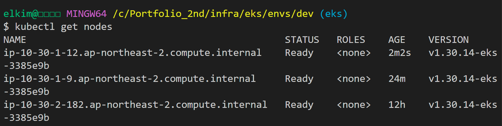

---

## 2. ECR Backend Image Push 확인

Backend 컨테이너 이미지를 Docker로 빌드한 뒤 Amazon ECR Repository에 `dev` 태그로 Push했다.

```bash
aws ecr describe-images \
  --repository-name koreanmate-dev-backend \
  --region ap-northeast-2 \
  --image-ids imageTag=dev
```

확인 결과, `koreanmate-dev-backend:dev` 이미지가 ECR에 정상적으로 업로드되었고 image digest가 생성되었다.

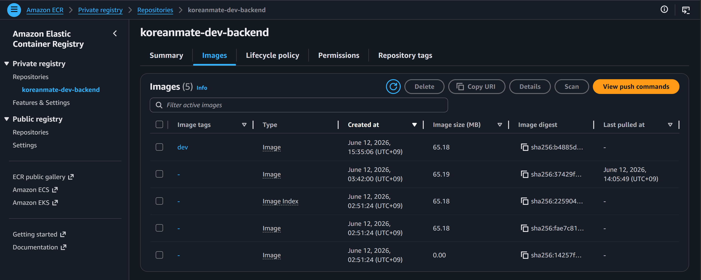

---

## 3. GitHub Actions EKS Image Build 성공 확인

GitHub Actions에서 Backend Docker Image Build, Trivy Scan, ECR Push가 자동으로 수행되도록 구성했다.

Workflow:

```text
EKS Backend Image Build
```

확인 결과, 전체 checks가 통과했고 Backend image build 및 push job이 성공했다.

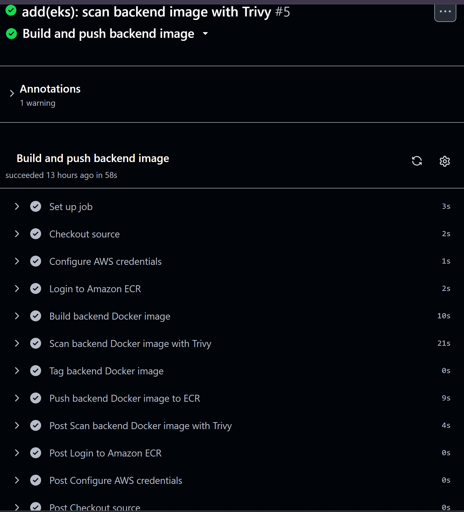

---

## 4. Trivy Image Scan 결과 확인

GitHub Actions workflow 안에서 Trivy를 사용하여 Backend Docker Image의 취약점을 스캔했다.

Trivy 실행 대상:

```text
koreanmate-dev-backend:dev
```

스캔 결과는 GitHub Actions 로그에 남으며, HIGH/CRITICAL 취약점 확인 및 이미지 보안 검증 근거로 사용한다.

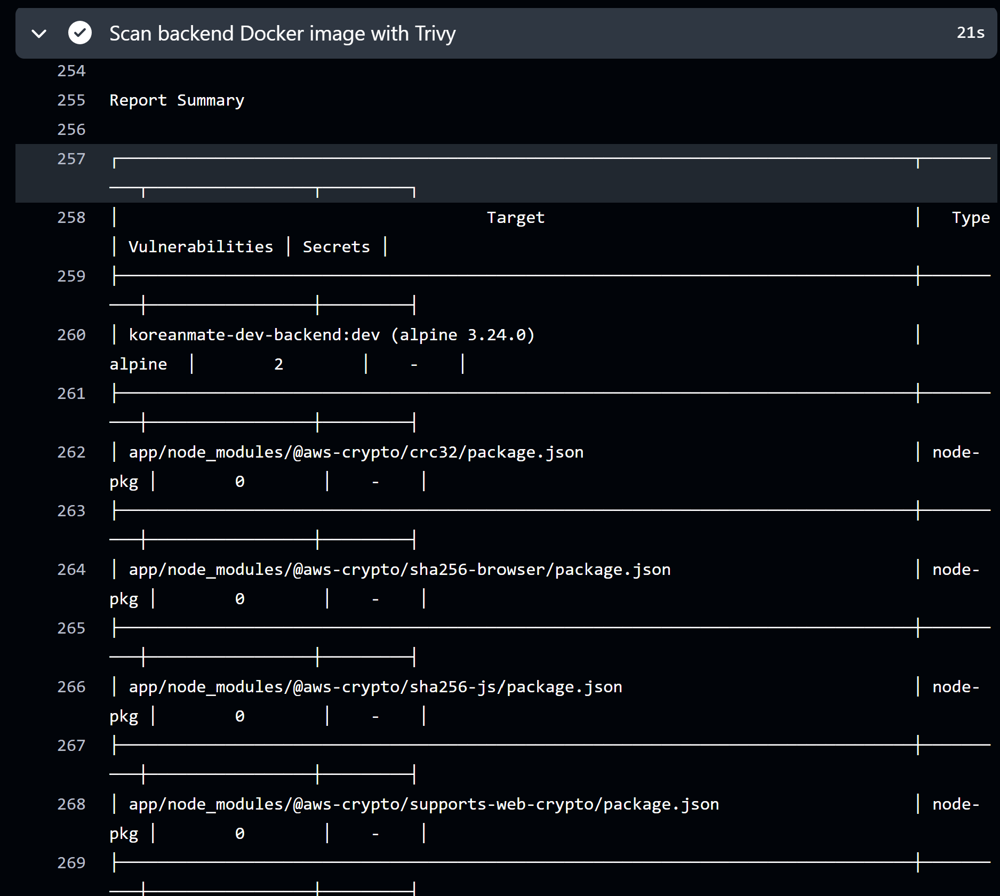

---

## 5. AWS Load Balancer Controller 구성 확인

AWS Load Balancer Controller를 EKS 클러스터에 설치하고, Controller Pod가 `kube-system` namespace에서 정상적으로 실행되는지 확인했다.

```bash
kubectl get pods -n kube-system | grep aws-load-balancer-controller
```

확인 결과, AWS Load Balancer Controller Pod 2개가 모두 `Running` 상태였다.

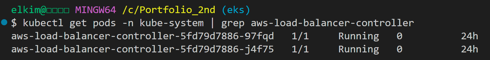

---

## 6. AWS Load Balancer Controller IRSA 확인

AWS Load Balancer Controller가 AWS 리소스를 제어할 수 있도록 IAM Role을 ServiceAccount에 연결했다.

```bash
kubectl describe serviceaccount aws-load-balancer-controller -n kube-system
```

확인 결과, ServiceAccount에 IAM Role ARN annotation이 정상적으로 연결되었다.

```text
eks.amazonaws.com/role-arn: arn:aws:iam::127696278675:role/koreanmate-dev-eks-cluster-aws-load-balancer-controller-role
```

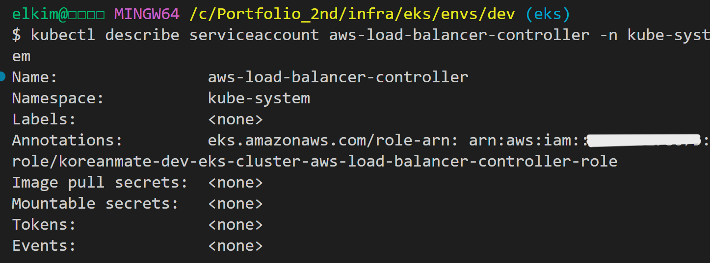

---

## 7. Backend Pod IRSA Role 확인

Backend Pod가 DynamoDB, SSM Parameter Store, Bedrock에 접근할 수 있도록 Backend 전용 IAM Role을 구성했다.

```bash
aws iam get-role \
  --role-name koreanmate-dev-eks-cluster-backend-pod-role
```

확인 결과, IAM Role의 trust policy가 `system:serviceaccount:koreanmate:backend` ServiceAccount만 AssumeRoleWithWebIdentity를 수행할 수 있도록 제한되어 있었다.

```text
system:serviceaccount:koreanmate:backend
```

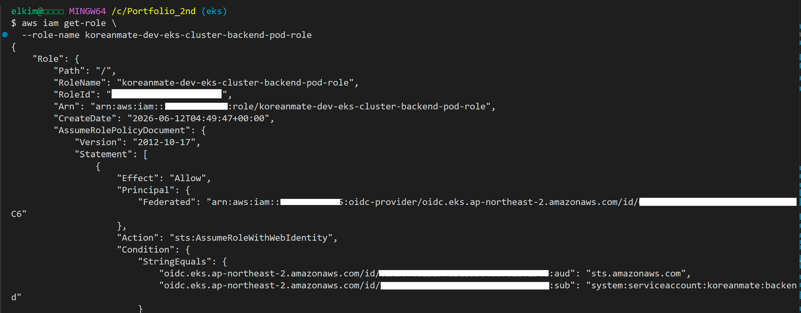

---

## 8. Backend Pod 배포 확인

Kubernetes Deployment를 통해 Backend Pod를 EKS에 배포했다.

```bash
kubectl get pods -n koreanmate
```

확인 결과, Backend Pod가 `Running` 상태로 실행되었다.

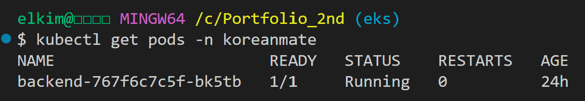

---

## 9. Backend Service 내부 통신 확인

Kubernetes Service가 Backend Pod로 정상적으로 트래픽을 전달하는지 확인하기 위해 port-forward로 `/health` endpoint를 호출했다.

```bash
kubectl port-forward -n koreanmate service/backend 8081:80
```

```bash
curl http://localhost:8081/health
```

응답:


---

## 10. ALB Ingress 외부 접근 확인

AWS Load Balancer Controller가 Ingress 리소스를 기반으로 ALB를 생성했고, 외부 ALB 주소를 통해 Backend `/health` endpoint에 접근할 수 있는지 확인했다.

```bash
kubectl get ingress -n koreanmate
```

```bash
curl http://<ALB_DNS_NAME>/health
```

응답:

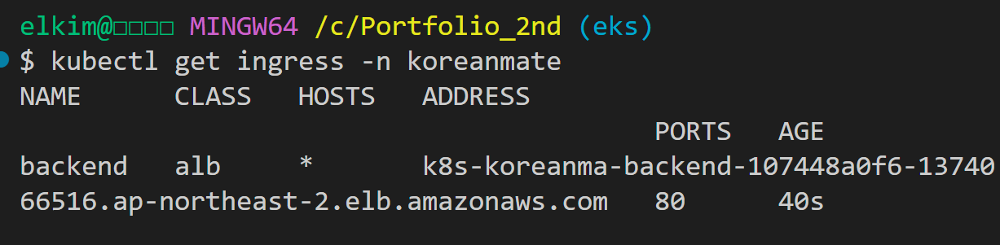

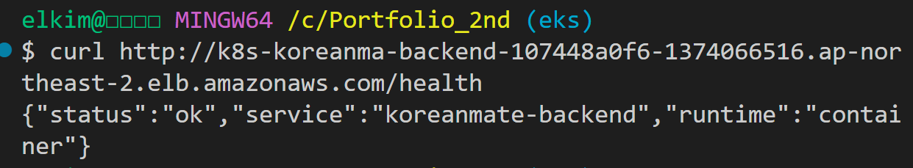

---

## 11. Backend API 호출 검증

ALB 주소를 통해 실제 Backend API를 호출하여 EKS 환경에서도 주요 기능이 정상 동작하는지 확인했다.

검증한 API:

```text
POST /correction
POST /conversation
POST /level-test
```

확인 결과, 세 API 모두 ALB Ingress를 통해 정상 응답했다.

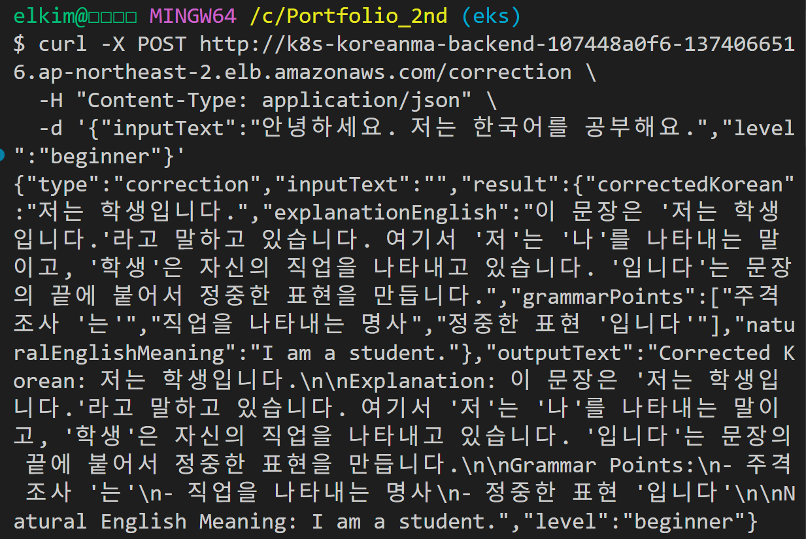

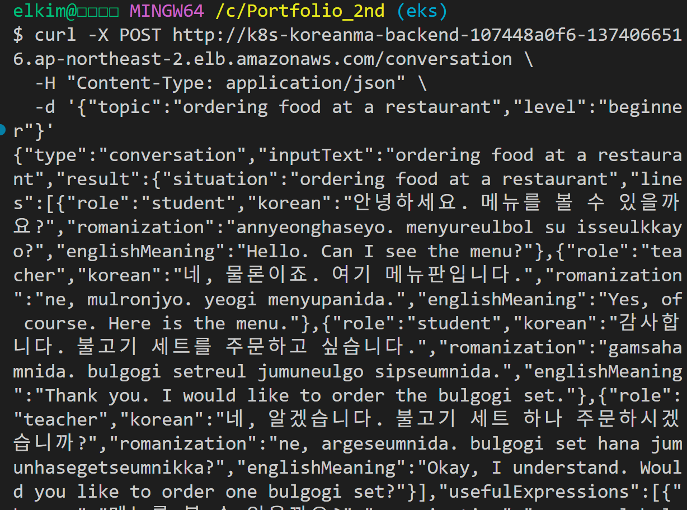

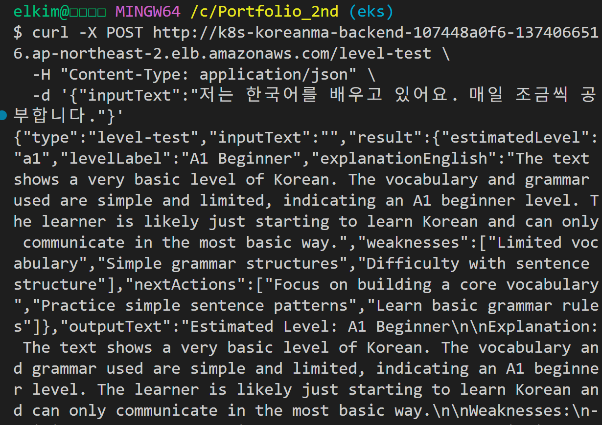

---

## 12. Argo CD 설치 확인

Argo CD를 EKS 클러스터에 설치한 뒤, 모든 Argo CD 구성 요소가 `Running` 상태인지 확인했다.

```bash
kubectl get pods -n argocd
```

확인 결과, Argo CD Application Controller, Repo Server, Redis, Dex Server, Argo CD Server가 모두 정상 실행되었다.

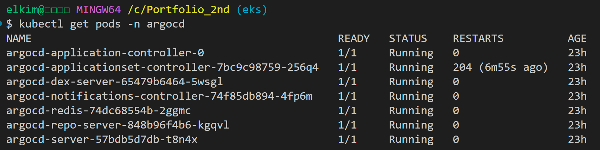

---

## 13. Argo CD Application Synced / Healthy 확인

Argo CD Application을 생성하여 GitHub Repository의 Kubernetes manifest를 감시하도록 구성했다.

Application 설정:

```text
Application: koreanmate-backend
Repository: https://github.com/elkim-ea/Portfolio_2nd.git
Target Revision: eks
Path: deploy/k8s/backend
Destination: in-cluster
Namespace: koreanmate
```

확인 결과, Argo CD UI에서 `koreanmate-backend` Application이 `Synced` 및 `Healthy` 상태로 표시되었다.


---

## 14. Monitoring Stack Pod 확인

Prometheus / Grafana / Alertmanager / kube-state-metrics / node-exporter를 설치한 뒤 monitoring namespace의 Pod 상태를 확인했다.

```bash
kubectl get pods -n monitoring
```

확인 결과, 모든 monitoring 구성 요소가 `Running` 상태로 실행되었다.


---

## 15. Prometheus Targets UP 확인

Prometheus Targets 화면에서 scrape 대상이 정상적으로 수집되고 있는지 확인했다.

접속 방식:

```bash
kubectl port-forward -n monitoring svc/monitoring-kube-prometheus-prometheus 9090:9090
```

```text
http://localhost:9090/targets
```

확인 결과, Grafana 및 Alertmanager targets가 `UP` 상태로 표시되었다.

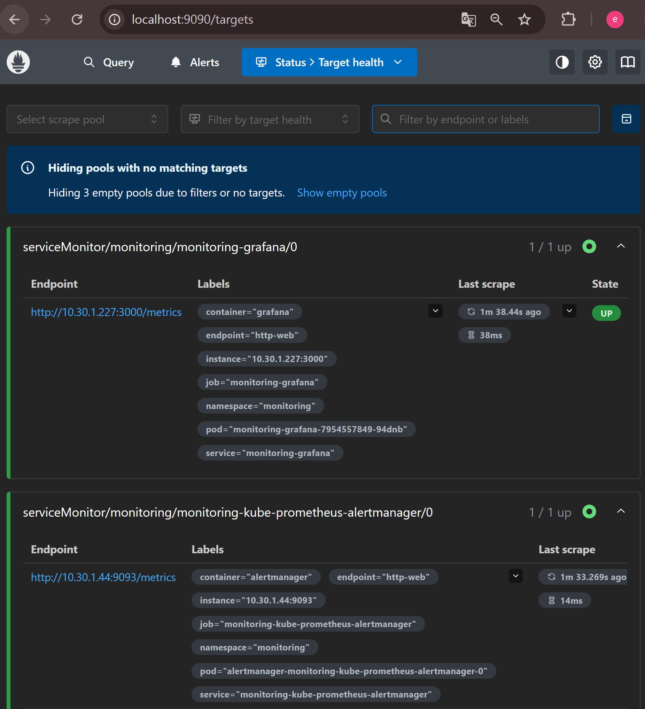

---

## 16. Grafana Cluster Dashboard 확인

Grafana Kubernetes dashboard에서 EKS 클러스터 전체의 CPU, Memory, Namespace별 리소스 사용량을 확인했다.

접속 방식:

```bash
kubectl port-forward -n monitoring svc/monitoring-grafana 3002:80
```

```text
http://localhost:3002
```

확인 결과, `argocd`, `monitoring`, `kube-system`, `koreanmate` namespace의 CPU/Memory 사용량이 Grafana dashboard에 표시되었다.

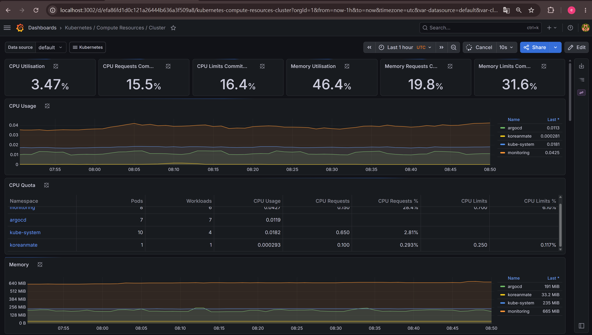

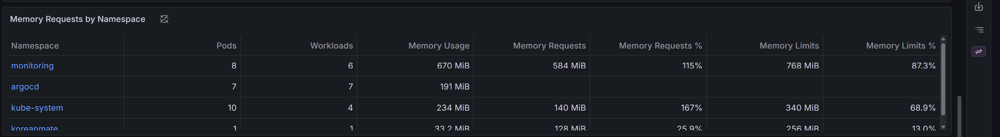
---

## 17. Grafana KoreanMate Backend Pod Metrics 확인

Grafana의 Kubernetes Namespace(Pods) dashboard에서 `koreanmate` namespace를 선택하고 Backend Pod의 CPU, Memory, Network metrics를 확인했다.

확인 대상:

```text
Namespace: koreanmate
Pod: backend-*
```

확인 결과, KoreanMate Backend Pod의 CPU usage, memory usage, network receive/transmit metrics가 정상적으로 표시되었다.

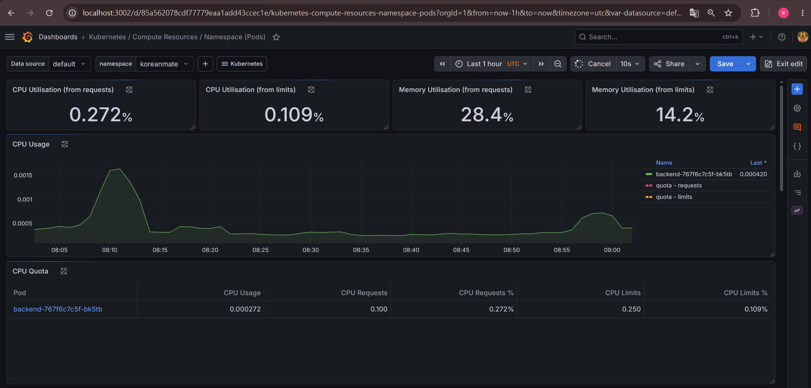

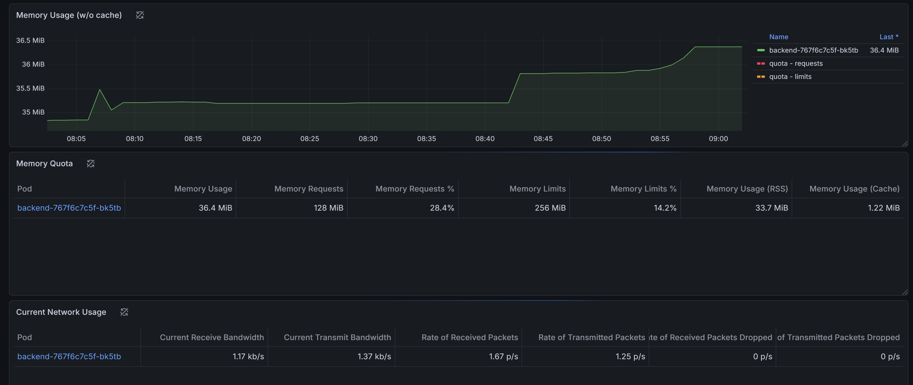

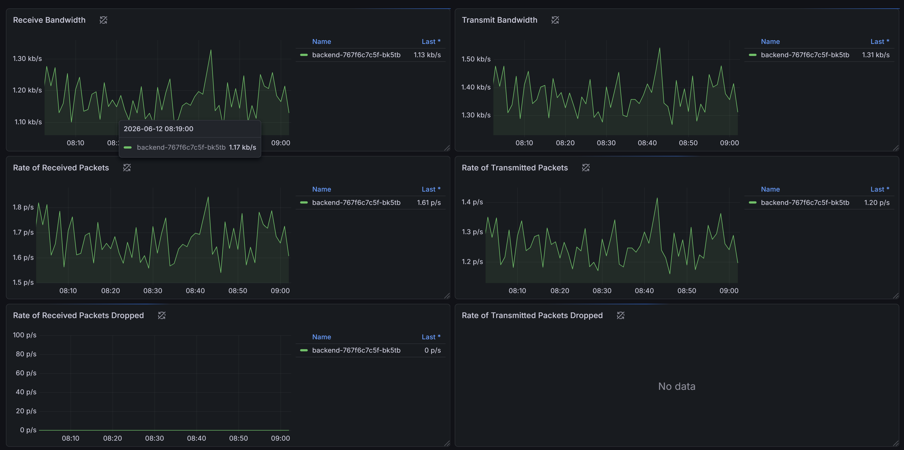

---

## 18. EKS Cost Cleanup Verification

EKS 검증과 문서화를 완료한 뒤, 지속 비용 발생을 방지하기 위해 EKS 관련 리소스를 삭제했다.

EKS는 클러스터가 존재하는 동안 Control Plane 비용이 발생하고, Worker Node, ALB, EBS Volume, NAT Gateway, ECR Image, CloudWatch Logs 등도 별도 비용을 발생시킬 수 있다. 따라서 이번 EKS 버전은 상시 운영 목적이 아니라, Kubernetes 운영 역량을 검증하고 Evidence를 남긴 뒤 리소스를 정리하는 방식으로 운영했다.

삭제 전에는 먼저 Kubernetes Ingress를 삭제하여 AWS Load Balancer Controller가 ALB를 정리할 수 있도록 했다. 이후 Backend namespace, Argo CD, Monitoring Stack을 정리하고 Terraform destroy를 실행했다.

정리 후 다음 항목을 AWS CLI로 확인했다.

---

### 18.1 EKS Cluster 삭제 확인

```bash
aws eks list-clusters --region ap-northeast-2
```

확인 결과, EKS Cluster가 남아 있지 않았다.

```json
{
  "clusters": []
}
```

---

### 18.2 Application Load Balancer 삭제 확인

```bash
aws elbv2 describe-load-balancers \
  --region ap-northeast-2
```

확인 결과, EKS Ingress에서 생성된 Application Load Balancer가 남아 있지 않았다.

```json
{
  "LoadBalancers": []
}
```

---

### 18.3 EBS Volume 잔여 리소스 확인

```bash
aws ec2 describe-volumes \
  --region ap-northeast-2 \
  --filters Name=status,Values=available
```

확인 결과, 삭제 후 남아 있는 `available` 상태의 EBS Volume이 없었다.

```json
{
  "Volumes": []
}
```

---

### 18.4 NAT Gateway 잔여 리소스 확인

```bash
aws ec2 describe-nat-gateways \
  --region ap-northeast-2 \
  --filter Name=state,Values=available,pending
```

확인 결과, `available` 또는 `pending` 상태의 NAT Gateway가 없었다.

```json
{
  "NatGateways": []
}
```

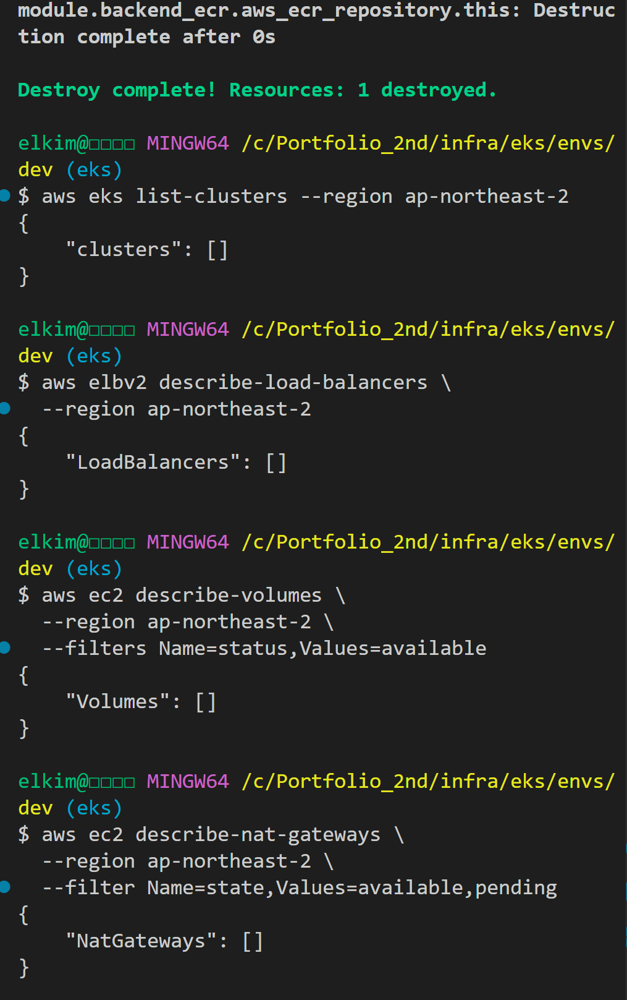

---

### 18.5 ECR Repository 삭제 확인

```bash
aws ecr describe-repositories \
  --region ap-northeast-2
```

확인 결과, EKS Backend Image 저장에 사용했던 ECR Repository가 삭제되었다.

```json
{
  "repositories": []
}
```

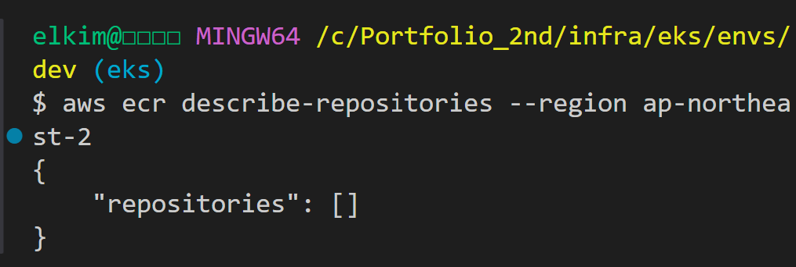

---

### 18.6 CloudWatch EKS Log Group 삭제 확인

Git Bash 환경에서는 `/aws/eks` 경로가 Windows 경로로 자동 변환될 수 있으므로 `MSYS_NO_PATHCONV=1` 옵션을 사용하여 확인했다.

```bash
MSYS_NO_PATHCONV=1 aws logs describe-log-groups \
  --region ap-northeast-2 \
  --log-group-name-prefix /aws/eks
```

확인 결과, EKS 관련 CloudWatch Log Group이 남아 있지 않았다.

```json
{
  "logGroups": []
}
```

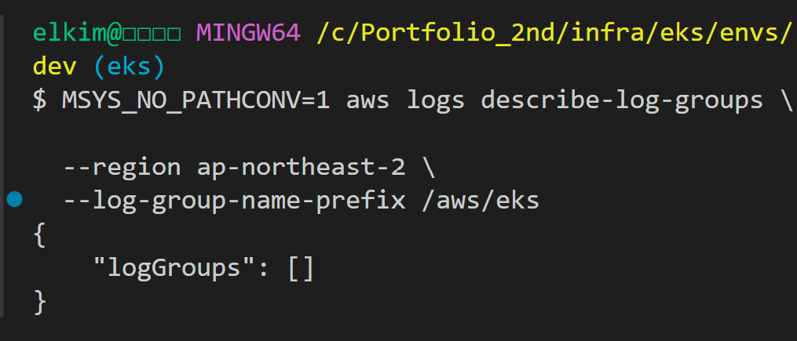

---

## 19. Evidence Summary

이번 EKS 버전에서 검증한 항목은 다음과 같다.

| 영역           | 검증 내용                                                          |
| ------------ | -------------------------------------------------------------- |
| EKS Cluster  | Worker Node Ready 확인                                           |
| ECR          | Backend Docker Image Push 확인                                   |
| CI/CD        | GitHub Actions Image Build / Push 확인                           |
| Security     | Trivy Image Scan 확인                                            |
| IAM          | ALB Controller IRSA 확인                                         |
| IAM          | Backend Pod IRSA 확인                                            |
| Kubernetes   | Backend Deployment / Service 확인                                |
| Ingress      | ALB Ingress 외부 접근 확인                                           |
| API          | `/correction`, `/conversation`, `/level-test` 호출 성공            |
| GitOps       | Argo CD Synced / Healthy 확인                                    |
| Monitoring   | Prometheus Targets UP 확인                                       |
| Monitoring   | Grafana Backend Pod Metrics 확인                                 |
| Cost Control | EKS Cluster, ALB, EBS, NAT Gateway, ECR, CloudWatch Logs 삭제 확인 |

이번 검증을 통해 KoreanMate Backend가 EKS 환경에서 컨테이너 기반으로 실행되고, ALB Ingress를 통해 외부 요청을 처리하며, IRSA를 통해 AWS Managed Services에 접근할 수 있음을 확인했다.

또한 GitHub Actions, ECR, Trivy, Argo CD, Prometheus, Grafana를 통해 이미지 빌드, 보안 스캔, GitOps 배포, Kubernetes 관측성까지 검증했다.

검증과 문서화를 완료한 뒤에는 비용 절감을 위해 EKS 관련 리소스를 삭제했고, AWS CLI로 잔여 리소스가 남아 있지 않음을 확인했다.
