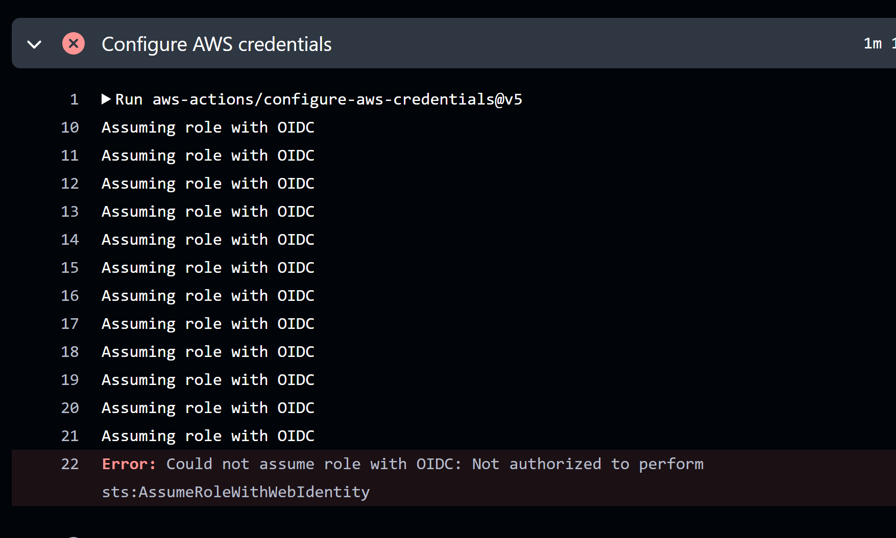
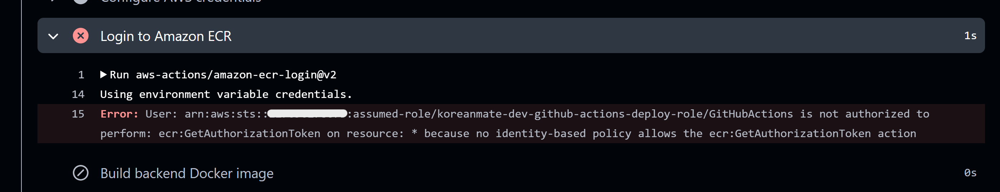
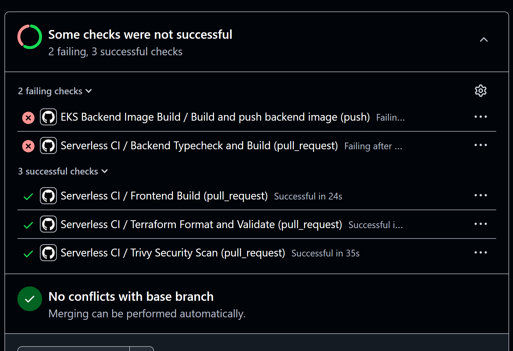

# KoreanMate EKS - Troubleshooting Notes

> 작성 기준: 문제 → 시도했던 방법들 → 비교 → 알게 된 점
> 기준 환경: AWS Seoul Region `ap-northeast-2`, EKS `dev` 환경, Terraform 기반 IaC

---

# 1. Backend Pod 실행 중 `BEDROCK_MODEL_ID` 환경변수 누락 문제

## 문제

Backend Deployment를 EKS에 배포한 뒤 Pod 로그를 확인했을 때, 컨테이너가 정상적으로 시작되지 않고 `ZodError`가 발생했다.

```bash
kubectl logs -n koreanmate deployment/backend
```

대표 오류는 다음과 같았다.

```text
ZodError: [
  {
    "expected": "string",
    "code": "invalid_type",
    "path": [
      "BEDROCK_MODEL_ID"
    ],
    "message": "Invalid input: expected string, received undefined"
  }
]
```

당시 오류 화면을 남기지 못했기 때문에, 실제 확인했던 오류 메시지를 텍스트로 기록했다.

핵심 원인은 Kubernetes Deployment manifest에 `BEDROCK_MODEL_ID` 환경변수가 정의되어 있지 않았다는 점이었다.

로컬 Docker 실행에서는 `.env` 파일을 사용했지만, EKS Pod에서는 `.env` 파일이 자동으로 주입되지 않는다. 따라서 컨테이너 런타임에 필요한 환경변수는 `deployment.yaml`에 명시하거나 ConfigMap / Secret으로 주입해야 한다.

---

## 시도했던 방법들

### 시도 1. Pod 로그 확인

먼저 Backend Pod가 왜 정상적으로 실행되지 않는지 확인하기 위해 로그를 조회했다.

```bash
kubectl logs -n koreanmate deployment/backend
```

로그에서 AWS 권한 문제나 이미지 Pull 문제가 아니라, 애플리케이션 시작 시점의 환경변수 검증 실패라는 것을 확인했다.

### 시도 2. Deployment manifest의 env 항목 확인

`deploy/k8s/backend/deployment.yaml`의 `env` 설정을 확인했다.

당시 manifest에는 다음 값들이 들어 있었다.

```text
NODE_ENV
PORT
AWS_REGION
LEARNING_RECORDS_TABLE_NAME
USAGE_LIMITS_TABLE_NAME
USER_PROFILES_TABLE_NAME
BEDROCK_MODEL_ID_PARAMETER_NAME
```

하지만 실제 애플리케이션이 필수로 요구하는 `BEDROCK_MODEL_ID`가 없었다.

### 시도 3. `BEDROCK_MODEL_ID` 환경변수 추가

`deployment.yaml`에 Bedrock model id를 명시적으로 추가했다.

```yaml
- name: BEDROCK_MODEL_ID
  value: "anthropic.claude-3-haiku-20240307-v1:0"
```

수정 후 Deployment를 다시 적용했다.

```bash
kubectl apply -f deploy/k8s/backend/deployment.yaml
kubectl rollout status deployment/backend -n koreanmate
```

### 시도 4. Service health check 확인

Pod가 정상적으로 뜬 뒤 Kubernetes Service를 통해 `/health` endpoint를 확인했다.


---

## 비교

| 항목                   | 문제 발생 시                      | 수정 후                          |
| -------------------- | ---------------------------- | ----------------------------- |
| 환경변수 관리              | 로컬 `.env`에 의존                | Kubernetes Deployment env에 명시 |
| Pod 상태               | 컨테이너 시작 실패                   | Running                       |
| 로그                   | `BEDROCK_MODEL_ID` undefined | Server running                |
| Service health check | 불가                           | `/health` 정상 응답               |
| 운영 설명                | 로컬과 EKS 환경 차이 불명확            | 컨테이너 런타임 환경변수 관리 가능           |

---

## 알게 된 점

로컬 Docker 실행과 Kubernetes Pod 실행은 환경변수 주입 방식이 다르다.

```text
로컬 Docker
→ --env-file 또는 .env 사용 가능

Kubernetes
→ Deployment env / ConfigMap / Secret으로 명시적 주입 필요
```

또한 `CrashLoopBackOff`나 컨테이너 시작 실패가 발생했을 때는 먼저 다음 순서로 확인하는 것이 효과적이다.

```text
1. kubectl get pods
2. kubectl logs
3. kubectl describe pod
4. Deployment env / command / image 설정 확인
```

이번 문제는 Kubernetes 자체 문제가 아니라, 애플리케이션이 요구하는 필수 환경변수를 Deployment manifest에 반영하지 않아 발생한 문제였다.

---

# 2. GitHub Actions OIDC / ECR 권한 문제

## 문제

EKS Backend Docker image를 GitHub Actions에서 빌드하고 Amazon ECR에 Push하는 workflow를 구성하는 과정에서 두 가지 권한 문제가 발생했다.

첫 번째 문제는 GitHub Actions가 AWS IAM Role을 OIDC 방식으로 Assume하지 못한 것이다.

`Configure AWS credentials` 단계에서 다음 오류가 발생했다.



두 번째 문제는 OIDC Role Assume은 성공했지만, ECR Login 단계에서 권한이 부족했던 것이다.

`Login to Amazon ECR` 단계에서 다음 오류가 발생했다.



---

## 원인

### 원인 1. GitHub OIDC Trust Policy 조건 불일치

GitHub Actions가 AWS IAM Role을 OIDC로 Assume하려면 IAM Role의 Trust Policy가 GitHub Repository와 Branch 조건을 허용해야 한다.

EKS 작업은 `eks` 브랜치에서 진행했기 때문에, Trust Policy가 `main` 브랜치만 허용하고 있으면 다음 오류가 발생할 수 있다.

```text
Not authorized to perform sts:AssumeRoleWithWebIdentity
```

즉, GitHub Actions workflow 자체의 문제가 아니라 IAM Role의 Trust Policy 조건이 현재 실행 브랜치와 맞지 않았던 것이 핵심 원인이었다.

### 원인 2. ECR Push에 필요한 IAM 권한 부족

OIDC Role Assume이 성공하더라도, 해당 IAM Role에 ECR 접근 권한이 없으면 ECR Login 단계에서 실패한다.

특히 `aws-actions/amazon-ecr-login`은 ECR 인증 토큰을 받아야 하므로 다음 권한이 필요하다.

```text
ecr:GetAuthorizationToken
```

그리고 Docker image를 Push하려면 다음과 같은 ECR 권한도 필요하다.

```text
ecr:BatchCheckLayerAvailability
ecr:InitiateLayerUpload
ecr:UploadLayerPart
ecr:CompleteLayerUpload
ecr:PutImage
```

---

## 시도했던 방법들

### 시도 5. GitHub Checks 결과 확인

권한 수정 전에는 PR checks에서 일부 job이 실패했다.



이후 EKS Backend Image Build workflow가 정상 동작하도록 수정했다.

### 시도 2. GitHub Actions 로그 확인

먼저 workflow가 어느 단계에서 실패하는지 확인했다.

```text
Configure AWS credentials
```

단계에서 실패했기 때문에 Docker build나 ECR push 문제가 아니라, AWS 인증 단계의 문제라고 판단했다.

### 시도 3. IAM Role Trust Policy 확인

GitHub Actions용 IAM Role의 Trust Policy를 확인했다.

확인 기준은 다음과 같았다.

```text
1. GitHub OIDC Provider가 연결되어 있는가?
2. Repository 조건이 현재 repository와 일치하는가?
3. Branch 조건이 현재 작업 브랜치와 일치하는가?
4. sts:AssumeRoleWithWebIdentity Action이 허용되어 있는가?
```

EKS 작업은 `eks` 브랜치에서 진행하고 있었으므로, Trust Policy에서 `eks` 브랜치를 허용하도록 수정했다.

### 시도 4. OIDC 인증 재실행

Trust Policy 수정 후 GitHub Actions workflow를 다시 실행했다.

이후 `Configure AWS credentials` 단계는 통과했지만, 다음 단계인 `Login to Amazon ECR`에서 새로운 권한 오류가 발생했다.

```text
not authorized to perform: ecr:GetAuthorizationToken
```
이 시점에서 첫 번째 문제는 IAM Role을 Assume하지 못한 것이었고, 두 번째 문제는 Assume한 Role에 ECR 접근 권한이 부족한 것이라고 분리해서 판단했다.

### 시도 5. GitHub Actions Role에 ECR 권한 추가

ECR 로그인과 이미지 Push를 위해 GitHub Actions IAM Role에 ECR 관련 권한을 추가했다.

필요 권한은 다음과 같다.

```text
ecr:GetAuthorizationToken
ecr:BatchCheckLayerAvailability
ecr:InitiateLayerUpload
ecr:UploadLayerPart
ecr:CompleteLayerUpload
ecr:PutImage
```

권한 수정 후 workflow를 다시 실행했다.

---

## 비교

| 항목                | 문제 발생 시                           | 수정 후                             |
| ----------------- | --------------------------------- | -------------------------------- |
| OIDC Role Assume  | 실패                                | 성공                               |
| AWS 인증 방식         | IAM Role Assume 불가                | GitHub OIDC로 임시 자격 증명 발급         |
| ECR Login         | `ecr:GetAuthorizationToken` 권한 부족 | ECR Login 가능                     |
| Docker image push | 불가                                | ECR Push 가능                      |
| 배포 보안             | 장기 Access Key를 사용할 위험             | OIDC 기반 임시 자격 증명 사용              |
| CI/CD 추적성        | PR Checks에서 실패 job 확인         | 실패 job → 실패 step → IAM 원인 순서로 추적 가능 |

---

## 알게 된 점

GitHub Actions에서 AWS OIDC를 사용할 때는 두 가지 권한 레이어를 분리해서 봐야 한다.

```text
1. Trust Policy
   → GitHub Actions가 IAM Role을 Assume할 수 있는가?

2. Permission Policy
   → Assume한 Role이 실제 AWS 작업을 수행할 권한이 있는가?
```

이번 문제에서는 먼저 Trust Policy 문제로 `sts:AssumeRoleWithWebIdentity`가 실패했고, 이후 Permission Policy 문제로 `ecr:GetAuthorizationToken`이 실패했다.

따라서 GitHub Actions AWS 인증 문제를 해결할 때는 다음 순서로 확인하는 것이 좋다.

```text
1. Workflow permissions에 id-token: write가 있는지 확인
2. configure-aws-credentials의 role-to-assume 값 확인
3. IAM Role Trust Policy의 repository / branch 조건 확인
4. Assume Role 성공 후 실제 필요한 AWS 서비스 권한 확인
5. GitHub Actions 로그에서 실패한 step 기준으로 원인 분리
```

이번 문제를 통해 OIDC 인증과 AWS 서비스 접근 권한은 별개의 문제이며, 둘을 분리해서 확인해야 한다는 것을 알게 되었다.

---

# 3. Argo CD 설치 중 `argocd-redis` Secret 누락 문제

## 문제

Argo CD를 EKS 클러스터에 설치한 뒤 일부 Pod가 정상적으로 실행되지 않았다.

```bash
kubectl get pods -n argocd -w
```

초기 상태에서는 여러 문제가 함께 보였다.


이 화면에는 두 가지 문제가 동시에 나타났다.

```text
1. argocd-repo-server의 CreateContainerConfigError
   → argocd-redis Secret 누락 문제

2. 일부 Argo CD Pod의 Pending 상태
   → t3.small 노드의 Pod capacity 부족 문제
```

이 섹션에서는 먼저 `argocd-repo-server`의 `CreateContainerConfigError` 원인이었던 `argocd-redis` Secret 누락 문제를 정리한다.
Pod capacity 부족으로 인한 `Pending` 문제는 다음 섹션에서 별도로 정리한다.

`argocd-repo-server` Pod를 describe 했을 때 다음 오류가 확인되었다.

```bash
kubectl describe pod -n argocd -l app.kubernetes.io/name=argocd-repo-server
```

오류 메시지:

```text
Error: secret "argocd-redis" not found
```

당시 `kubectl describe pod` 화면을 남기지 못했기 때문에, Events에서 확인한 핵심 메시지를 텍스트로 기록했다.

---

## 시도했던 방법들

### 시도 1. Argo CD Pod 상태 확인

먼저 전체 Pod 상태를 확인했다.

```bash
kubectl get pods -n argocd
```

초기 상태에서 `argocd-repo-server`는 `CreateContainerConfigError`, `argocd-dex-server`는 `Error` 또는 `CrashLoopBackOff` 상태였다.

동시에 일부 Pod는 `Pending` 상태였지만, 이 문제는 Node Pod capacity 부족과 관련된 별도 문제로 판단했다.

따라서 이 섹션에서는 `CreateContainerConfigError`의 원인을 먼저 확인했다.

### 시도 2. Repo Server Pod describe 확인

```bash
kubectl describe pod -n argocd -l app.kubernetes.io/name=argocd-repo-server
```

`Events`에서 다음 원인을 확인했다.

```text
Error: secret "argocd-redis" not found
```

Repo Server가 Redis 인증 정보를 `argocd-redis` Secret에서 읽도록 구성되어 있었지만, 해당 Secret이 존재하지 않았다.

### 시도 3. `argocd-redis` Secret 수동 생성

누락된 Redis Secret을 생성했다.

```bash
kubectl -n argocd create secret generic argocd-redis \
  --from-literal=auth="$(openssl rand -base64 32)"
```

생성 결과:

```text
secret/argocd-redis created
```

### 시도 4. 관련 Argo CD Pod 재시작

Secret 생성 후 관련 컴포넌트들이 새 Secret을 참조하도록 재시작했다.

```bash
kubectl rollout restart deployment -n argocd argocd-repo-server
kubectl rollout restart deployment -n argocd argocd-dex-server
kubectl rollout restart deployment -n argocd argocd-server
kubectl rollout restart deployment -n argocd argocd-redis
kubectl rollout restart statefulset -n argocd argocd-application-controller
```

이후 Pod 상태를 다시 확인했다.

```bash
kubectl get pods -n argocd
```

---

## 비교

| 시도                        | 결과                                                                | 판단              |
| ------------------------- | ----------------------------------------------------------------- | --------------- |
| Pod 상태만 확인                | `CreateContainerConfigError`, `CrashLoopBackOff`, `Pending` 상태 확인 | 원인 분리 필요        |
| `kubectl describe pod` 확인 | `argocd-redis` Secret 누락 확인                                       | Secret 문제 원인 확인 |
| Secret 수동 생성              | Redis auth Secret 생성                                              | 해결 방향           |
| Argo CD Pod 재시작           | Secret 반영                                                         | Secret 누락 문제 해결 |

---

## 검증 결과

`argocd-redis` Secret을 생성하고 관련 Pod를 재시작한 뒤, Secret 누락으로 인한 `CreateContainerConfigError` 문제를 해결했다.

이후 Pod capacity 문제까지 해결한 뒤 Argo CD 구성 요소가 모두 `Running` 상태가 되었다.

```bash
kubectl get pods -n argocd
```


이후 Argo CD UI에서 `koreanmate-backend` Application이 `Synced` 및 `Healthy` 상태로 표시되었다.


---

## 알게 된 점

`CreateContainerConfigError`는 컨테이너 내부 애플리케이션 오류가 아니라, 컨테이너 생성 전에 필요한 Kubernetes 리소스가 없을 때 발생할 수 있다.

특히 Secret / ConfigMap 참조가 누락되면 Pod 로그가 나오기 전에 컨테이너 생성 자체가 실패할 수 있다.

확인 순서는 다음이 적절하다.

```text
1. kubectl get pods
2. kubectl describe pod
3. Events에서 Secret / ConfigMap / Volume mount 오류 확인
4. 누락된 리소스 생성
5. Deployment / StatefulSet 재시작
```

이번 문제에서는 Pod 로그보다 `kubectl describe pod`의 Events가 더 중요한 단서였다.

또한 같은 `kubectl get pods` 화면에 여러 증상이 함께 표시될 수 있으므로, `CreateContainerConfigError`와 `Pending`을 같은 원인으로 묶지 않고 각각 분리해서 분석해야 한다는 것을 알게 되었다.

---

# 4. EKS t3.small 노드 Pod Capacity 부족 문제

## 문제

Argo CD와 Monitoring Stack을 EKS 클러스터에 설치하는 과정에서 일부 Pod가 `Pending` 상태로 남아 있었다.

처음에는 CPU 또는 Memory 부족 문제로 예상했지만, Node 상태를 확인한 결과 핵심 원인은 **노드당 생성 가능한 Pod 수 제한**이었다.

```bash
kubectl describe nodes
```

당시 Node 1대 환경에서 확인한 내용은 다음과 같았다.

```text
Capacity:
  pods: 11

Allocatable:
  pods: 11

Non-terminated Pods: 11 in total
```

즉, `t3.small` 노드 1대에서 생성 가능한 Pod 수가 이미 가득 찬 상태였다.

이로 인해 Argo CD 일부 Pod가 `Pending` 상태로 남았고, 이후 Prometheus / Grafana Monitoring Stack을 설치할 때도 충분한 Pod capacity가 필요했다.

---

## 시도했던 방법들

### 시도 1. Argo CD Pending 상태 확인

Argo CD 설치 후 Pod 상태를 확인했을 때 일부 Pod가 `Pending` 상태로 남아 있었다.

```bash
kubectl get pods -n argocd
```

문제 상태는 다음과 같았다.

```text
argocd-application-controller-0   Pending
argocd-redis                      Pending
argocd-server                     Pending
```

이 상태만으로는 CPU/Memory 부족인지, Pod 개수 제한인지 바로 판단하기 어려웠다.

### 시도 2. Node 리소스와 Pod capacity 확인

CPU/Memory 부족 여부를 확인하기 위해 Node 상태를 조회했다.

```bash
kubectl describe nodes
```

`MemoryPressure`, `DiskPressure`, `PIDPressure`는 모두 `False`였고 Node는 `Ready` 상태였다.

하지만 `Non-terminated Pods`가 11개였고, 노드의 `Allocatable pods`도 11개였다.

따라서 원인은 CPU/Memory 부족이 아니라 **노드당 Pod 개수 제한**이라고 판단했다.

### 시도 3. NodeGroup desired size 임시 확장

Argo CD와 Monitoring Stack 검증을 위해 `terraform.tfvars`에서 EKS Managed NodeGroup 크기를 임시로 확장했다.

기존 설정:

```hcl
node_desired_size = 1
node_min_size     = 1
node_max_size     = 1
```

최종 수정 후:

```hcl
node_desired_size = 3
node_min_size     = 1
node_max_size     = 3
```

Terraform을 적용했다.

```bash
cd infra/eks/envs/dev

terraform plan
terraform apply
```

### 시도 4. Node 추가 확인

NodeGroup 확장 후 Worker Node가 3대로 증가했는지 확인했다.

```bash
kubectl get nodes
```

확인 결과 Worker Node 3대가 모두 `Ready` 상태가 되었다.


### 시도 5. Monitoring Stack Pod 상태 확인

Argo CD 이후 Prometheus / Grafana Monitoring Stack도 설치했다.

Monitoring Stack은 Prometheus, Grafana, Alertmanager, kube-state-metrics, node-exporter 등 여러 Pod를 생성한다. 특히 node-exporter는 Node마다 실행되는 DaemonSet이므로, Node와 Add-on이 늘어날수록 Pod 수가 함께 증가한다.

```bash
kubectl get pods -n monitoring
```

확인 결과 Monitoring 관련 Pod들이 모두 `Running` 상태가 되었다.


---

## 비교

| 항목               | Node 1대                 | Node 3대                       |
| ---------------- | ----------------------- | ----------------------------- |
| 인스턴스 타입          | t3.small                | t3.small x 3                  |
| Pod capacity     | 11개                     | 약 33개 수준                      |
| Argo CD 일부 Pod   | Pending                 | Running                       |
| Monitoring Stack | 설치 시 Pod capacity 부족 가능 | Prometheus / Grafana Running  |
| 비용               | 낮음                      | 증가                            |
| 사용 목적            | 기본 Backend 검증           | GitOps / Monitoring 검증용 임시 확장 |

---

## 알게 된 점

EKS에서 작은 인스턴스 타입을 사용할 때는 CPU/Memory뿐만 아니라 **노드당 Pod capacity**도 반드시 고려해야 한다.

특히 다음 구성 요소들을 함께 올리면 Pod 수가 빠르게 증가한다.

```text
kube-system 기본 Pod
AWS Load Balancer Controller
Backend Application Pod
Argo CD components
Prometheus / Grafana stack
node-exporter DaemonSet
```

처음에는 작은 NodeGroup으로 Backend 배포를 검증할 수 있지만, Argo CD와 Monitoring Stack까지 설치하면 Pod 수가 빠르게 증가한다.

개인 포트폴리오 환경에서는 비용 절감이 중요하기 때문에 다음 전략이 현실적이다.

```text
1. 기본 Backend 배포는 최소 NodeGroup으로 검증
2. Argo CD / Monitoring 검증 시 NodeGroup을 임시로 확장
3. 캡처와 문서화 완료 후 NodeGroup 축소 또는 EKS destroy
```

이번 문제를 통해 EKS 운영에서는 CPU/Memory뿐만 아니라 Pod capacity, DaemonSet 개수, Add-on Pod 수까지 함께 고려해야 한다는 것을 알게 되었다.


# 요약

```text
EKS 버전 구축 중 Backend Pod 환경변수 누락, GitHub Actions OIDC/ECR 권한 부족, Argo CD Redis Secret 누락, t3.small 노드의 Pod capacity 부족 문제를 해결했다.

각 문제는 단순 오류 수정이 아니라 Kubernetes 환경변수 관리, GitHub Actions OIDC 인증 구조, ECR 권한 설계, Kubernetes Secret 참조 방식, EKS 노드 스케줄링 한계라는 관점에서 정리했다.
```
