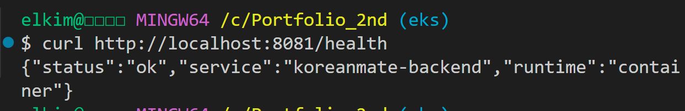
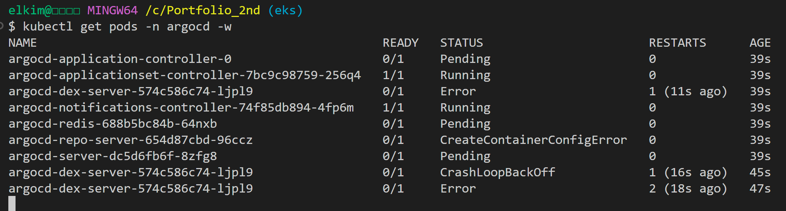
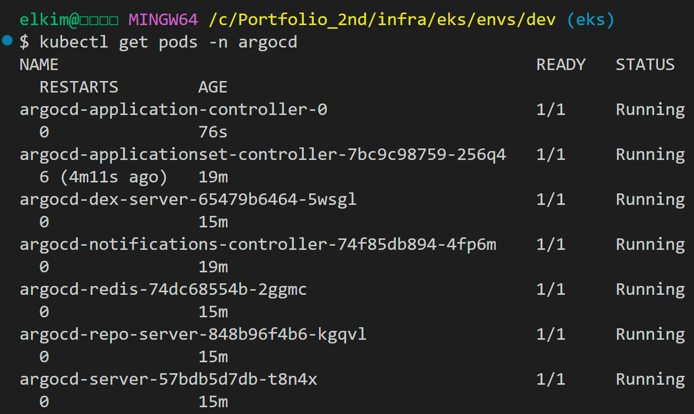
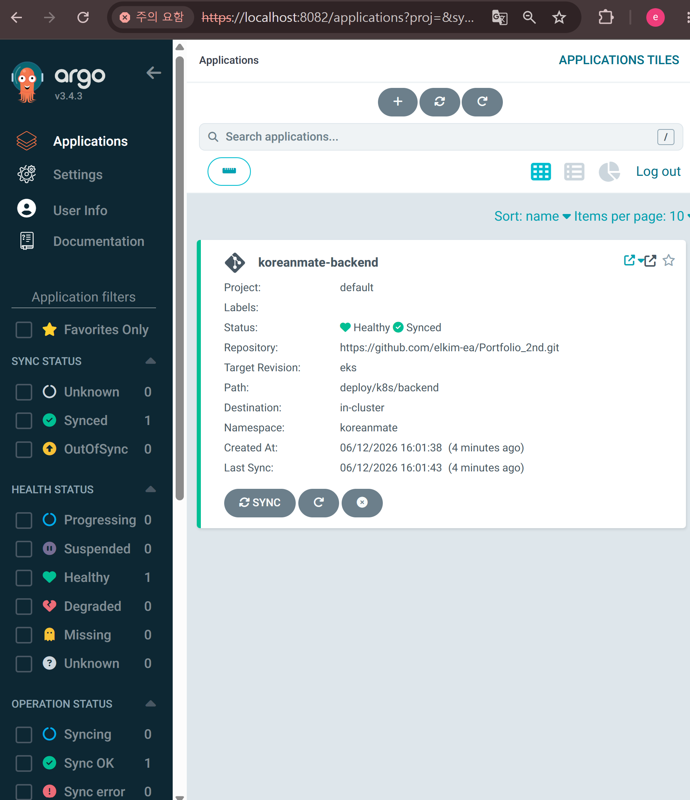
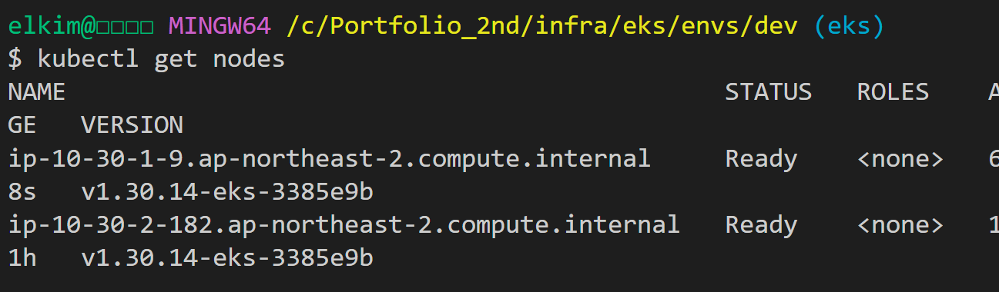
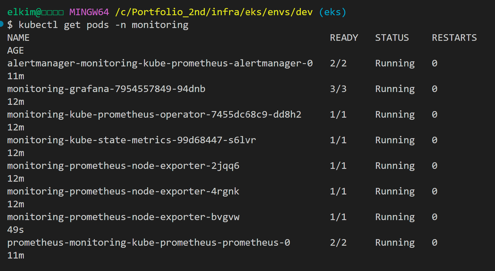

# KoreanMate EKS - Troubleshooting Notes

> 작성 기준: 문제 → 시도했던 방법들 → 비교 → 알게 된 점
> 기준 환경: AWS Seoul Region `ap-northeast-2`, EKS `dev` 환경, Terraform 기반 IaC

---

# 1. Backend Pod 실행 중 `BEDROCK_MODEL_ID` 환경변수 누락 문제

## 문제

Backend Deployment를 EKS에 배포한 뒤 Pod 로그를 확인했을 때, 컨테이너가 정상적으로 시작되지 않고 `ZodError`가 발생했다.

```bash
kubectl logs -n koreanmate deployment/backend
```

대표 오류는 다음과 같았다.

```text
ZodError: [
  {
    "expected": "string",
    "code": "invalid_type",
    "path": [
      "BEDROCK_MODEL_ID"
    ],
    "message": "Invalid input: expected string, received undefined"
  }
]
```


핵심 원인은 Kubernetes Deployment manifest에 `BEDROCK_MODEL_ID` 환경변수가 정의되어 있지 않았다는 점이었다.

로컬 Docker 실행에서는 `.env` 파일을 사용했지만, EKS Pod에서는 `.env` 파일이 자동으로 주입되지 않는다. 따라서 컨테이너 런타임에 필요한 환경변수는 `deployment.yaml`에 명시하거나 ConfigMap / Secret으로 주입해야 한다.

## 시도했던 방법들

### 시도 1. Pod 로그 확인

먼저 Backend Pod가 왜 정상적으로 실행되지 않는지 확인하기 위해 로그를 조회했다.

```bash
kubectl logs -n koreanmate deployment/backend
```

로그에서 AWS 권한 문제나 이미지 Pull 문제가 아니라, 애플리케이션 시작 시점의 환경변수 검증 실패라는 것을 확인했다.

### 시도 2. Deployment manifest의 env 항목 확인

`deploy/k8s/backend/deployment.yaml`의 `env` 설정을 확인했다.

당시 manifest에는 다음 값들이 들어 있었다.

```text
NODE_ENV
PORT
AWS_REGION
LEARNING_RECORDS_TABLE_NAME
USAGE_LIMITS_TABLE_NAME
USER_PROFILES_TABLE_NAME
BEDROCK_MODEL_ID_PARAMETER_NAME
```

하지만 실제 애플리케이션이 필수로 요구하는 `BEDROCK_MODEL_ID`가 없었다.

### 시도 3. `BEDROCK_MODEL_ID` 환경변수 추가

`deployment.yaml`에 Bedrock model id를 명시적으로 추가했다.

```yaml
- name: BEDROCK_MODEL_ID
  value: "anthropic.claude-3-haiku-20240307-v1:0"
```

수정 후 Deployment를 다시 적용했다.

```bash
kubectl apply -f deploy/k8s/backend/deployment.yaml
kubectl rollout status deployment/backend -n koreanmate
```

### 시도 4. Service health check 확인

Pod가 정상적으로 뜬 뒤 Kubernetes Service를 통해 `/health` endpoint를 확인했다.

```bash
kubectl port-forward -n koreanmate service/backend 8081:80
```

```bash
curl http://localhost:8081/health
```

응답:

```json
{"status":"ok","service":"koreanmate-backend","runtime":"container"}
```



## 비교

| 항목                   | 문제 발생 시                      | 수정 후                          |
| -------------------- | ---------------------------- | ----------------------------- |
| 환경변수 관리              | 로컬 `.env`에 의존                | Kubernetes Deployment env에 명시 |
| Pod 상태               | 컨테이너 시작 실패                   | Running                       |
| 로그                   | `BEDROCK_MODEL_ID` undefined | Server running                |
| Service health check | 불가                           | `/health` 정상 응답               |
| 운영 설명                | 로컬과 EKS 환경 차이 불명확            | 컨테이너 런타임 환경변수 관리 가능           |

## 알게 된 점

로컬 Docker 실행과 Kubernetes Pod 실행은 환경변수 주입 방식이 다르다.

```text
로컬 Docker
→ --env-file 또는 .env 사용 가능

Kubernetes
→ Deployment env / ConfigMap / Secret으로 명시적 주입 필요
```

또한 `CrashLoopBackOff`나 컨테이너 시작 실패가 발생했을 때는 먼저 다음 순서로 확인하는 것이 효과적이다.

```text
1. kubectl get pods
2. kubectl logs
3. kubectl describe pod
4. Deployment env / command / image 설정 확인
```

이번 문제는 Kubernetes 자체 문제가 아니라, 애플리케이션이 요구하는 필수 환경변수를 Deployment manifest에 반영하지 않아 발생한 문제였다.

---

# 2. Argo CD 설치 중 `argocd-redis` Secret 누락 문제

## 문제

Argo CD를 EKS 클러스터에 설치한 뒤 일부 Pod가 정상적으로 실행되지 않았다.

```bash
kubectl get pods -n argocd
```

초기 상태는 다음과 같았다.

```text
argocd-dex-server       CrashLoopBackOff
argocd-repo-server      CreateContainerConfigError
argocd-redis            Pending
argocd-server           Pending
```



`argocd-repo-server` Pod를 describe 했을 때 다음 오류가 확인되었다.

```bash
kubectl describe pod -n argocd -l app.kubernetes.io/name=argocd-repo-server
```

오류 메시지:

```text
Error: secret "argocd-redis" not found
```


## 시도했던 방법들

### 시도 1. Argo CD Pod 상태 확인

먼저 전체 Pod 상태를 확인했다.

```bash
kubectl get pods -n argocd
```

`argocd-repo-server`는 `CreateContainerConfigError`, `argocd-dex-server`는 `CrashLoopBackOff` 상태였다.

이 상태만으로는 원인을 알 수 없었기 때문에 `kubectl describe pod`로 Events를 확인했다.

### 시도 2. Repo Server Pod describe 확인

```bash
kubectl describe pod -n argocd -l app.kubernetes.io/name=argocd-repo-server
```

`Events`에서 다음 원인을 확인했다.

```text
Error: secret "argocd-redis" not found
```

Repo Server가 Redis 인증 정보를 `argocd-redis` Secret에서 읽도록 구성되어 있었지만, 해당 Secret이 존재하지 않았다.

### 시도 3. `argocd-redis` Secret 수동 생성

누락된 Redis Secret을 생성했다.

```bash
kubectl -n argocd create secret generic argocd-redis \
  --from-literal=auth="$(openssl rand -base64 32)"
```

생성 결과:

```text
secret/argocd-redis created
```

### 시도 4. 관련 Argo CD Pod 재시작

Secret 생성 후 관련 컴포넌트들이 새 Secret을 참조하도록 재시작했다.

```bash
kubectl rollout restart deployment -n argocd argocd-repo-server
kubectl rollout restart deployment -n argocd argocd-dex-server
kubectl rollout restart deployment -n argocd argocd-server
kubectl rollout restart deployment -n argocd argocd-redis
kubectl rollout restart statefulset -n argocd argocd-application-controller
```

이후 Pod 상태를 다시 확인했다.

```bash
kubectl get pods -n argocd
```

## 비교

| 시도                        | 결과                          | 판단       |
| ------------------------- | --------------------------- | -------- |
| Pod 상태만 확인                | Error / Pending 상태만 확인 가능   | 원인 파악 부족 |
| `kubectl describe pod` 확인 | `argocd-redis` Secret 누락 확인 | 원인 확인    |
| Secret 수동 생성              | Redis auth Secret 생성        | 해결 방향    |
| Argo CD Pod 재시작           | Secret 반영 후 Pod 정상화         | 최종 해결    |

## 검증 결과

Argo CD 구성 요소가 모두 `Running` 상태가 되었다.

```text
argocd-application-controller   1/1 Running
argocd-applicationset-controller 1/1 Running
argocd-dex-server               1/1 Running
argocd-notifications-controller  1/1 Running
argocd-redis                    1/1 Running
argocd-repo-server              1/1 Running
argocd-server                   1/1 Running
```



이후 Argo CD UI에서 `koreanmate-backend` Application이 `Synced` 및 `Healthy` 상태로 표시되었다.



## 알게 된 점

`CreateContainerConfigError`는 컨테이너 내부 애플리케이션 오류가 아니라, 컨테이너 생성 전에 필요한 Kubernetes 리소스가 없을 때 발생할 수 있다.

특히 Secret / ConfigMap 참조가 누락되면 Pod 로그가 나오기 전에 컨테이너 생성 자체가 실패할 수 있다.

확인 순서는 다음이 적절하다.

```text
1. kubectl get pods
2. kubectl describe pod
3. Events에서 Secret / ConfigMap / Volume mount 오류 확인
4. 누락된 리소스 생성
5. Deployment / StatefulSet 재시작
```

이번 문제에서는 Pod 로그보다 `kubectl describe pod`의 Events가 더 중요한 단서였다.

---

# 3. Argo CD 설치 중 t3.small 노드 Pod Capacity 부족 문제

## 문제

Argo CD 설치 후 일부 Pod가 계속 `Pending` 상태로 남아 있었다.

```bash
kubectl get pods -n argocd
```

문제 상태:

```text
argocd-application-controller-0   Pending
argocd-redis                      Pending
argocd-server                     Pending
```

처음에는 CPU 또는 Memory 부족 문제로 예상했지만, Node 상태를 확인한 결과 다른 원인이 있었다.

```bash
kubectl describe nodes
```

확인 결과:

```text
Capacity:
  pods: 11

Allocatable:
  pods: 11

Non-terminated Pods: 11 in total
```


핵심 원인은 `t3.small` 노드 1대에서 생성 가능한 Pod 수가 이미 가득 찼다는 점이었다.

## 시도했던 방법들

### 시도 1. Argo CD Pod 상태 확인

Argo CD 설치 후 Pod 상태를 확인했다.

```bash
kubectl get pods -n argocd
```

일부 Pod는 Running이었지만, application controller, redis, server 등이 Pending 상태로 남아 있었다.

### 시도 2. Node 리소스 확인

CPU/Memory 부족 여부를 확인하기 위해 Node 상태를 조회했다.

```bash
kubectl describe nodes
```

`MemoryPressure`, `DiskPressure`, `PIDPressure`는 모두 `False`였고 Node는 `Ready` 상태였다.
하지만 `Non-terminated Pods`가 11개였고, 노드의 `Allocatable pods`도 11개였다.

즉, CPU/Memory가 아니라 **노드당 Pod 개수 제한**이 문제였다.

### 시도 3. NodeGroup desired size 임시 확장

`terraform.tfvars`에서 EKS Managed NodeGroup 크기를 임시로 확장했다.

기존 설정:

```hcl
node_desired_size = 1
node_min_size     = 1
node_max_size     = 1
```

수정 후:

```hcl
node_desired_size = 2
node_min_size     = 1
node_max_size     = 2
```

Terraform을 적용했다.

```bash
cd infra/eks/envs/dev

terraform plan
terraform apply
```

### 시도 4. Node 추가 확인

```bash
kubectl get nodes
```

확인 결과 Worker Node가 2대로 확장되었다.

```text
ip-10-30-1-9     Ready
ip-10-30-2-182   Ready
```



## 비교

| 항목             | Node 1대       | Node 2대           |
| -------------- | ------------- | ----------------- |
| 인스턴스 타입        | t3.small      | t3.small x 2      |
| Pod capacity   | 11개           | 22개 수준            |
| Argo CD 일부 Pod | Pending       | Running           |
| 비용             | 낮음            | 증가                |
| 사용 목적          | 기본 backend 검증 | Argo CD 검증용 임시 확장 |

## 검증 결과

NodeGroup 확장 후 Argo CD Pod들이 정상적으로 스케줄링되었다.

```bash
kubectl get pods -n argocd
```

확인 결과:

```text
argocd-application-controller   1/1 Running
argocd-applicationset-controller 1/1 Running
argocd-dex-server               1/1 Running
argocd-notifications-controller  1/1 Running
argocd-redis                    1/1 Running
argocd-repo-server              1/1 Running
argocd-server                   1/1 Running
```


## 알게 된 점

EKS에서 작은 인스턴스 타입을 사용할 때는 CPU/Memory뿐만 아니라 **노드당 Pod capacity**도 고려해야 한다.

특히 다음 구성 요소들을 함께 올리면 Pod 수가 빠르게 증가한다.

```text
kube-system 기본 Pod
AWS Load Balancer Controller
Backend Application Pod
Argo CD components
Prometheus / Grafana stack
```

개인 포트폴리오 환경에서는 비용 절감이 중요하기 때문에 기본은 작은 노드로 시작할 수 있다.
다만 GitOps나 Monitoring 도구를 검증할 때는 임시로 NodeGroup을 확장하고, 검증 후 다시 축소하거나 destroy하는 방식이 적절하다.

---

# 4. Prometheus Server Pending 문제

## 문제

`kube-prometheus-stack`을 설치한 뒤 대부분의 monitoring 구성 요소는 정상적으로 실행되었지만, Prometheus Server가 처음에는 `Pending` 상태로 남아 있었다.

```bash
kubectl get pods -n monitoring
```

문제 상태:

```text
prometheus-monitoring-kube-prometheus-prometheus-0   0/2   Pending
```


당시 Grafana, Alertmanager, kube-state-metrics, node-exporter 등은 대부분 Running 상태였지만, Prometheus 본체가 올라오지 않아 metrics 수집과 dashboard 확인이 완전하지 않았다.

## 시도했던 방법들

### 시도 1. Monitoring Pod 상태 확인

먼저 monitoring namespace의 Pod 상태를 확인했다.

```bash
kubectl get pods -n monitoring
```

대부분의 구성 요소는 Running이었지만 Prometheus Server만 Pending 상태였다.

### 시도 2. 기존 NodeGroup 상태 확인

이미 Argo CD 설치를 위해 NodeGroup을 2대로 확장한 상태였지만, monitoring stack까지 추가되면서 Pod 수가 다시 증가했다.

Monitoring Stack은 다음 구성 요소들을 생성한다.

```text
Prometheus
Grafana
Alertmanager
kube-state-metrics
node-exporter
Prometheus Operator
```

특히 node-exporter는 Node마다 DaemonSet으로 실행되기 때문에 노드 수에 따라 Pod가 추가된다.

### 시도 3. NodeGroup을 추가로 임시 확장

Prometheus / Grafana 검증을 완료하기 위해 NodeGroup을 임시로 한 번 더 확장했다.

예시 설정:

```hcl
node_desired_size = 3
node_min_size     = 1
node_max_size     = 3
```

Terraform 적용 후 Node와 monitoring Pod 상태를 다시 확인했다.

```bash
terraform plan
terraform apply

kubectl get nodes
kubectl get pods -n monitoring
```

## 비교

| 항목                | Node 2대       | Node 3대              |
| ----------------- | ------------- | -------------------- |
| Argo CD           | Running       | Running              |
| Grafana           | Running       | Running              |
| Alertmanager      | Running       | Running              |
| Prometheus Server | Pending       | Running              |
| 비용                | 중간            | 높음                   |
| 판단                | Argo CD까지는 가능 | Monitoring 검증용 임시 확장 |

## 검증 결과

NodeGroup 확장 후 Prometheus Server가 정상적으로 실행되었다.

```text
prometheus-monitoring-kube-prometheus-prometheus-0   2/2   Running
```



Prometheus Targets 화면에서도 scrape 대상이 `UP` 상태로 표시되었다.


Grafana Dashboard에서 `koreanmate` namespace와 Backend Pod의 CPU, Memory, Network metrics도 확인할 수 있었다.


## 알게 된 점

Prometheus / Grafana 같은 Observability Stack은 포트폴리오에서 매우 좋은 증거가 되지만, 작은 EKS 클러스터에서는 생각보다 많은 Pod와 리소스를 사용한다.

따라서 개인 포트폴리오 환경에서는 다음 전략이 현실적이다.

```text
1. 기본 Backend 배포는 작은 NodeGroup으로 검증
2. Argo CD / Monitoring 검증 시 NodeGroup 임시 확장
3. 캡처와 문서화 완료 후 NodeGroup 축소 또는 EKS destroy
```

운영 환경이라면 노드 크기, Pod capacity, request/limit, autoscaling 전략을 미리 설계해야 한다.

---

# 요약

```text
EKS 버전 구축 중 Backend Pod 환경변수 누락, Argo CD Redis Secret 누락, t3.small 노드의 Pod capacity 부족, Prometheus Server Pending 문제를 해결했다. 각 문제는 단순 오류 수정이 아니라 Kubernetes 환경변수 관리, Secret 참조 방식, EKS 노드 스케줄링 한계, Observability Stack 운영 비용과 리소스 설계라는 관점에서 정리했다.
```
