# KoreanMate Serverless 운영 증거 정리

> 목적: KoreanMate Serverless 버전이 실제 AWS 환경에 배포되었고, 사용자가 웹에서 기능을 실행하면 API Gateway, Lambda, Bedrock, DynamoDB까지 정상적으로 연결되며, CloudWatch/X-Ray 기반으로 운영 관측이 가능하다는 것을 증명한다.
> 기준 환경: AWS Seoul Region `ap-northeast-2`, `dev` 환경, Terraform 기반 IaC

---

## 1. 증거 정리 목적

이 문서는 KoreanMate Serverless 버전의 구현 결과를 단순 기능 설명이 아니라, 실제 운영 가능한 클라우드 애플리케이션 관점에서 정리하기 위해 작성한다.

검증 기준은 다음과 같다.

| 순서 | 검증 항목                            | 목적                                                 |
| -: | -------------------------------- | -------------------------------------------------- |
|  1 | 웹 서비스 접속 및 기능 실행                 | 실제 사용자가 CloudFront URL로 서비스에 접근하고 기능을 실행할 수 있는지 확인 |
|  2 | S3 정적 웹 배포                       | React/Vite 빌드 결과물이 S3에 배포되었는지 확인                   |
|  3 | CloudFront 배포 URL                | 프론트엔드가 CDN을 통해 실제 배포되었는지 확인                        |
|  4 | API Gateway + Cognito Authorizer | 인증된 사용자만 API를 호출할 수 있는지 확인                         |
|  5 | Lambda 실행 로그                     | 서버리스 백엔드가 실제 요청을 처리하는지 확인                          |
|  6 | DynamoDB 테이블 생성                  | Terraform 기반 데이터 저장소 생성 확인                         |
|  7 | DynamoDB 아이템 저장                  | API 호출 결과가 실제 DB에 저장되는지 확인                         |
|  8 | 사용량 제한 429 응답                    | 비용 제어 및 abuse 방어 로직 확인                             |
|  9 | CloudWatch Logs                  | 운영 중 로그 기반 장애 분석 가능성 확인                            |
| 10 | X-Ray Trace Map                  | 요청 흐름 추적 및 병목 분석 가능성 확인                            |
| 11 | SSM Parameter Store              | Bedrock Model ID 등 설정값을 코드와 분리했는지 확인               |
| 12 | IAM Role 및 권한 분리                 | Lambda 실행 권한이 필요한 리소스 중심으로 제한되었는지 확인               |

전체 검증 흐름은 다음과 같다.

```text
User Browser
  ↓
CloudFront
  ↓
S3 Static Frontend
  ↓
API Gateway
  ↓
Cognito JWT Authorizer
  ↓
Lambda
  ↓
Bedrock
  ↓
DynamoDB
  ↓
CloudWatch Logs / X-Ray
```

---

## 2. 웹 서비스 접속 및 기능 실행 증거

### 목적

웹 서비스 접속 증거는 KoreanMate가 단순히 AWS 리소스만 생성된 상태가 아니라, 사용자가 실제 브라우저에서 접근 가능한 서비스로 배포되었음을 보여준다.

이 캡처는 CloudFront 배포 URL을 통해 프론트엔드에 접속하고, 실제 AI 기능을 실행할 수 있음을 검증하기 위한 것이다.

### 검증 흐름

```text
User Browser
  ↓
CloudFront URL
  ↓
React/Vite Frontend
  ↓
API Gateway
  ↓
Lambda
  ↓
Bedrock
  ↓
DynamoDB
```

### 확인 항목

| 캡처 항목                   | 목적                           |
| ----------------------- | ---------------------------- |
| CloudFront URL 접속 화면    | 실제 배포된 웹 서비스임을 확인            |
| 로그인 또는 인증 후 화면          | Cognito 기반 인증 흐름 확인          |
| Dashboard 화면             | 저장된 결과를 사용자 화면에서 확인 가능함을 보여줌 |
| AI 기능 실행 성공 화면          | 사용자가 실제 기능을 사용할 수 있음을 확인     |

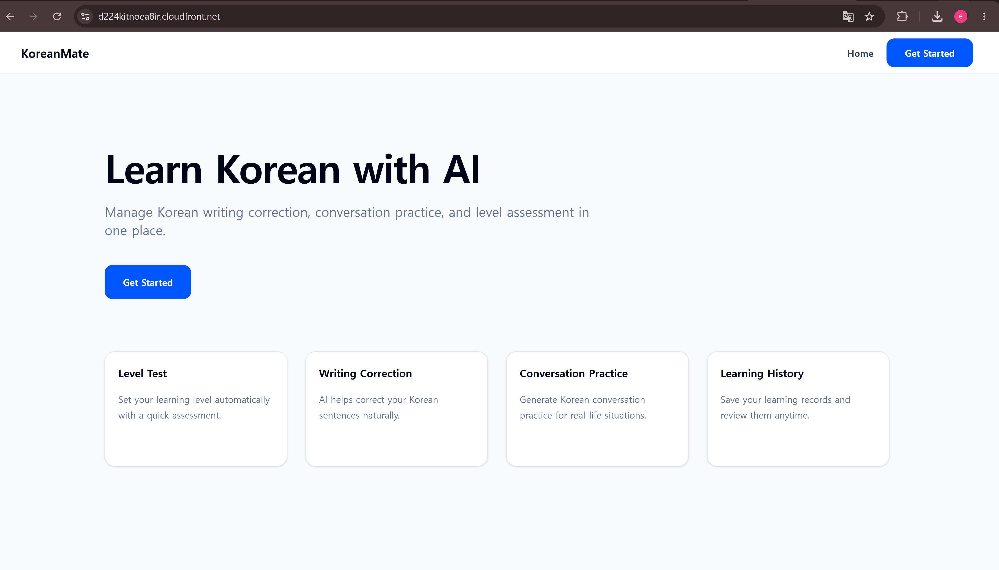

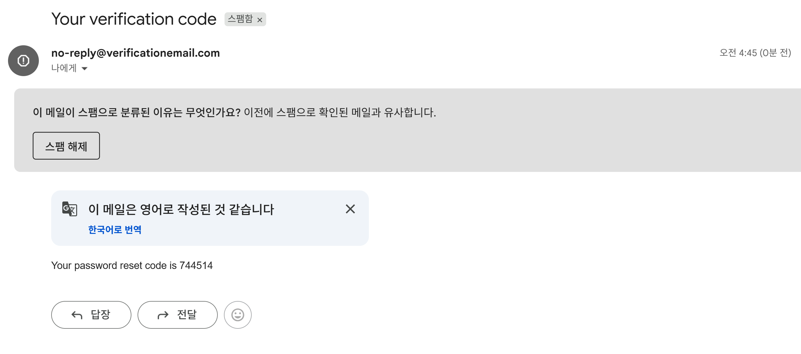

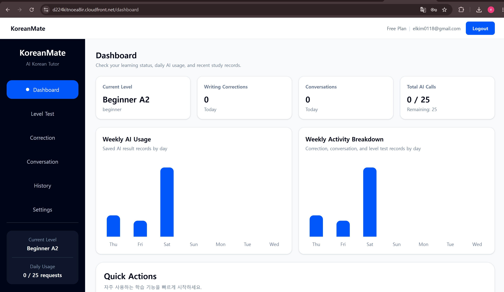

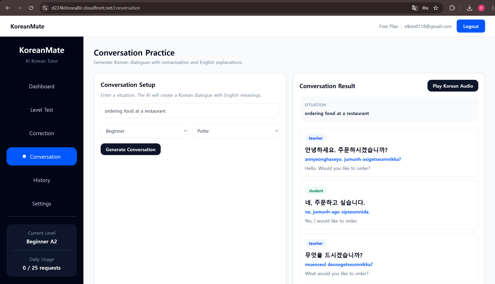

### 설명

CloudFront 배포 URL을 통해 KoreanMate 프론트엔드에 실제로 접속 가능한 것을 확인했다.
또한 사용자가 웹 화면에서 AI 기능을 실행하면 API Gateway, Lambda, Bedrock을 거쳐 결과가 반환되고, 이후 DynamoDB에 저장되는 전체 흐름을 검증했다.

이 캡처는 단순 인프라 생성이 아니라, 사용자가 접근 가능한 실제 운영 형태의 Serverless 애플리케이션으로 배포되었음을 보여준다.

---

## 3. S3 정적 웹 배포 증거

### 목적

S3 정적 웹 배포 증거는 프론트엔드 빌드 결과물이 실제 배포 대상 버킷에 업로드되었음을 보여준다.

CloudFront는 사용자에게 콘텐츠를 전달하는 CDN 역할을 하고, S3는 React/Vite 정적 파일의 원본 저장소 역할을 한다.

### 확인 항목

| 항목 | 설명 |
|---|---|
| S3 Bucket | 프론트엔드 정적 파일 저장 |
| index.html | SPA 진입점 |
| assets/ | Vite 빌드 결과물 |
| favicon.svg / icons.svg | 프론트엔드 정적 리소스 |
| Last modified | 최근 빌드 결과물 업로드 시점 확인 |

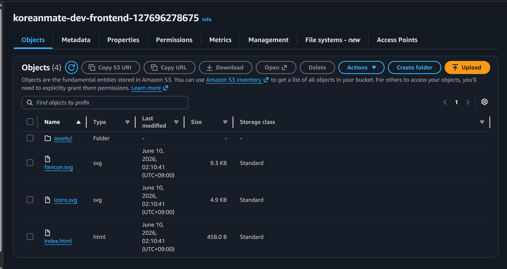

### 설명

React/Vite 빌드 결과물이 S3 버킷에 업로드된 것을 확인했다.
캡처에서는 `index.html`, `assets/`, `favicon.svg`, `icons.svg` 등의 정적 파일이 배포 대상 버킷에 저장된 것을 확인할 수 있다.

S3는 프론트엔드 정적 파일의 원본 저장소 역할을 하며, 사용자는 CloudFront를 통해 이 정적 리소스에 접근한다.

---

## 4. CloudFront 배포 URL

### 목적

CloudFront 배포 URL은 프론트엔드가 실제 운영 환경에 배포되었음을 보여주는 증거다.

### 배포 흐름

```text
React/Vite Build
  ↓
S3 Upload
  ↓
CloudFront Distribution
  ↓
User Access
```

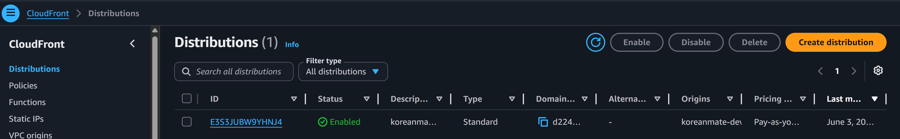

### 설명

프론트엔드는 Vite 빌드 결과물을 S3에 업로드하고 CloudFront를 통해 배포했다.
이를 통해 정적 웹 호스팅, CDN 기반 전송, 캐시 무효화 흐름까지 포함한 Serverless 프론트엔드 배포 구조를 구성했다.

---

## 5. API Gateway Route 및 Authorizer 구성 증거

### 목적

API Gateway Route 및 Authorizer 구성 증거는 각 API 경로가 Lambda Integration과 연결되어 있고, Cognito JWT Authorizer를 통해 인증된 사용자만 접근할 수 있도록 구성되었는지 확인하기 위한 것이다.

이 캡처는 API Gateway 콘솔에서 Route, Authorization, Integration 구성을 확인하는 증거로 사용한다.

### 확인 항목

| 항목 | 설명 |
|---|---|
| Route | `/correction`, `/conversation`, `/level-test`, `/usage`, `/history` 등의 API 경로 |
| Method | GET 또는 POST |
| Authorization | Cognito JWT Authorizer 연결 여부 |
| Integration | 각 Route가 연결된 Lambda Integration |

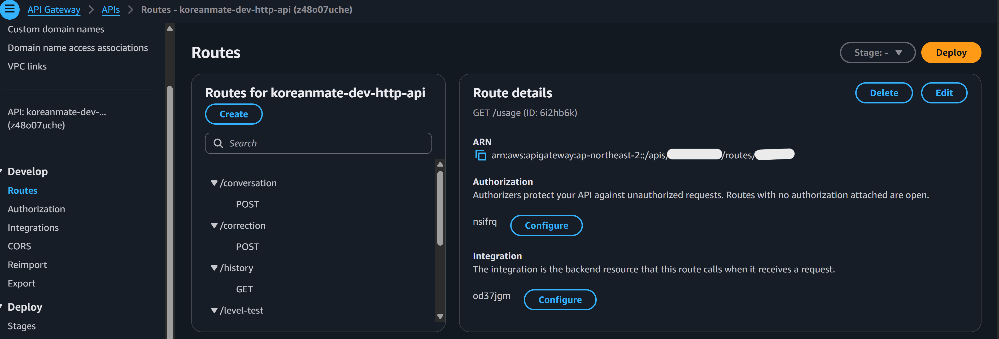

### 설명 

API Gateway HTTP API에 Cognito JWT Authorizer를 적용하여 인증된 사용자만 AI 기능 API를 호출할 수 있도록 구성했다.
이를 통해 프론트엔드 인증 상태와 백엔드 API 접근 제어가 분리되지 않고 하나의 보안 흐름으로 동작하도록 설계했다.

또한 인증 실패 시 `401 Unauthorized`, 사용량 제한 초과 시 `429 Too Many Requests` 응답을 반환하도록 검증했다.
이는 단순 성공 응답뿐 아니라 운영 환경에서 필요한 접근 제어와 비용 방어 로직이 동작함을 보여준다.

--- 

## 6. API 인증/사용량 제한 응답 검증

### 목적

API 인증/사용량 제한 응답 검증은 API Gateway Authorizer와 애플리케이션 레벨 사용량 제한 로직이 실제 요청에서 정상적으로 동작하는지 확인하기 위한 것이다.

API Gateway 콘솔에서는 401, 200, 429 응답 결과가 직접 보이지 않기 때문에, curl 또는 브라우저 개발자 도구 Network 탭을 통해 실제 API 호출 결과를 캡처한다.

### 검증 케이스

| 케이스 | 예상 결과 | 검증 방법 |
|---|---|---|
| Authorization 헤더 없음 | 401 Unauthorized | curl 또는 Network 탭 |
| 만료된 JWT 사용 | 401 Unauthorized | curl 또는 Network 탭 |
| 정상 JWT 사용 | 200 OK | curl 또는 Network 탭 |
| 사용량 초과 | 429 Too Many Requests | curl 또는 Network 탭 |

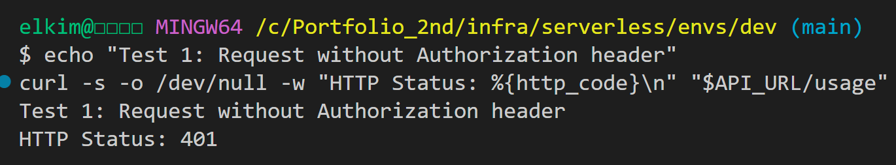

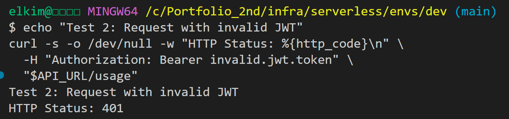

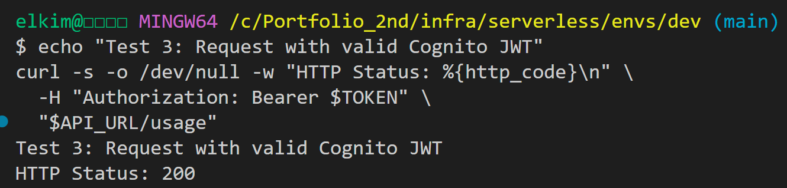

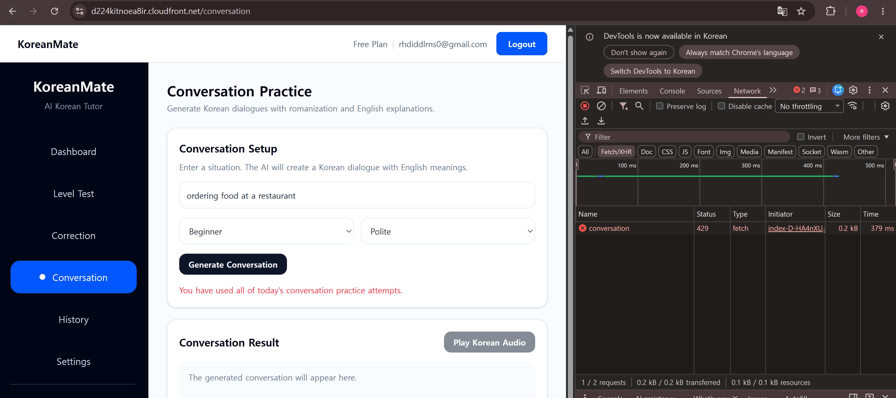

---

## 7. Lambda 실행 로그

### 목적

Lambda 실행 로그는 서버리스 백엔드가 실제 요청을 처리하고 있는지 확인하는 증거다.

CloudWatch Logs와 함께 Lambda 로그를 확인하면 API 요청 처리, Bedrock 호출, DynamoDB 저장, 오류 발생 여부를 분석할 수 있다.

### 확인 대상

| Lambda 함수           | 목적           |
| ------------------- | ------------ |
| correction Lambda   | 글쓰기 교정 요청 처리 |
| conversation Lambda | 회화 생성 요청 처리  |
| level-test Lambda   | 레벨 테스트 요청 처리 |
| usage Lambda        | 사용자 사용량 조회   |
| history Lambda      | 학습 기록 조회     |
| profile Lambda      | 사용자 프로필 조회   |

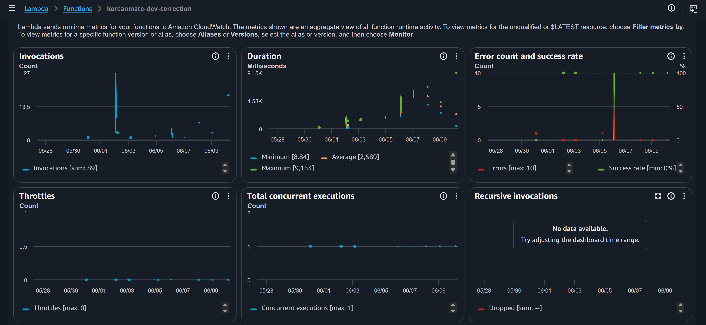

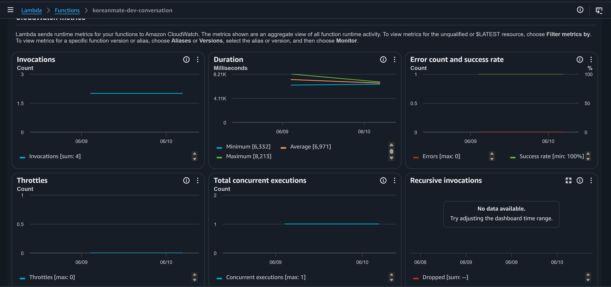

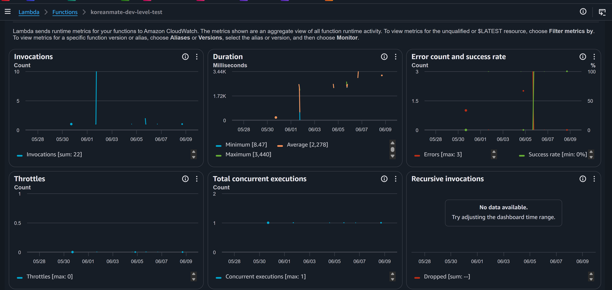

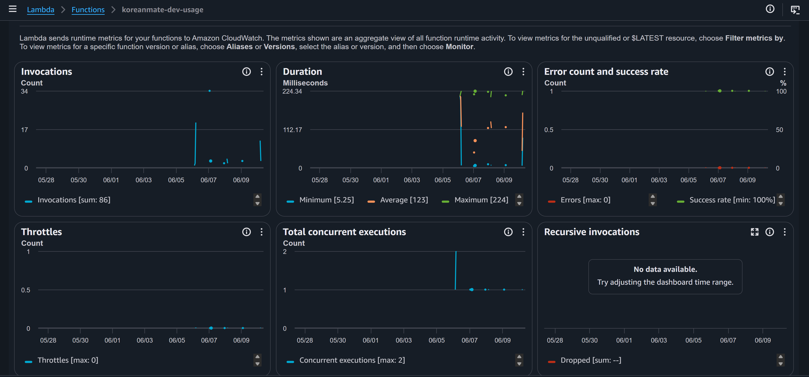

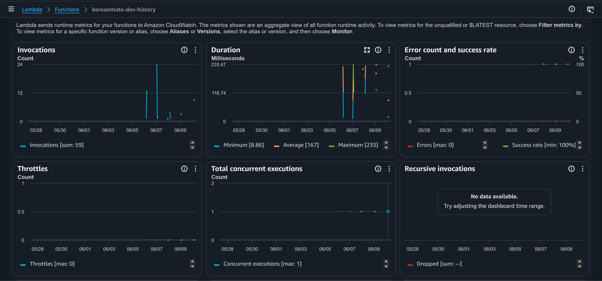

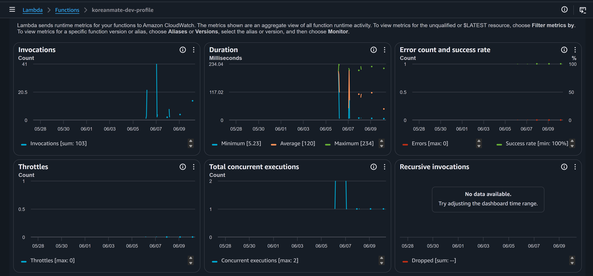

### 설명

Lambda 실행 로그를 통해 실제 API 요청이 서버리스 함수에서 처리되는 것을 확인했다.
이 로그는 장애 발생 시 요청 단위의 오류 원인을 추적하고, Bedrock 호출 실패나 DynamoDB 저장 실패를 분석하는 근거로 사용할 수 있다.

---

## 8. DynamoDB 테이블 생성 증거

### 목적

DynamoDB 테이블 생성 증거는 Terraform으로 Serverless 애플리케이션의 영속성 계층을 구성했음을 보여준다.

이 캡처에서는 KoreanMate 애플리케이션에서 사용하는 DynamoDB 테이블과 Terraform 상태 잠금에 사용하는 lock 테이블이 함께 표시된다.

### 확인 대상 테이블

| 테이블 | 목적 |
|---|---|
| koreanmate-dev-learning-records | 사용자의 학습 기록 저장 |
| koreanmate-dev-usage-limits | 일일 API 사용량 제한 관리 |
| koreanmate-dev-user-profiles | 사용자 기본 프로필 및 학습 설정 관리 |
| koreanmate-dev-terraform-locks | Terraform state lock 관리용 테이블 |

### 애플리케이션 데이터 테이블

KoreanMate 애플리케이션에서 직접 사용하는 테이블은 다음 3개다.

| 테이블 | 목적 |
|---|---|
| koreanmate-dev-learning-records | 사용자의 학습 기록 저장 |
| koreanmate-dev-usage-limits | 일일 API 사용량 제한 관리 |
| koreanmate-dev-user-profiles | 사용자 기본 프로필 및 학습 설정 관리 |

`koreanmate-dev-terraform-locks`는 애플리케이션 런타임 데이터 저장용 테이블이 아니라, Terraform 원격 상태 관리 시 동시 작업 충돌을 방지하기 위한 lock 테이블이다.

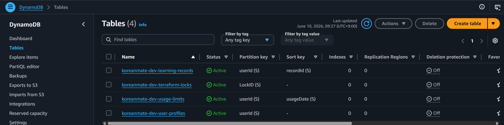

---

## 9. DynamoDB 아이템 저장 결과

### 목적

DynamoDB 아이템 저장 결과는 단순히 테이블이 존재하는 것이 아니라, 실제 API 호출 결과가 DB에 저장되었음을 보여주는 강한 증거다.

### 검증 흐름

```text
Web Frontend 또는 curl
  ↓
API Gateway
  ↓
Lambda
  ↓
Bedrock
  ↓
DynamoDB 저장
```

### 확인할 필드 예시

| 필드                       | 설명                                     |
| ------------------------ | -------------------------------------- |
| userId                   | Cognito 사용자 식별자                        |
| recordId                 | 생성 시간 + 기능 타입 + UUID 기반 정렬 키           |
| type                     | correction / conversation / level-test |
| inputText                | 사용자 입력                                 |
| outputText 또는 outputData | AI 응답 결과                               |
| createdAt                | 생성 시각                                  |

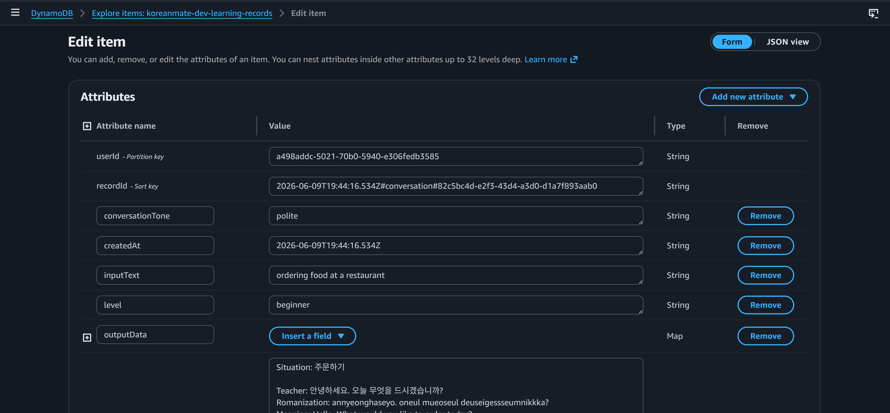

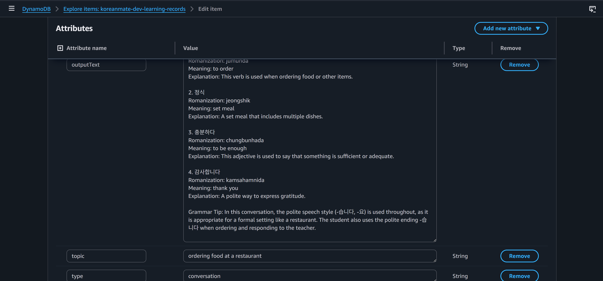

### 설명 

웹 화면 또는 API 호출을 통해 생성된 학습 결과가 Lambda 내부 처리에만 머무르지 않고 DynamoDB에 저장되는 것을 확인했다.
이를 통해 Serverless API, Bedrock 호출, Repository Layer, DynamoDB 저장 흐름이 정상적으로 연결되었음을 검증했다.

---

## 10. 비용 제어 및 사용량 제한 검증

### 목적

AI API는 호출량이 증가하면 비용이 빠르게 증가할 수 있기 때문에, 사용자별 일일 사용량 제한을 직접 구현했다.

이 검증은 사용자가 AI 기능을 호출할 때마다 `UsageLimits` 테이블의 기능별 사용량과 전체 사용량이 증가하는지 확인하기 위한 것이다.

### 검증 항목

| 항목 | 결과 |
|---|---|
| 사용자별 일일 사용량 저장 | `UsageLimits` 테이블에 `userId + usageDate` 기준으로 저장 |
| 기능별 호출 횟수 증가 | `correctionCount`, `conversationCount`, `levelTestCount` 증가 |
| 전체 호출 횟수 증가 | `totalCount` 증가 |
| 제한 초과 응답 | 일일 한도 초과 시 `429 Too Many Requests` 반환 |

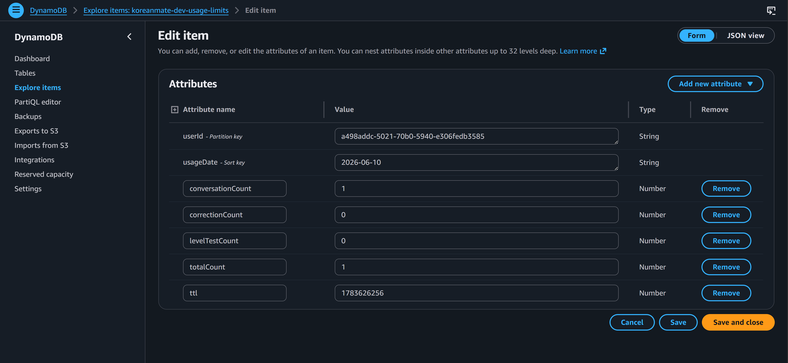

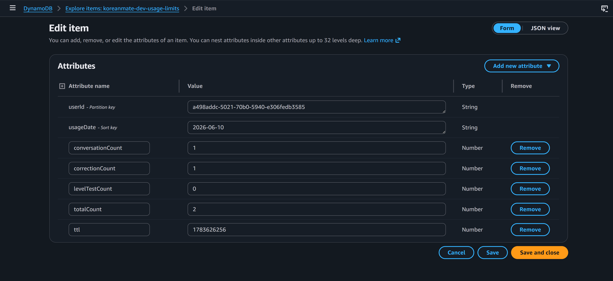


### 설명

Bedrock 호출 비용을 제어하기 위해 사용자별 일일 사용량 제한을 DynamoDB 기반으로 직접 구현했다.
단순 기능 구현이 아니라 운영 비용을 고려한 Serverless 설계임을 보여주는 핵심 요소다.

---

## 11. CloudWatch Logs

### 목적

CloudWatch Logs는 Lambda 실행 결과, 오류 메시지, API 처리 흐름을 확인할 수 있는 운영 증거다.

### 확인 대상

| 로그 그룹                    | 목적                 |
| ------------------------ | ------------------ |
| correction Lambda logs   | 글쓰기 교정 API 실행 로그   |
| conversation Lambda logs | 회화 생성 API 실행 로그    |
| level-test Lambda logs   | 레벨 테스트 API 실행 로그   |
| usage Lambda logs        | 사용량 조회 API 실행 로그   |
| history Lambda logs      | 학습 기록 조회 API 실행 로그 |

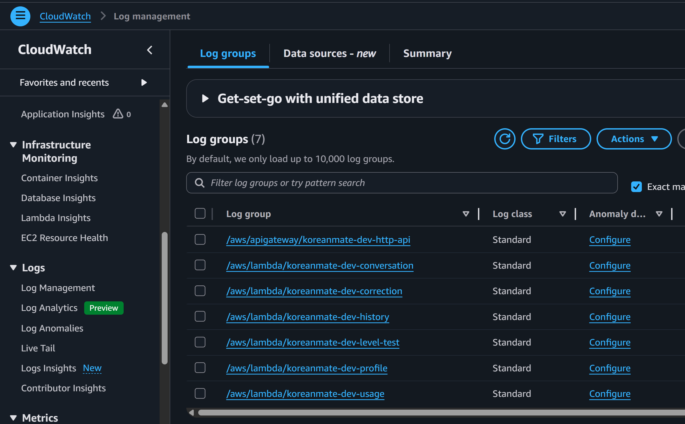

### 설명

Lambda 실행 로그를 CloudWatch Logs에서 확인할 수 있도록 구성했다.
운영 중 API 오류, Bedrock 호출 실패, 사용량 제한 처리, 인증 실패 등을 로그 기반으로 추적할 수 있다.

---

## 12. X-Ray Trace Map

### 목적

X-Ray Trace Map은 Serverless 요청 처리 흐름을 시각적으로 확인하고, 각 Lambda 함수가 요청을 어떻게 처리하는지 추적할 수 있는 관측성 증거다.

### 확인 항목

| 항목 | 설명 |
|---|---|
| Client Node | 외부 요청 진입 지점 |
| Lambda Context | Lambda 실행 컨텍스트 |
| Lambda Function | 서버리스 비즈니스 로직 실행 함수 |
| 요청 흐름 | 요청이 어떤 Lambda 함수로 전달되는지 확인 |
| 함수 분리 | conversation, correction 등 기능별 Lambda 분리 확인 |


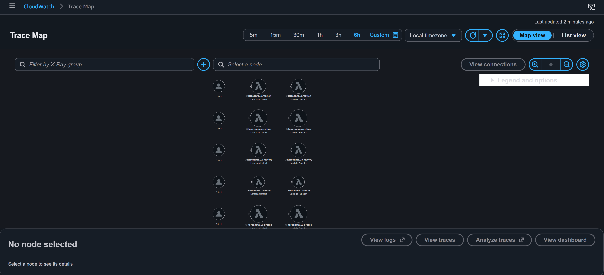

### 설명

X-Ray Trace Map을 통해 API 요청이 Lambda까지 전달되는 흐름을 확인했다.
이를 통해 단순 로그 확인을 넘어 요청 단위의 실행 경로와 지연 구간을 추적할 수 있는 관측성 구성을 검증했다.

---

## 13. SSM Parameter Store 구성 증거

### 목적

SSM Parameter Store 구성 증거는 Bedrock Model ID와 같은 환경별 설정값을 코드에서 분리했음을 보여준다.

Model ID를 코드에 직접 하드코딩하지 않고 SSM Parameter Store에 저장하면, 환경별 설정 변경이 쉬워지고 운영 환경에서 설정값을 더 안전하게 관리할 수 있다.

### 확인 항목

| 항목 | 설명 |
|---|---|
| Parameter Name | Bedrock Model ID 저장 경로 |
| Type | String 타입 사용 여부 |
| Value | 실제 Bedrock Model ID 저장 여부 |
| Tier | Standard Parameter 사용 여부 |
| Description | 파라미터 용도 설명 |
| Version | 파라미터 버전 관리 정보 |


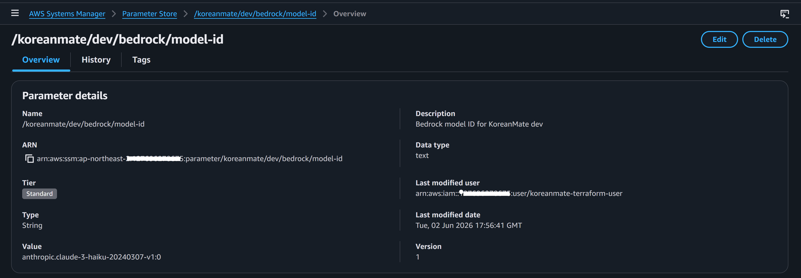

### 설명

Bedrock Model ID를 코드에 직접 작성하지 않고 SSM Parameter Store로 분리했다.
이를 통해 모델 변경 시 코드 수정 없이 설정값만 변경할 수 있으며, 환경별 설정 관리가 가능하도록 구성했다.

---

## 14. IAM Role 및 권한 분리 증거

### 목적

IAM Role 및 권한 분리 증거는 Lambda가 필요한 AWS 리소스에만 접근하도록 실행 역할과 정책을 분리했음을 보여준다.

Serverless 환경에서는 Lambda 함수가 DynamoDB, CloudWatch Logs, X-Ray, SSM Parameter Store, Bedrock 등 여러 AWS 서비스와 직접 통신하기 때문에, 실행 역할의 권한 범위를 제한하는 것이 중요하다.

### 확인 항목

| 항목 | 설명 |
|---|---|
| Lambda Execution Role | Lambda 함수 실행에 사용하는 IAM Role |
| CloudWatch Logs 권한 | Lambda 로그 그룹, 로그 스트림 생성 및 로그 기록 |
| DynamoDB 권한 | 학습 기록, 사용량 제한, 사용자 프로필 테이블에 대한 읽기/쓰기 |
| Bedrock 권한 | AI 모델 호출을 위한 `bedrock:InvokeModel` 권한 |
| Resource 제한 | DynamoDB 권한을 KoreanMate 관련 테이블 ARN으로 제한 |
| KMS 권한 | Lambda 환경 변수 암호화 및 복호화를 위한 KMS 권한 |

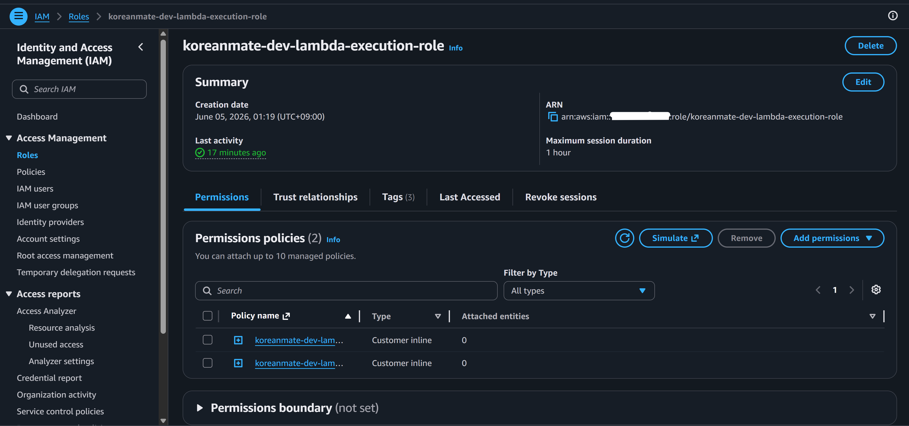

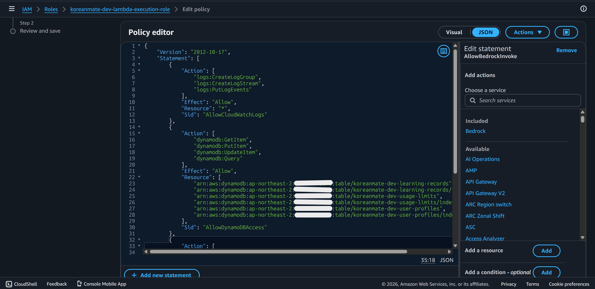

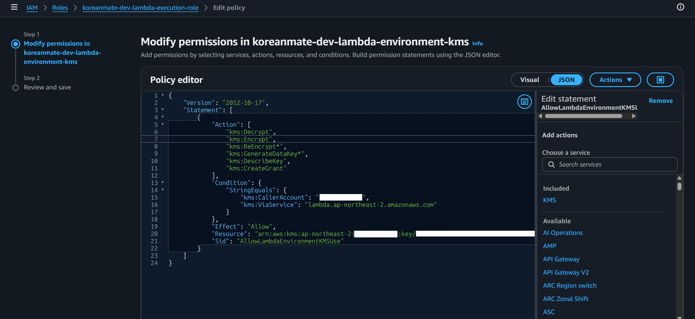

### 설명

Lambda 실행 역할을 별도로 구성하고, DynamoDB, CloudWatch Logs, X-Ray, SSM, Bedrock에 필요한 권한만 부여했다.
이를 통해 Serverless 애플리케이션에서 최소 권한 원칙을 고려한 IAM 설계를 적용했다.

