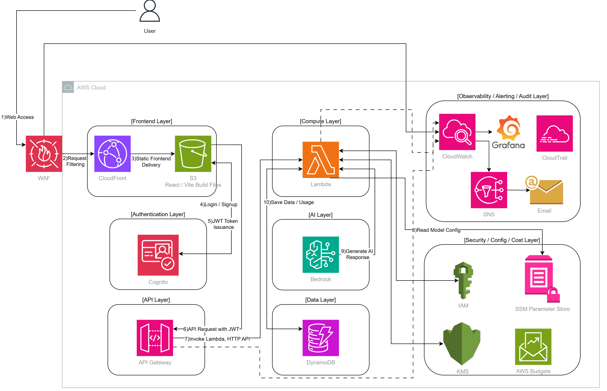

# KoreanMate Serverless Design

> 목적: KoreanMate Serverless 버전의 설계 의도, AWS 리소스 구성, 요청 처리 흐름, 보안/관측성/비용 최적화 전략을 면접과 포트폴리오 설명에 맞게 정리한다.  
> 기준 환경: AWS Seoul Region `ap-northeast-2`, `dev` 환경, Terraform 기반 IaC

---

## 1. Project Overview

KoreanMate는 한국어 학습자를 위한 AI 기반 학습 보조 서비스다. 사용자는 글쓰기 교정, 상황별 회화 생성, 레벨 테스트 기능을 사용할 수 있고, 결과는 학습 기록으로 저장된다.

이 프로젝트는 단순 기능 구현보다 **Serverless 기반 운영 설계**, **비용 제어**, **인증/보안**, **관측성**, **CI/CD 자동화**를 보여주는 것을 목표로 한다.

주요 기술 구성은 다음과 같다.

| 영역 | 기술 |
|---|---|
| Frontend | React, Vite |
| Hosting | S3, CloudFront |
| Auth | Amazon Cognito |
| API | API Gateway HTTP API |
| Compute | AWS Lambda |
| AI | Amazon Bedrock |
| Data | DynamoDB |
| Config | SSM Parameter Store |
| Security | IAM, KMS, WAF |
| Observability | CloudWatch, X-Ray, Grafana Cloud |
| Audit | CloudTrail |
| Cost | AWS Budgets, Usage Limit |
| IaC / CI/CD | Terraform, GitHub Actions |

---

## 2. Design Goals

이 프로젝트의 설계 목표는 다음과 같다.

| 목표 | 설계 반영 |
|---|---|
| 낮은 운영 부담 | 서버 관리가 필요 없는 Serverless 구조 선택 |
| 비용 최적화 | S3/CloudFront, Lambda, DynamoDB On-demand, 사용량 제한, Budgets 적용 |
| 인증 기반 사용자 분리 | Cognito JWT의 `sub` 값을 userId로 사용 |
| AI 호출 비용 제어 | Bedrock 호출 전 사용량 제한 확인 |
| 보안 강화 | WAF, JWT Authorizer, IAM, KMS, S3 OAC 적용 |
| 운영 가시성 확보 | CloudWatch Alarm, X-Ray, Grafana Cloud 구성 |
| 감사 추적 | CloudTrail로 AWS API 호출 이력 저장 |
| 안전한 배포 | GitHub Actions에서 CI와 Deploy Pipeline 분리 |

**왜 Serverless를 선택했는가?**

개인 포트폴리오 프로젝트에서는 상시 트래픽이 많지 않고, 서버 운영보다 아키텍처 설계와 자동화 역량을 보여주는 것이 중요하다. 그래서 EC2나 EKS보다 Lambda, API Gateway, DynamoDB, S3, CloudFront 중심의 Serverless 구조를 선택했다. 이 구조는 유휴 비용이 낮고, 인프라 운영 부담이 적으며, 필요한 만큼만 과금되는 구조라 현재 프로젝트 목적에 적합하다.

---

## 3. Architecture Overview



전체 아키텍처는 다음 계층으로 나뉜다.

| Layer | 구성 요소 | 역할 |
|---|---|---|
| Frontend Layer | S3, CloudFront | React/Vite 정적 파일 배포 |
| Authentication Layer | Cognito | 회원가입, 로그인, JWT 발급 |
| API Layer | API Gateway HTTP API | API 진입점, JWT 검증 |
| Compute Layer | Lambda | 기능별 백엔드 로직 실행 |
| AI Layer | Bedrock | 교정, 회화, 레벨 테스트 응답 생성 |
| Data Layer | DynamoDB | 학습 기록, 사용량, 프로필 저장 |
| Observability / Audit Layer | CloudWatch, X-Ray, Grafana, CloudTrail | 로그, 지표, 추적, 감사 |
| Security / Config / Cost Layer | IAM, KMS, SSM, Budgets, WAF | 권한, 암호화, 설정, 비용 제어 |

프론트엔드는 S3에 저장하고 CloudFront로 배포한다. S3는 직접 공개하지 않고 CloudFront OAC를 통해서만 접근하도록 설계했다. CloudFront 앞단에는 WAF를 연결하여 기본적인 요청 필터링과 Rate Limit을 적용한다.

백엔드는 API Gateway와 Lambda로 구성한다. API Gateway는 Cognito JWT Authorizer로 인증을 검증하고, Lambda는 JWT claims의 `sub` 값을 userId로 사용한다.

AI 응답 생성은 Amazon Bedrock을 사용한다. Bedrock Model ID는 Terraform에서 SSM Parameter Store로 관리하고, 배포 시 Lambda 환경변수로 전달한다.

---

## 4. User Flow


User Flow는 사용자가 KoreanMate에 접속한 뒤 어떤 화면을 거쳐 주요 기능을 사용하는지 보여준다. 이 흐름은 AWS 내부 처리 구조가 아니라, 사용자 관점의 화면 이동과 기능 접근 방식을 설명하기 위한 다이어그램이다.

기본 사용자 흐름은 다음과 같다.

1. 사용자는 Home Page에 접속한다.
2. 사용자는 Home Page에서 Login Page로 이동한다.
3. 기존 사용자는 Login Page에서 로그인 후 Dashboard로 이동한다.
4. 신규 사용자는 Signup Page에서 회원가입을 진행한다.
5. 회원가입 후 Confirm Signup Page에서 인증을 완료한다.
6. 인증 완료 후 다시 Login Page로 돌아와 로그인한다.
7. 비밀번호를 잊은 사용자는 Forgot Password Page와 Reset Password Page를 통해 비밀번호를 재설정한 뒤 Login Page로 돌아온다.
8. 로그인 성공 후 사용자는 Dashboard로 이동한다.
9. Dashboard는 학습 상태, 일일 AI 사용량, 최근 학습 기록을 확인하는 메인 허브 역할을 한다.
10. 사용자는 Dashboard 또는 Sidebar에서 Level Test, Correction, Conversation, History, Settings 기능으로 이동할 수 있다.
11. 사용자는 인증된 영역에서 Logout을 선택해 세션을 종료할 수 있다.

이 User Flow를 별도로 정의한 이유는 로그인 전 화면과 로그인 후 학습 기능 영역을 명확히 분리하기 위해서다. Home, Login, Signup, Forgot Password는 인증 전 흐름이고, Dashboard 이후의 Level Test, Correction, Conversation, History, Settings는 인증된 사용자만 접근하는 학습 기능 흐름이다.

Dashboard를 중심으로 기능을 분기한 이유는 사용자가 로그인 직후 자신의 학습 상태와 사용량을 확인하고, 필요한 학습 기능으로 바로 이동할 수 있도록 하기 위해서다.


---
## 5. Request Flow


기본 요청 흐름은 다음과 같다.

1. 사용자가 React Frontend에서 로그인한다.
2. Cognito가 JWT를 발급한다.
3. Frontend는 API 요청 시 JWT를 Authorization Header에 포함한다.
4. API Gateway JWT Authorizer가 토큰을 검증한다.
5. 검증된 요청만 Lambda로 전달된다.
6. Lambda Handler는 요청 Body를 파싱하고 입력값을 검증한다.
7. Lambda는 Cognito `sub` 값을 userId로 사용한다.
8. AI 기능 요청은 Bedrock 호출 전 사용량 제한을 확인한다.
9. 한도 내 요청만 Bedrock을 호출한다.
10. 결과와 사용량 데이터는 DynamoDB에 저장된다.
11. API 응답이 Frontend로 반환된다.
12. 사용자는 결과 화면에서 AI 응답을 확인한다.

주의할 점은, 현재 구현은 **Lambda가 요청마다 SSM Parameter Store를 읽는 구조가 아니다.** Bedrock Model ID는 Terraform에서 SSM Parameter Store로 관리하고, 배포 시 Lambda 환경변수 `BEDROCK_MODEL_ID`로 전달된다. 따라서 다이어그램의 “Read Model Config”는 “Model Config managed by SSM and provided to Lambda env” 정도로 바꾸는 것이 더 정확하다.

---

## 6. Authentication Design

사용자 인증은 Amazon Cognito User Pool을 사용한다.

| 항목 | 설계 |
|---|---|
| 로그인 식별자 | Email |
| Token | Access Token, ID Token, Refresh Token |
| API 인증 | API Gateway JWT Authorizer |
| 사용자 식별 | Cognito JWT claims의 `sub` |
| User Pool Client | SPA 사용을 위해 Client Secret 미사용 |

프론트엔드가 Cognito에서 받은 JWT를 API 요청에 포함하면, API Gateway가 JWT를 검증한다. Lambda는 클라이언트가 전달한 userId를 신뢰하지 않고, 검증된 JWT claims의 `sub` 값을 userId로 사용한다.

**왜 Cognito JWT Authorizer를 사용했는가?**

Lambda 내부에서 직접 토큰을 검증할 수도 있지만, 그렇게 하면 모든 Lambda에 인증 검증 로직이 중복된다. API Gateway JWT Authorizer를 사용하면 인증 검증을 API Gateway 계층에서 먼저 처리할 수 있고, Lambda는 검증된 요청만 받아 비즈니스 로직에 집중할 수 있다. 또한 클라이언트가 임의로 userId를 보내는 구조가 아니라 Cognito `sub`를 기준으로 데이터를 분리할 수 있어 사용자 데이터 격리에 유리하다.

---

## 7. API Processing Flow

백엔드는 기능 단위 Lambda로 분리한다.

| API | Method | Lambda | 역할 |
|---|---|---|---|
| `/correction` | POST | correction | 한국어 글쓰기 교정 |
| `/conversation` | POST | conversation | 상황별 회화 생성 |
| `/level-test` | POST | level-test | 한국어 레벨 테스트 |
| `/profile` | GET / PUT | profile | 사용자 프로필 조회/수정 |
| `/history` | GET | history | 학습 기록 조회 |
| `/usage` | GET | usage | 오늘 사용량 조회 |

Lambda 내부 흐름은 다음과 같다.

```text
Handler
  ↓
Request Parsing
  ↓
Validation
  ↓
Service Layer
  ↓
Usage Limit Check
  ↓
Bedrock Client
  ↓
Repository
  ↓
HTTP Response
```

Correction, Conversation, Level Test는 Bedrock 호출 전 사용량 제한을 먼저 확인한다. 한도를 초과한 요청은 Bedrock을 호출하지 않고 429 응답을 반환한다.

**왜 API Gateway + Lambda 구조를 사용했는가?**

KoreanMate의 API는 긴 시간 동안 지속 실행되는 서버가 필요하지 않다. 요청이 들어올 때만 실행되는 구조가 비용과 운영 측면에서 적합하다. API Gateway는 인증, CORS, 라우팅을 담당하고, Lambda는 기능별 로직을 실행한다. 이 방식은 서버 관리가 필요 없고, 기능별 Lambda 분리가 가능해 장애 범위와 배포 단위를 작게 가져갈 수 있다.

---

## 8. Data Design

DynamoDB는 세 개의 테이블로 분리한다.

| 테이블 | PK | SK | 역할 |
|---|---|---|---|
| LearningRecords | userId | recordId | 학습 기록 저장 |
| UsageLimits | userId | usageDate | 일일 사용량 제한 |
| UserProfiles | userId | 없음 | 사용자 프로필 저장 |

LearningRecords의 `recordId`는 생성 시각, 기능 타입, UUID를 조합하여 생성한다.

```text
{createdAt}#{type}#{uuid}
```

UsageLimits는 KST 기준 `usageDate`를 사용하고, TTL을 적용하여 오래된 사용량 데이터를 자동 삭제한다. 모든 DynamoDB 테이블은 `PAY_PER_REQUEST` 방식으로 구성하여 초기 트래픽 예측 없이 요청량 기반으로 과금되도록 설계했다.

**왜 DynamoDB에 userId 기반으로 저장했는가?**

주요 조회 패턴이 “내 학습 기록”, “내 오늘 사용량”, “내 프로필”이기 때문이다. Cognito `sub`를 userId로 사용하면 인증된 사용자 기준으로 데이터를 자연스럽게 분리할 수 있다. 또한 userId를 Partition Key로 사용하면 특정 사용자의 데이터 조회가 단순해지고, IAM과 애플리케이션 로직에서도 사용자 데이터 격리를 설명하기 쉽다.

**왜 사용량 제한을 직접 구현했는가?**

Bedrock은 호출량에 따라 비용이 발생한다. API Gateway Throttling이나 WAF Rate Limit은 요청량을 제어할 수 있지만, “사용자별 하루 교정 10회”, “레벨 테스트 5회” 같은 비즈니스 기준 사용량 제한은 직접 구현해야 한다. 그래서 UsageLimits 테이블에 사용자별, 날짜별 사용량을 저장하고 Bedrock 호출 전에 한도를 확인하도록 설계했다.

---

## 9. CI/CD Design


GitHub Actions는 CI Pipeline과 Deploy Pipeline으로 분리한다.

| Pipeline | Trigger | 역할 |
|---|---|---|
| CI Pipeline | Pull Request, 수동 실행 | Build, Validate, Security Scan |
| Deploy Pipeline | 수동 실행 | Build & Package, Terraform Deploy, Frontend Deploy, Cache Invalidation |

CI Pipeline은 백엔드 TypeScript 검증, 프론트엔드 빌드, Terraform validate, Trivy 보안 스캔을 수행한다.

Deploy Pipeline은 `workflow_dispatch`로만 실행되며, `plan-only`와 `apply`를 선택할 수 있다. `plan-only`는 Terraform Plan까지만 수행하고, `apply`는 Terraform Apply, S3 업로드, CloudFront 캐시 무효화까지 수행한다.

**왜 GitHub Actions에서 CI와 Deploy를 분리했는가?**

CI는 코드가 안전한지 검증하는 단계이고, Deploy는 실제 AWS 리소스를 변경하는 단계다. 두 단계를 합치면 PR 검증 과정에서 실수로 배포가 발생할 위험이 있다. 특히 Terraform Apply는 비용이 발생하는 리소스를 만들거나 바꿀 수 있으므로 수동 실행과 `plan-only/apply` 분리가 필요하다. 이 구조는 개인 포트폴리오 프로젝트에서도 안전한 배포 통제를 보여준다.

---

## 10. Security Design

보안 설계는 여러 계층으로 나누었다.

| 계층 | 구성 | 목적 |
|---|---|---|
| Edge Security | WAF | 일반 웹 공격 패턴, 과도한 요청 필터링 |
| Auth | Cognito | 사용자 인증 |
| API Authorization | JWT Authorizer | 인증된 요청만 Lambda 호출 |
| IAM | Lambda Execution Role | DynamoDB, Bedrock, X-Ray 접근 제어 |
| Encryption | KMS | Lambda 환경변수 암호화 |
| Storage Security | S3 Public Access Block, OAC | S3 직접 공개 차단 |
| Audit | CloudTrail | AWS API 호출 이력 기록 |

S3는 Public Access Block과 CloudFront OAC를 사용하여 직접 공개하지 않는다. Lambda 환경변수는 KMS Key로 암호화한다. IAM은 DynamoDB 테이블 ARN 기반 권한을 사용한다.

다만 현재 Bedrock 권한은 `Resource = "*"`로 되어 있어 운영 환경에서는 사용하는 Foundation Model ARN으로 제한하는 개선이 필요하다.

---

## 11. Observability and Audit Design

CloudWatch, X-Ray, Grafana Cloud, CloudTrail은 역할을 분리하여 사용한다.

| 도구 | 역할 |
|---|---|
| CloudWatch Logs | Lambda, API Gateway 로그 저장 |
| CloudWatch Alarms | Lambda Error, Duration, API Gateway 5XX 감지 |
| X-Ray | Lambda 호출 흐름 추적 |
| Grafana Cloud | CloudWatch 메트릭과 로그 시각화 |
| CloudTrail | AWS API 호출 이력 감사 |

**왜 CloudWatch / CloudTrail / Grafana를 분리해서 설계했는가?**

세 도구는 목적이 다르다. CloudWatch는 애플리케이션 로그와 메트릭, 알람을 담당한다. CloudTrail은 누가 어떤 AWS API를 호출했는지 감사 이력을 남긴다. Grafana는 CloudWatch 데이터를 대시보드로 시각화하기 위한 도구다. 즉, CloudWatch는 운영 감지, CloudTrail은 감사, Grafana는 시각화 역할로 분리했다.

CloudTrail은 Multi-region Trail, Global Service Events, Log File Validation, KMS 암호화, S3 Versioning을 적용하여 감사 로그의 신뢰성을 높인다.

---

## 12. Cost Optimization Design

비용 최적화는 인프라 선택과 애플리케이션 로직 양쪽에서 반영했다.

| 영역 | 비용 최적화 방식 |
|---|---|
| Frontend | S3 + CloudFront로 정적 호스팅 |
| Compute | Lambda로 요청 시에만 실행 |
| Data | DynamoDB PAY_PER_REQUEST |
| Usage Data | UsageLimits TTL 적용 |
| AI Cost | Bedrock 호출 전 사용량 제한 |
| Logs | CloudWatch Log Retention 14일 |
| Trail Logs | CloudTrail S3 Lifecycle 180일 |
| Budget | 월 $10 기준 Budgets 알림 |

**비용 최적화를 어떤 구조로 반영했는가?**

첫째, 상시 서버를 두지 않고 Serverless 구조로 유휴 비용을 줄였다. 둘째, DynamoDB는 On-demand 방식으로 초기 트래픽 예측 없이 시작했다. 셋째, AI 호출은 사용자별 일일 사용량 제한으로 제어한다. 넷째, 로그 보관 기간과 CloudTrail Lifecycle을 설정하여 장기 보관 비용을 줄였다. 마지막으로 AWS Budgets를 설정하여 실제 비용 80%, 100%, 예측 100% 기준으로 비용 초과를 감지하도록 했다.

---

## 13. Limitations and Future Improvements

현재 설계는 포트폴리오 `dev` 환경 기준으로 적절하지만, 운영 수준으로 확장하려면 다음 개선이 필요하다.

| 항목 | 현재 상태 | 개선 방향 |
|---|---|---|
| Bedrock IAM | `Resource = "*"` | Foundation Model ARN으로 제한 |
| CI/CD 인증 | AWS Access Key 방식 | GitHub OIDC 기반 AssumeRole |
| Deploy 변수 | 일부 하드코딩 | GitHub Variables 또는 Terraform Output 기반 자동화 |
| Alarm 알림 | CloudWatch Alarm 중심 | SNS, Slack, EventBridge 연동 |
| AI 응답 검증 | TypeScript 타입 단언 | Zod 기반 런타임 검증 |
| 데이터 정합성 | usage 증가와 record 저장 분리 | DynamoDB TransactWriteItems 검토 |
| History 조회 | 최근 20개 고정 | Pagination 추가 |
| 사용자 시간대 | KST 기준 사용량 | 사용자 timezone 기반 확장 |
| 환경 분리 | dev 중심 | prod 환경 분리 |

