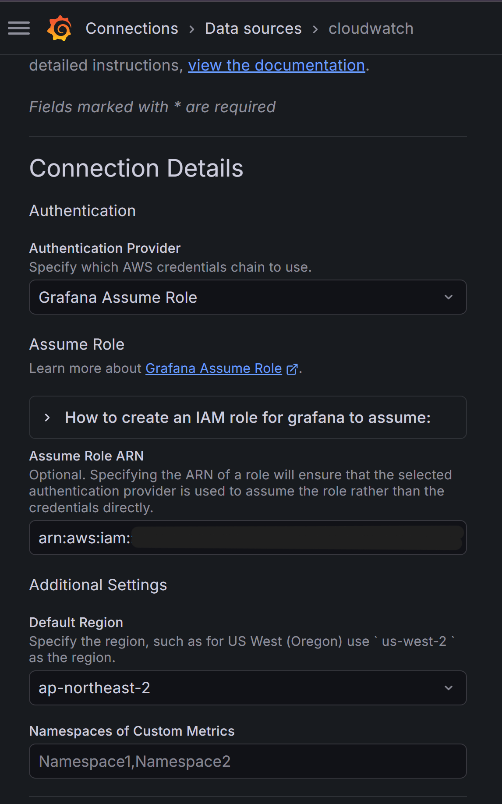

# KoreanMate Serverless - Troubleshooting Notes

> Documentation format: problem → attempted approaches → comparison → lessons learned

---

# 1. Existing AWS Resources Were Recreated During Terraform Apply in GitHub Actions

## Problem

When I ran the `Serverless Deploy` workflow in GitHub Actions with the `apply` option, Terraform attempted to create new AWS resources instead of recognizing the existing ones.


This caused `AlreadyExists`-type errors because resources such as SSM Parameter, DynamoDB tables, S3 buckets, Cognito resources, and WAF had already been created in AWS.

```text
ParameterAlreadyExists
ResourceAlreadyExistsException
BucketAlreadyOwnedByYou
EntityAlreadyExists
```


The root cause was that the GitHub Actions runner did not share the Terraform state file that I had been using locally. The resources existed in AWS, but they were not recorded in the Terraform state used by the GitHub Actions execution environment. As a result, Terraform treated them as new resources to create.

## Attempted Approaches

### Attempt 1. Run `terraform apply` directly from GitHub Actions

At first, I configured the workflow so that selecting `apply` through `workflow_dispatch` would run Terraform apply from GitHub Actions.

However, the GitHub Actions runner did not have access to the local `terraform.tfstate` file, so Terraform interpreted the existing infrastructure as resources that did not yet exist.

### Attempt 2. Temporarily block apply and keep plan-only execution

To prevent duplicate resource creation, I temporarily blocked apply execution and allowed only plan-only runs.

This was effective as a temporary safeguard, but it did not solve the underlying CI/CD automation problem.

### Attempt 3. Configure a Terraform remote backend

I concluded that the root cause was Terraform state isolation, so I separated `infra/bootstrap`.

```text
infra/bootstrap
→ S3 bucket for Terraform state storage
→ DynamoDB table for Terraform state locking
```

After that, I updated the serverless dev environment to use an S3 backend and DynamoDB locking.

```text
backend = S3
lock    = DynamoDB
region  = ap-northeast-2
```

I did not capture the initial migration screen, so I used the current successful remote backend initialization screen as evidence instead.


## Comparison

| Approach | Result | Decision |
|---|---|---|
| Run apply directly from GitHub Actions | Terraform attempted to recreate existing resources | Failed |
| Temporarily block apply | Prevented additional damage | Temporary mitigation |
| S3 remote backend + DynamoDB lock | Local environment and GitHub Actions used the same state | Final solution |

After configuring the remote backend, the `Serverless Deploy` workflow in GitHub Actions completed successfully.


## Lessons Learned

When connecting Terraform to CI/CD, sharing only the source code is not enough. Terraform state must also be shared through a common backend.

```text
Local state only
→ GitHub Actions cannot recognize existing resources
→ apply causes AlreadyExists errors

Remote backend configured
→ Local environment and GitHub Actions use the same state
→ plan/apply becomes stable
```

---

# 2. Removed the `dev-user-001` Fallback After Applying Cognito

## Problem

Even after applying Cognito authentication, some backend code still contained the development user ID fallback `dev-user-001`.


The fallback user ID was found in the following files:

```text
profile.ts
historyService.ts
usageLimitService.ts
```

Local usage checks also returned data based on `dev-user-001` instead of the actual Cognito user.

In this state, it would be difficult to explain the project as a system that properly isolates user data based on the Cognito `sub` claim.

## Attempted Approaches

### Attempt 1. Update only some Lambda handlers to use Cognito sub

I first updated Correction, Conversation, and Level Test so that they used the `sub` claim from the Cognito JWT as the `userId`.

However, parts of the History, Usage, and Profile flows still used the fallback user ID.

### Attempt 2. Search for `dev-user-001` in the production code path

I searched the codebase to check whether the development user ID remained in the production code path.

```bash
grep -R "dev-user-001" src scripts
```

The result confirmed that fallback logic still existed inside `src`.

### Attempt 3. Require userId as an explicit service argument

Before the fix, some service functions used the default user ID internally.

```text
Before: getUsageSummary()
After:  getUsageSummary(userId)
```

I made the same change for History.

```text
Before: getLearningHistory()
After:  getLearningHistory(userId)
```

### Attempt 4. Pass Cognito sub from the handler to the service layer

I updated the handler to extract the Cognito `sub` claim and pass it to the service layer. If no user ID was available, the handler returned `401 Unauthorized`.

```text
Cognito JWT sub
→ handler
→ service
→ repository
→ DynamoDB
```

## Comparison

| Item | Before | After |
|---|---|---|
| User identification | `dev-user-001` fallback | Cognito JWT `sub` |
| Authentication failure handling | Could continue with fallback user | Returns 401 Unauthorized |
| Usage lookup | Fixed development user | Actual logged-in user |
| History lookup | Fixed development user | Actual logged-in user |
| Portfolio explanation | Weak evidence for user isolation | Verifiable Cognito-based isolation |

## Verification Result

I verified the actual Cognito `sub` from the access token.

```bash
aws cognito-idp get-user --access-token "$TOKEN" --region ap-northeast-2
```


I checked the `UsageLimits` table using the actual Cognito `sub`.

```bash
aws dynamodb get-item --table-name koreanmate-dev-usage-limits ...
```


I also confirmed that `LearningRecords` were queried by the actual Cognito `sub`.

```bash
aws dynamodb query --table-name koreanmate-dev-learning-records ...
```


## Lessons Learned

Adding authentication and actually isolating data by authenticated user are different problems.

Even if API Gateway validates tokens using a Cognito Authorizer, user isolation is not actually applied if Lambda continues to use a development user ID internally.

The following points should be checked:

```text
1. Does the Lambda handler extract the Cognito sub?
2. Is userId explicitly passed to the service/repository layers?
3. Is there any fallback userId left in the production code path?
4. Is data stored and queried in DynamoDB using the actual Cognito sub?
```

---

# 3. CloudTrail KMS Warning Detected by Trivy IaC Scan

## Problem

After adding Trivy security scanning to GitHub Actions, HIGH severity warnings were detected for CloudTrail and S3 encryption.

```text
AWS-0015: CloudTrail does not use a customer managed key
AWS-0132: Bucket does not encrypt data with a customer managed key
```

At first, I thought there was no issue because the S3 buckets already used SSE-S3 encryption.

However, based on the Trivy rule, CloudTrail log protection required a customer managed KMS key.

## Attempted Approaches

### Attempt 1. Add Trivy IaC scan to CI

I first configured CI so that the workflow would fail when HIGH or CRITICAL issues were detected.

As a result, CloudTrail and S3 bucket encryption issues were reported.

### Attempt 2. Review applying KMS CMK to every S3 bucket

I initially considered applying KMS Customer Managed Keys to all S3 buckets.

However, this introduced several concerns.

```text
Increased KMS key cost
Additional key policy management
Additional IAM permissions for GitHub Actions
Potential Terraform state backend permission issues
```

In particular, changing the Terraform state bucket to use CMK could cause GitHub Actions to lose access to the state unless KMS permissions were configured correctly.

### Attempt 3. Apply KMS CMK to CloudTrail first

I decided to apply a Customer Managed KMS Key first to the CloudTrail logs bucket because audit logs have the highest security value.

```text
CloudTrail logs bucket
→ SSE-KMS
→ Customer Managed KMS Key
→ key rotation enabled
```

## Comparison

| Target | KMS CMK Applied | Decision |
|---|---|---|
| CloudTrail logs bucket | Yes | Clear purpose for protecting audit logs |
| Terraform state bucket | No | Higher permission complexity and CI/CD risk |
| Frontend S3 bucket | No | Static build files; SSE-S3 remains sufficient |
| All S3 buckets | Deferred | Lower benefit compared to cost and complexity |

## Verification Result

I checked whether the KMS key was attached to CloudTrail.

```bash
aws cloudtrail describe-trails --trail-name-list koreanmate-dev-cloudtrail --region ap-northeast-2
```


I also verified the S3 bucket encryption configuration.

```bash
aws s3api get-bucket-encryption --bucket koreanmate-dev-cloudtrail-127696278675
```


After that, the Trivy Security Scan completed successfully.


## Lessons Learned

SSE-S3 and SSE-KMS both provide encryption, but they are different from an operational security perspective.

```text
SSE-S3
→ AWS-managed S3 encryption
→ Simple and low operational cost

SSE-KMS with Customer Managed Key
→ Key policy, rotation, auditability, and access control
→ Higher level of security control
```

I also learned that not every security scan finding should be fixed blindly. A more realistic approach is to prioritize based on the importance of the target resource, cost, and operational complexity.

---

# 4. CloudWatch Logs Permission Error During Grafana Cloud Integration

## Problem

When I added a CloudWatch datasource in Grafana Cloud and ran `Save & test`, the Metrics API succeeded, but the Logs API failed.

I did not capture the original error screen, so I documented the actual error message as text.

```text
Successfully queried the CloudWatch metrics API.
CloudWatch logs query failed:
AccessDeniedException:
is not authorized to perform: logs:DescribeLogGroups
```

This happened because Grafana Cloud could successfully assume the AWS IAM Role, but that role did not have permission to read CloudWatch Logs.

## Attempted Approaches

### Attempt 1. Create a metrics-only IAM Role with minimum permissions

At first, the goal was to build a CloudWatch Metrics dashboard, so I granted only metrics-related permissions.

```text
cloudwatch:GetMetricData
cloudwatch:GetMetricStatistics
cloudwatch:ListMetrics
cloudwatch:DescribeAlarms
```

With this configuration, the CloudWatch Metrics API test succeeded in Grafana Cloud.

However, Grafana's `Save & test` also checked the Logs API, so the test failed due to missing Logs permissions.

### Attempt 2. Add read permissions for CloudWatch Logs

I added read-only CloudWatch Logs permissions so that the Grafana CloudWatch datasource could also query logs.

```text
logs:DescribeLogGroups
logs:DescribeLogStreams
logs:FilterLogEvents
logs:StartQuery
logs:GetQueryResults
logs:GetLogEvents
```

After applying the change, I checked the actual IAM Role policy.

```bash
aws iam get-role-policy --role-name koreanmate-dev-grafana-cloudwatch-readonly-role --policy-name koreanmate-dev-grafana-cloudwatch-readonly-policy
```


I confirmed that `logs:DescribeLogGroups` was included in the policy.

### Attempt 3. Refresh the page and retest

Although the IAM policy had already been updated, Grafana continued to show the same error for a while.

After refreshing the datasource page and running `Save & test` again, the test succeeded.


Therefore, I concluded that the problem was not with the Terraform code itself, but likely with IAM propagation delay or Grafana Cloud-side session caching.

## Comparison

| Attempt | Result | Decision |
|---|---|---|
| Metrics permissions only | Metrics API succeeded, Logs API failed | Dashboard was partially possible, but Save & test failed |
| Add Logs read permissions | IAM policy reflected the required permissions | Correct direction |
| Refresh and retest | Metrics and Logs both succeeded | Final solution |

## Final Configuration

Grafana Cloud was connected using AssumeRole + External ID instead of storing AWS access keys directly.



```text
Grafana Cloud
→ AssumeRole
→ AWS IAM Role
→ CloudWatch Metrics / Logs read access
```

Finally, both the CloudWatch Metrics and Logs API tests succeeded, and I was able to view Lambda and API Gateway metrics in the Grafana dashboard.


## Lessons Learned

When integrating an external SaaS with AWS, AssumeRole + External ID is more appropriate than storing long-term access keys.

When a permission issue occurs, the following order is useful for troubleshooting:

```text
1. Did AssumeRole itself succeed?
2. Did the Metrics API succeed?
3. Which specific API action failed?
4. Does the IAM Role policy include that action?
5. Could IAM propagation delay or SaaS-side session caching be involved?
```

In this case, the Metrics API succeeded, so the trust policy and External ID were likely correct. The remaining issue was Logs permissions and session propagation.

---

# Summary

During this project, I resolved several operational issues: GitHub Actions apply failures caused by missing Terraform remote state, remaining development user ID fallback after applying Cognito, CloudTrail KMS findings detected by Trivy IaC scanning, and missing CloudWatch Logs permissions during Grafana Cloud integration. These were not just simple bug fixes. They were documented from an operational perspective: state management, authenticated user data isolation, security scan-driven infrastructure improvement, and external observability SaaS integration.

