# KoreanMate Serverless Portfolio - Troubleshooting Notes

> 작성 기준: 문제 → 시도했던 방법들 → 비교 → 알게 된 점  
> 코드/설정은 핵심 원인을 설명하는 최소 수준만 포함한다.  
> 이미지 경로 기준: `docs/troubleshooting.md` 파일과 같은 `docs/` 폴더 안에 `images/troubleshooting/` 폴더를 둔다고 가정한다.

---

## 캡처 파일명 정리

| 구분 | 저장할 파일명 | 사용 위치 |
|---|---|---|
| GitHub Actions apply 실패 로그 | `github-actions-apply-failed.png` | 1번 `## 문제` |
| GitHub Actions 실패 요약 | `github-actions-apply-failure-summary.png` | 1번 `## 문제` |
| GitHub Actions deploy 성공 목록 | `github-actions-deploy-success.png` | 1번 `## 비교` |
| Terraform init 성공 | `terraform-remote-backend-init.png` | 1번 `시도 3` |
| VS Code dev-user 검색 결과 | `dev-user-search-result.png` | 2번 `## 문제` |
| Cognito get-user sub 확인 | `cognito-get-user-sub.png` | 2번 `## 검증 결과` |
| DynamoDB UsageLimits 조회 | `dynamodb-usage-limits-cognito-sub.png` | 2번 `## 검증 결과` |
| DynamoDB LearningRecords 조회 | `dynamodb-learning-records-cognito-sub.png` | 2번 `## 검증 결과` |
| CloudTrail KMS Key 확인 | `cloudtrail-kms-key-id.png` | 3번 `## 검증 결과` |
| CloudTrail bucket SSE-KMS 확인 | `cloudtrail-bucket-sse-kms.png` | 3번 `## 검증 결과` |
| Trivy Security Scan 성공 | `trivy-security-scan-success.png` | 3번 `## 검증 결과` |
| Grafana datasource 설정 화면 | `grafana-cloudwatch-datasource-settings.png` | 4번 `## 최종 구성` |
| Grafana IAM policy Logs 권한 CLI | `grafana-iam-policy-logs-read.png` | 4번 `시도 2` |
| Grafana Save & test 성공 | `grafana-save-and-test-success.png` | 4번 `시도 3` |
| Grafana Dashboard 전체 화면 1 | `grafana-dashboard-overview-1.png` | 4번 `## 최종 구성` |
| Grafana Dashboard 전체 화면 2 | `grafana-dashboard-overview-2.png` | 4번 `## 최종 구성` |

---

# 1. GitHub Actions Terraform apply 중 기존 리소스 재생성 문제

## 문제

GitHub Actions에서 `Serverless Deploy` workflow를 `apply`로 실행했을 때 Terraform이 기존 AWS 리소스를 인식하지 못하고 새로 생성하려고 했다.

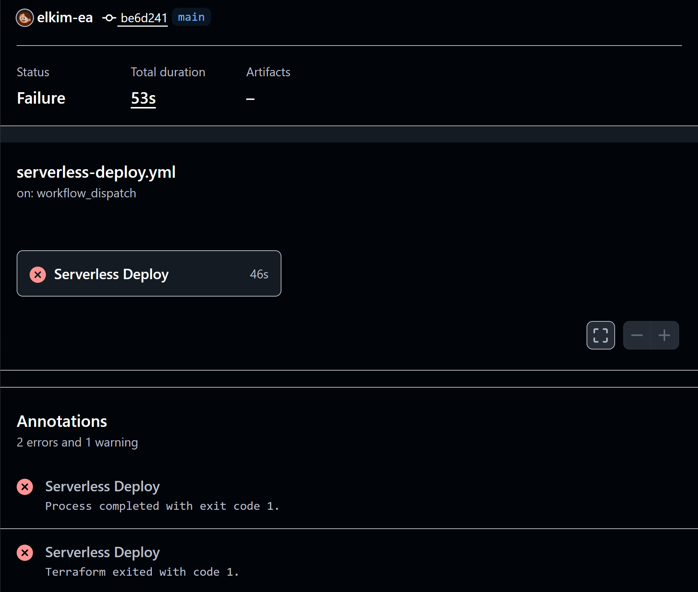

대표적으로 SSM Parameter, DynamoDB, S3, Cognito, WAF 등 이미 생성되어 있던 리소스를 다시 생성하려고 하면서 `AlreadyExists` 계열 오류가 발생했다.

```text
ParameterAlreadyExists
ResourceAlreadyExistsException
BucketAlreadyOwnedByYou
EntityAlreadyExists
```

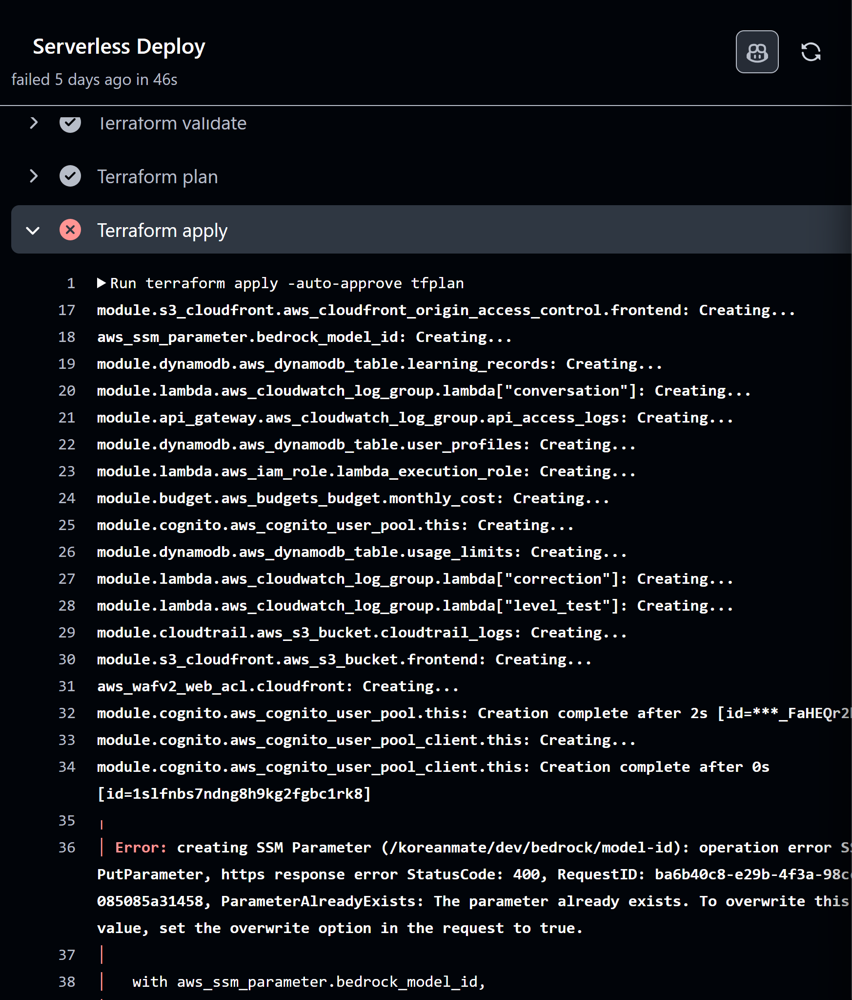

핵심 원인은 GitHub Actions runner가 로컬에서 사용하던 Terraform state를 공유하지 못했다는 점이었다. 실제 AWS에는 리소스가 있었지만, GitHub Actions의 Terraform 실행 환경에서는 해당 리소스가 state에 없었기 때문에 새로 만들려고 했다.

## 시도했던 방법들

### 시도 1. GitHub Actions에서 `terraform apply` 직접 실행

처음에는 workflow_dispatch 입력값으로 `apply`를 선택하면 GitHub Actions에서 Terraform apply가 실행되도록 구성했다.  
하지만 GitHub Actions runner에는 로컬 `terraform.tfstate`가 없었기 때문에 기존 인프라를 새 리소스로 판단했다.

### 시도 2. apply를 임시 중단하고 plan-only만 유지

리소스 중복 생성 위험이 있어 `apply` 실행을 임시로 막고 `plan-only`만 허용했다.  
이 방식은 추가 피해를 막는 데는 효과적이었지만, CI/CD 배포 자동화의 근본 해결책은 아니었다.

### 시도 3. Terraform remote backend 구성

근본 원인이 state 공유 문제라고 판단하고 `infra/bootstrap`을 분리했다.

```text
infra/bootstrap
→ Terraform state 저장용 S3 bucket
→ Terraform lock용 DynamoDB table
```

이후 serverless dev 환경에서 S3 backend와 DynamoDB lock을 사용하도록 변경했다.

```text
backend = S3
lock    = DynamoDB
region  = ap-northeast-2
```

최초 migration 당시 화면은 남기지 못했기 때문에, 현재 remote backend 초기화가 정상 동작하는 화면으로 대체했다.

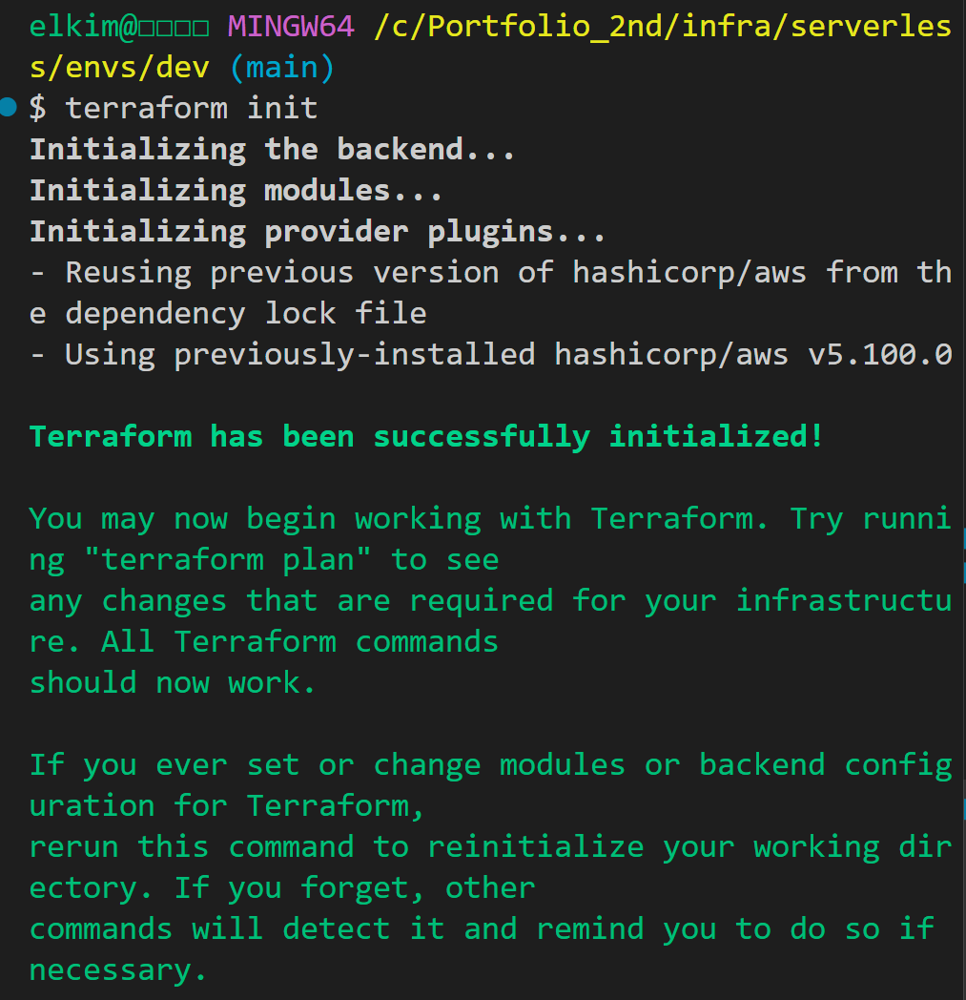

## 비교

| 방식 | 결과 | 판단 |
|---|---|---|
| GitHub Actions에서 바로 apply | 기존 리소스를 새로 만들려고 함 | 실패 |
| apply 임시 중단 | 추가 피해 방지 | 임시 조치 |
| S3 remote backend + DynamoDB lock | 로컬과 GitHub Actions가 같은 state 참조 | 최종 해결 |

remote backend 구성 후 GitHub Actions에서 `Serverless Deploy`가 정상적으로 성공했다.

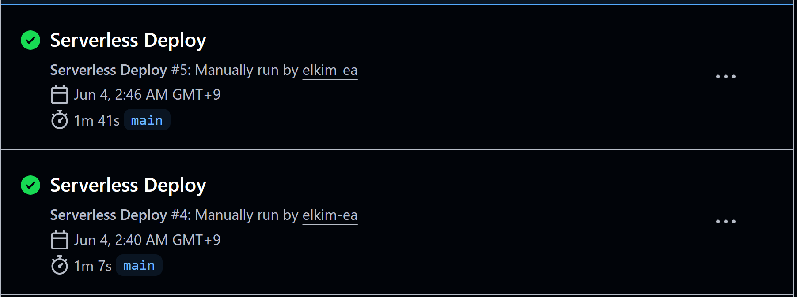

## 알게 된 점

Terraform을 CI/CD에 연결할 때는 코드만 공유하는 것으로 충분하지 않다. Terraform state도 동일한 backend에서 공유되어야 한다.

```text
로컬 state만 존재
→ GitHub Actions는 기존 리소스를 모름
→ apply 시 AlreadyExists 오류 발생

remote backend 구성
→ 로컬과 GitHub Actions가 같은 state 사용
→ plan/apply 안정화
```

---

# 2. Cognito 적용 후 `dev-user-001` fallback 제거

## 문제

Cognito 인증을 적용한 뒤에도 일부 backend 코드에서 개발용 사용자 ID인 `dev-user-001`이 남아 있었다.

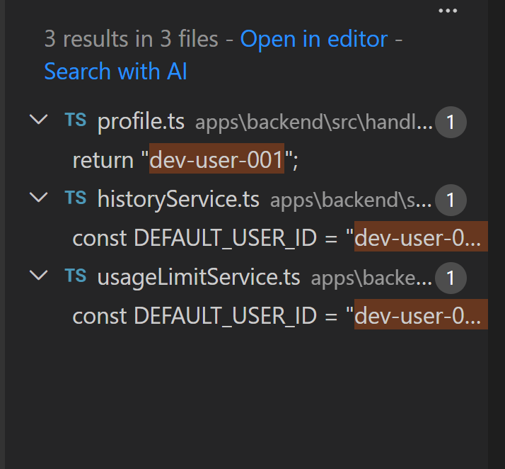

검색 결과 다음 파일들에서 개발용 userId fallback이 발견되었다.

```text
profile.ts
historyService.ts
usageLimitService.ts
```

로컬 usage 확인 결과도 실제 Cognito 사용자가 아니라 `dev-user-001` 기준으로 조회되었다.  
이 상태라면 “Cognito sub 기반 사용자 격리”를 포트폴리오에서 설명하기 어렵다.

## 시도했던 방법들

### 시도 1. 일부 Lambda만 Cognito sub로 변경

Correction, Conversation, Level Test에서는 Cognito JWT claim의 `sub`를 userId로 사용하도록 변경했다.  
하지만 History, Usage, Profile 일부 흐름에는 여전히 fallback userId가 남아 있었다.

### 시도 2. 운영 코드에서 `dev-user-001` 검색

운영 코드에 개발용 userId가 남아 있는지 검색했다.

```bash
grep -R "dev-user-001" src scripts
```

검색 결과 `src` 내부에 fallback이 남아 있는 것을 확인했다.

### 시도 3. service 함수에서 userId를 필수 인자로 변경

수정 전에는 service 내부에서 기본 userId를 사용했다.

```text
수정 전: getUsageSummary()
수정 후: getUsageSummary(userId)
```

History도 동일하게 변경했다.

```text
수정 전: getLearningHistory()
수정 후: getLearningHistory(userId)
```

### 시도 4. handler에서 Cognito sub를 service로 전달

handler에서 Cognito sub를 추출하고, userId가 없으면 401을 반환하도록 변경했다.

```text
Cognito JWT sub
→ handler
→ service
→ repository
→ DynamoDB
```

## 비교

| 항목 | 이전 방식 | 개선 후 |
|---|---|---|
| 사용자 식별 | `dev-user-001` fallback | Cognito JWT `sub` |
| 인증 실패 처리 | fallback 사용자로 진행 가능 | 401 Unauthorized |
| Usage 조회 | 고정 사용자 기준 | 실제 로그인 사용자 기준 |
| History 조회 | 고정 사용자 기준 | 실제 로그인 사용자 기준 |
| 포트폴리오 설명 | 사용자 격리 근거 약함 | Cognito 기반 격리 검증 가능 |

## 검증 결과

Cognito access token에서 실제 sub를 확인했다.

```bash
aws cognito-idp get-user --access-token "$TOKEN" --region ap-northeast-2
```

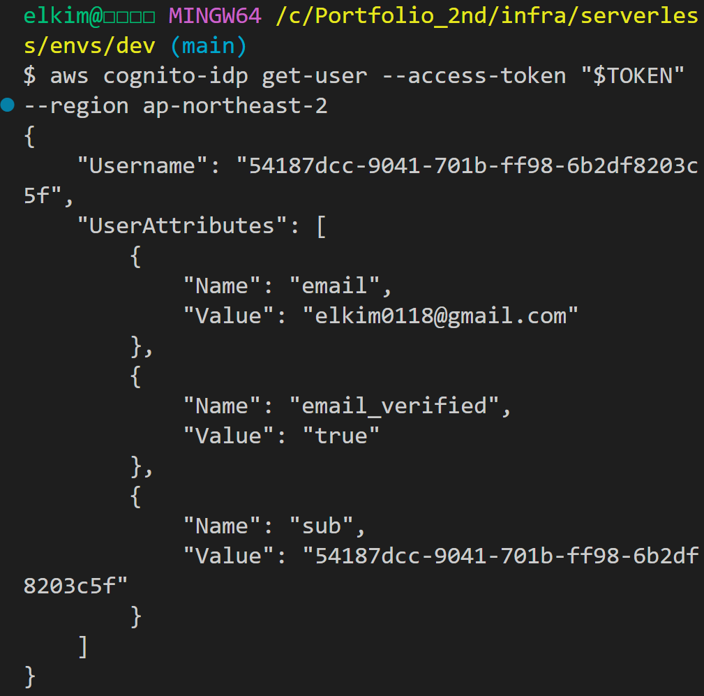

UsageLimits를 실제 Cognito sub 기준으로 조회했다.

```bash
aws dynamodb get-item --table-name koreanmate-dev-usage-limits ...
```

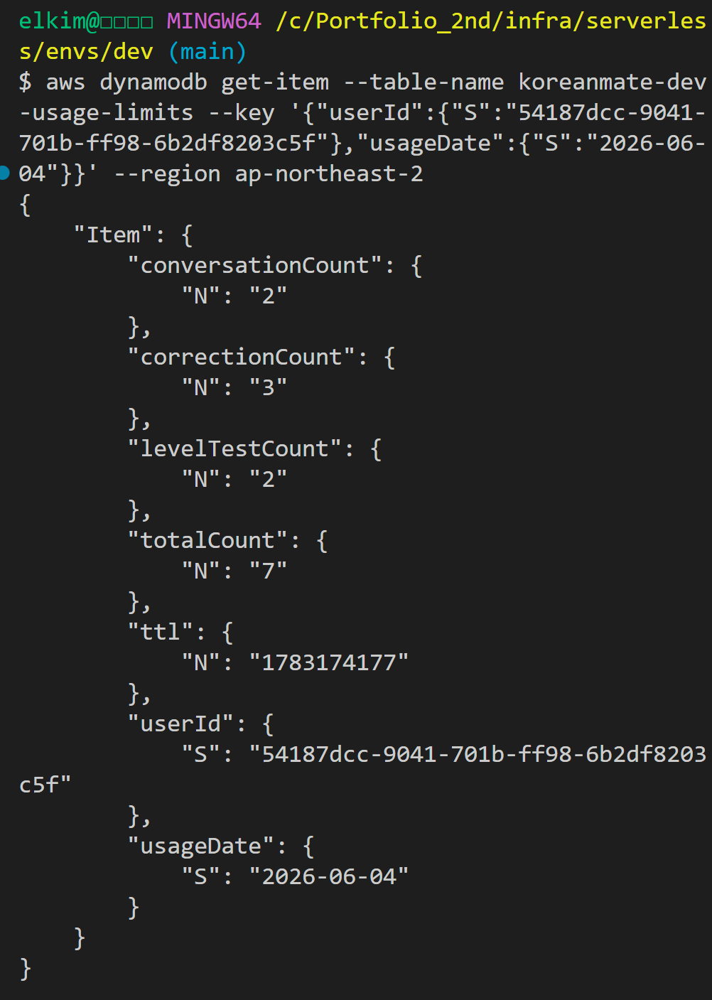

LearningRecords도 실제 Cognito sub 기준으로 조회되었다.

```bash
aws dynamodb query --table-name koreanmate-dev-learning-records ...
```

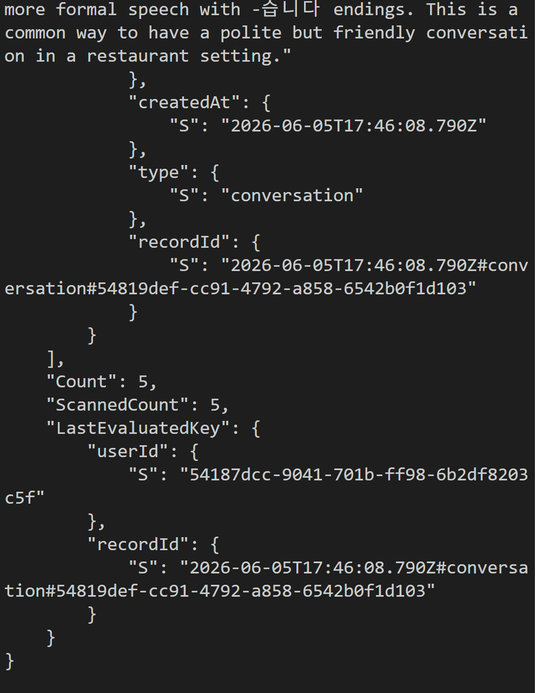

## 알게 된 점

인증 기능을 붙이는 것과 인증 기반으로 데이터가 분리되는 것은 다른 문제다.

Cognito Authorizer가 API Gateway에서 토큰을 검증하더라도, Lambda 내부에서 계속 개발용 userId를 사용하면 사용자 격리는 실제로 적용되지 않는다.

확인해야 할 기준은 다음과 같다.

```text
1. Lambda handler가 Cognito sub를 추출하는가
2. service/repository에 userId가 명시적으로 전달되는가
3. fallback userId가 운영 코드에 남아 있지 않은가
4. DynamoDB에 실제 Cognito sub 기준으로 저장되는가
```

---

# 3. Trivy IaC Scan에서 CloudTrail KMS 경고 탐지

## 문제

GitHub Actions에 Trivy 보안 스캔을 추가했더니 CloudTrail과 S3 암호화 관련 HIGH 경고가 발생했다.

```text
AWS-0015: CloudTrail does not use a customer managed key
AWS-0132: Bucket does not encrypt data with a customer managed key
```

처음에는 S3 bucket에 SSE-S3 암호화가 적용되어 있었기 때문에 문제가 없다고 생각했다.  
하지만 Trivy 기준에서는 CloudTrail 로그 보호에 Customer Managed KMS Key 적용을 요구했다.

## 시도했던 방법들

### 시도 1. Trivy IaC scan을 CI에 추가

처음에는 HIGH/CRITICAL 이슈가 나오면 CI를 실패시키도록 설정했다.  
그 결과 CloudTrail과 S3 bucket encryption 관련 이슈가 탐지되었다.

### 시도 2. 모든 S3 bucket에 KMS CMK 적용 검토

처음에는 모든 S3 bucket에 KMS CMK 적용을 검토했다.  
하지만 다음 문제가 있었다.

```text
KMS key 비용 증가
key policy 관리 필요
GitHub Actions IAM 권한 추가 필요
Terraform state backend 권한 문제 가능성
```

특히 Terraform state bucket까지 CMK로 바꾸면 GitHub Actions가 state를 읽지 못하는 문제가 생길 수 있다고 판단했다.

### 시도 3. CloudTrail만 우선 KMS CMK 적용

감사 로그 보안 가치가 가장 큰 CloudTrail 로그 bucket에 우선적으로 Customer Managed KMS Key를 적용했다.

```text
CloudTrail logs bucket
→ SSE-KMS
→ Customer Managed KMS Key
→ key rotation enabled
```

## 비교

| 대상 | KMS CMK 적용 여부 | 판단 |
|---|---|---|
| CloudTrail logs bucket | 적용 | 감사 로그 보호 목적이 명확 |
| Terraform state bucket | 미적용 | 권한 복잡도와 CI/CD 위험 증가 |
| Frontend S3 bucket | 미적용 | 정적 빌드 파일 중심, SSE-S3 유지 |
| 전체 S3 일괄 적용 | 보류 | 비용/복잡도 대비 효과 낮음 |

## 검증 결과

CloudTrail에 KMS key가 연결되었는지 확인했다.

```bash
aws cloudtrail describe-trails --trail-name-list koreanmate-dev-cloudtrail --region ap-northeast-2
```

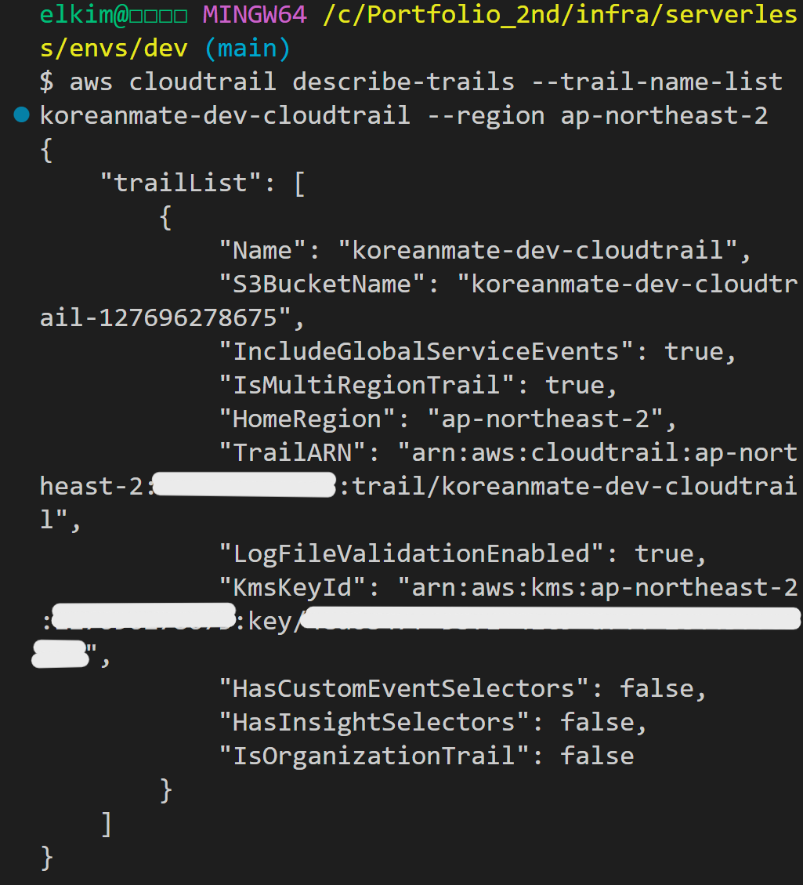

S3 bucket encryption도 확인했다.

```bash
aws s3api get-bucket-encryption --bucket koreanmate-dev-cloudtrail-127696278675
```

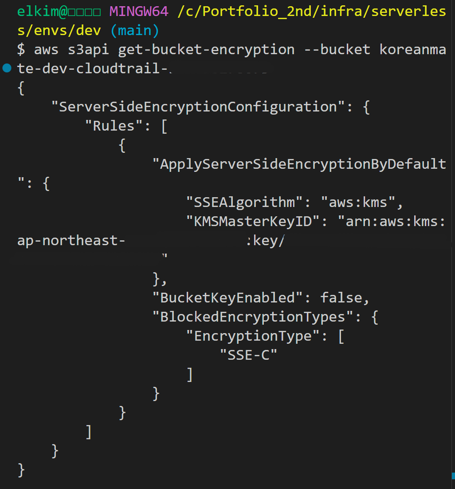

이후 Trivy Security Scan이 성공했다.

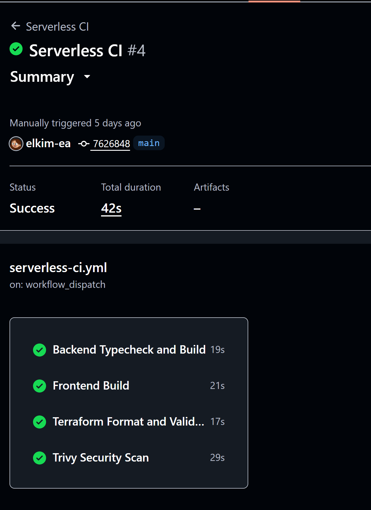

## 알게 된 점

SSE-S3와 SSE-KMS는 둘 다 암호화지만 운영 보안 관점에서는 수준이 다르다.

```text
SSE-S3
→ AWS 관리형 S3 암호화
→ 간단하고 비용 부담 낮음

SSE-KMS with Customer Managed Key
→ 키 정책, 회전, 감사, 접근 제어 가능
→ 보안 통제 수준 높음
```

또한 보안 스캔 결과를 무조건 전부 해결하는 것보다, 대상의 중요도와 비용/운영 복잡도를 비교해 우선순위를 정하는 것이 더 현실적이라는 점을 확인했다.

---

# 4. Grafana Cloud와 CloudWatch 연동 중 Logs 권한 오류

## 문제

Grafana Cloud에서 CloudWatch datasource를 추가하고 `Save & test`를 실행했을 때 Metrics API는 성공했지만 Logs API가 실패했다.

당시 오류 화면 캡처는 남기지 못했기 때문에, 실제 오류 메시지를 텍스트로 기록했다.

```text
Successfully queried the CloudWatch metrics API.
CloudWatch logs query failed:
AccessDeniedException:
is not authorized to perform: logs:DescribeLogGroups
```

이 문제는 Grafana Cloud가 AWS IAM Role을 Assume하는 것 자체는 성공했지만, 해당 Role에 CloudWatch Logs 조회 권한이 없어서 발생했다.

## 시도했던 방법들

### 시도 1. Metrics 전용 최소 권한 Role 생성

처음에는 CloudWatch Metrics dashboard 구성이 목적이었기 때문에 Metrics 관련 권한만 부여했다.

```text
cloudwatch:GetMetricData
cloudwatch:GetMetricStatistics
cloudwatch:ListMetrics
cloudwatch:DescribeAlarms
```

이 상태에서 Grafana Cloud의 CloudWatch Metrics API 테스트는 성공했다.  
하지만 Grafana의 Save & test는 Logs API도 함께 확인했고, Logs 권한 부족으로 실패했다.

### 시도 2. CloudWatch Logs 읽기 권한 추가

Grafana CloudWatch datasource가 Logs도 조회할 수 있도록 읽기 전용 권한을 추가했다.

```text
logs:DescribeLogGroups
logs:DescribeLogStreams
logs:FilterLogEvents
logs:StartQuery
logs:GetQueryResults
logs:GetLogEvents
```

적용 후 실제 IAM Role policy를 확인했다.

```bash
aws iam get-role-policy --role-name koreanmate-dev-grafana-cloudwatch-readonly-role --policy-name koreanmate-dev-grafana-cloudwatch-readonly-policy
```

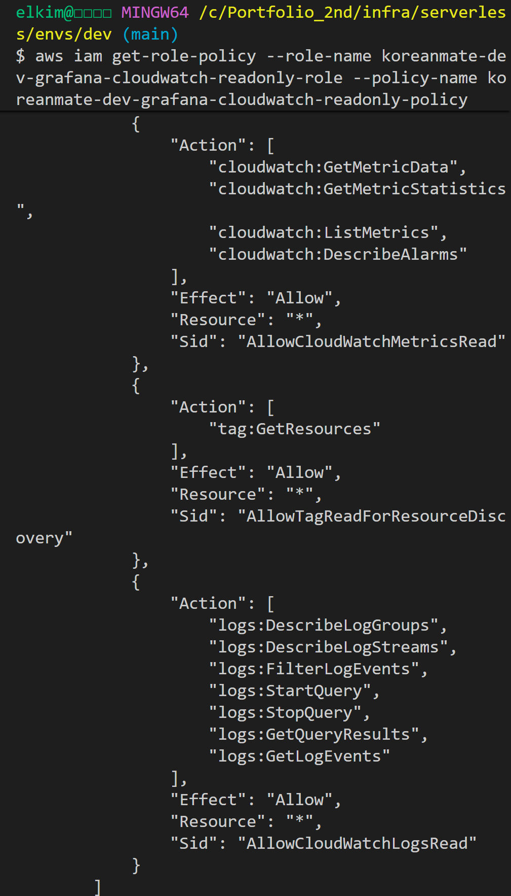

정책 안에 `logs:DescribeLogGroups`가 있는 것을 확인했다.

### 시도 3. 새로고침 후 재테스트

IAM policy에는 권한이 반영되어 있었지만 Grafana에서는 한동안 같은 오류가 계속 보였다.  
이후 datasource 페이지를 새로고침하고 다시 `Save & test`를 실행하자 성공했다.

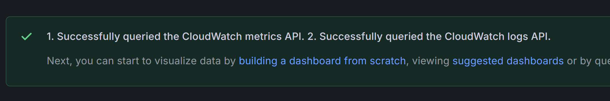

즉, 원인은 Terraform 코드 문제가 아니라 IAM 정책 반영 지연 또는 Grafana Cloud 쪽 세션 캐시로 판단했다.

## 비교

| 시도 | 결과 | 판단 |
|---|---|---|
| Metrics 권한만 부여 | Metrics API 성공, Logs API 실패 | 대시보드 일부는 가능하지만 Save & test 실패 |
| Logs read 권한 추가 | IAM policy에는 반영됨 | 방향은 맞음 |
| 페이지 새로고침 후 재테스트 | Metrics/Logs 모두 성공 | 최종 해결 |

## 최종 구성

Grafana Cloud는 AWS Access Key를 직접 저장하지 않고 AssumeRole + External ID 방식으로 연결했다.


```text
Grafana Cloud
→ AssumeRole
→ AWS IAM Role
→ CloudWatch Metrics / Logs 조회
```

최종적으로 CloudWatch Metrics와 Logs API 테스트가 성공했고, Lambda/API Gateway 지표를 Grafana Dashboard에서 확인할 수 있었다.

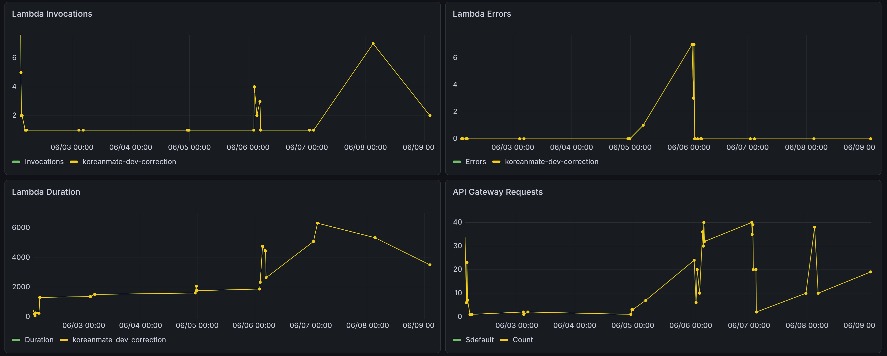

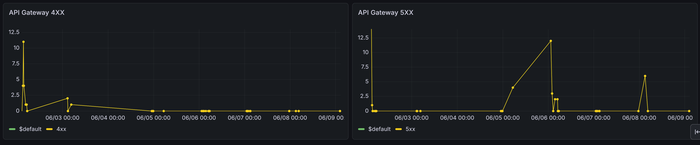

## 알게 된 점

외부 SaaS와 AWS를 연동할 때는 Access Key 방식보다 AssumeRole + External ID 방식이 더 적절하다.

또한 권한 문제가 발생했을 때는 다음 순서로 확인해야 한다.

```text
1. AssumeRole 자체가 성공했는가
2. Metrics API는 성공하는가
3. 실패한 API Action이 무엇인가
4. 실제 IAM Role policy에 해당 Action이 있는가
5. IAM 전파 지연 또는 SaaS 세션 캐시 가능성이 있는가
```

이번 문제에서는 Metrics API가 성공했기 때문에 trust policy와 External ID는 맞다고 판단할 수 있었다. 남은 문제는 Logs 권한과 세션 반영이었다.

---

# 최종 운영 테스트 결과 요약

| 항목 | 결과 |
|---|---|
| CloudFront frontend access | 성공 |
| Cognito Access Token 발급 | 성공 |
| Correction API 호출 | 성공 |
| Conversation API 호출 | 성공 |
| Level Test API 호출 | 성공 |
| UsageLimits 증가 확인 | 성공 |
| LearningRecords 저장 확인 | 성공 |
| Grafana Cloud datasource 연결 | 성공 |
| Grafana Dashboard metrics 반영 | 성공 |

---

# README에 넣을 요약 문장

```text
프로젝트 진행 중 Terraform remote state 부재로 인한 GitHub Actions apply 실패, Cognito 적용 후 남아 있던 개발용 userId fallback, Trivy IaC scan에서 탐지된 CloudTrail KMS 미적용 이슈, Grafana Cloud 연동 중 CloudWatch Logs 권한 부족 문제를 해결했다. 각 문제는 단순 오류 수정이 아니라 운영 환경 기준의 state 관리, 사용자 데이터 격리, 보안 스캔 기반 인프라 개선, 외부 Observability SaaS 연동이라는 관점에서 정리했다.
```
