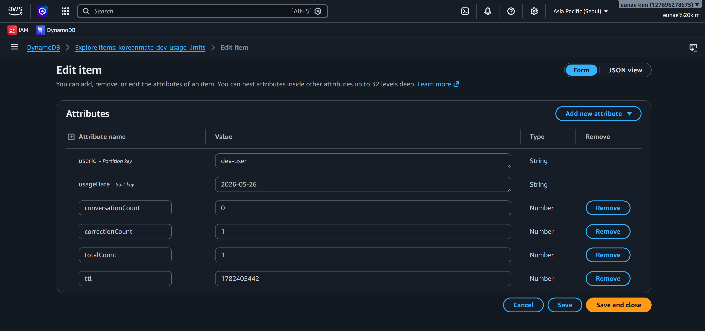
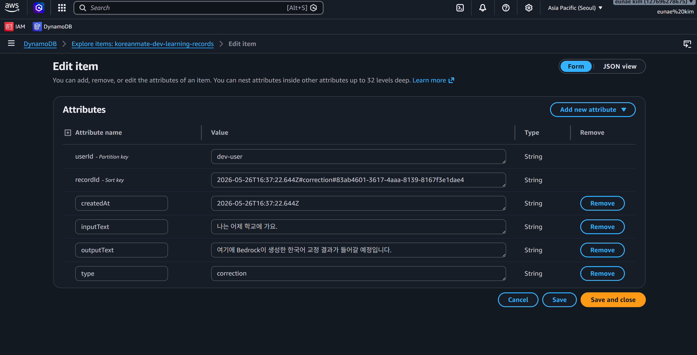

# Troubleshooting: Lambda Handler 로컬 실행 후 DynamoDB 저장 검증

## 1. 개요

KoreanMate 백엔드에서 `correction` Lambda handler를 로컬에서 직접 실행하여 DynamoDB에 데이터가 실제로 저장되는지 검증했다.

이번 트러블슈팅의 핵심은 다음과 같다.

```text
Terraform으로 생성한 DynamoDB 테이블
→ 로컬 .env 연결
→ Lambda handler 로컬 invoke
→ usage-limits 저장 확인
→ learning-records 저장 확인
```

최종적으로 `correction` 요청이 정상 처리되었고, DynamoDB의 두 테이블에 각각 사용량 데이터와 학습 기록 데이터가 저장되는 것을 확인했다.

---

## 2. 작업 환경

| 항목 | 내용 |
|---|---|
| Project | KoreanMate |
| Backend Runtime | Node.js / TypeScript |
| Handler Type | AWS Lambda handler |
| Local Executor | tsx |
| Database | Amazon DynamoDB |
| Region | ap-northeast-2 |
| 테스트 대상 API | correction |
| 작업 위치 | `apps/backend` |

---

## 3. 관련 DynamoDB 테이블

Terraform으로 생성한 DynamoDB 테이블은 다음 2개다.

| Table name | 목적 | Partition key | Sort key |
|---|---|---|---|
| `koreanmate-dev-usage-limits` | AI 사용량 제한 관리 | `userId` | `usageDate` |
| `koreanmate-dev-learning-records` | 학습 기록 저장 | `userId` | `recordId` |

---

## 4. 로컬 환경변수 연결

백엔드 로컬 실행을 위해 `apps/backend/.env`에 DynamoDB 테이블명을 연결했다.

```env
AWS_REGION=ap-northeast-2
LEARNING_RECORDS_TABLE_NAME=koreanmate-dev-learning-records
USAGE_LIMITS_TABLE_NAME=koreanmate-dev-usage-limits
BEDROCK_MODEL_ID=anthropic.claude-3-haiku-20240307-v1:0
LOG_LEVEL=info
NODE_ENV=development
```

`apps/backend/src/config/env.ts`에서는 `zod`를 사용해 필수 환경변수를 검증했다.

```ts
import "dotenv/config";
import { z } from "zod";

const envSchema = z.object({
  AWS_REGION: z.string().default("ap-northeast-2"),
  LEARNING_RECORDS_TABLE_NAME: z.string().min(1),
  USAGE_LIMITS_TABLE_NAME: z.string().min(1),
  BEDROCK_MODEL_ID: z.string().min(1),
  LOG_LEVEL: z.enum(["debug", "info", "warn", "error"]).default("info"),
  NODE_ENV: z.string().default("development"),
});

export type AppEnv = z.infer<typeof envSchema>;

export const getEnv = (): AppEnv => {
  return envSchema.parse(process.env);
};
```

주의할 점은 Node.js가 `.env` 파일을 자동으로 읽지 않는다는 것이다.  

로컬 실행에서는 `dotenv`를 사용해 `.env`를 명시적으로 로드해야 한다.

---

## 5. 로컬 invoke 스크립트 작성

현재 백엔드는 Express 서버가 아니라 Lambda handler 구조다.         

따라서 `localhost` 서버를 띄우는 방식이 아니라, handler를 직접 실행하는 invoke 스크립트를 작성했다.

파일 위치:

```text
apps/backend/scripts/invoke-correction.ts
```

예시 코드:

```ts
import type { APIGatewayProxyStructuredResultV2 } from "aws-lambda";
import { handler } from "../src/handlers/correction.js";

const event = {
  body: JSON.stringify({
    text: "나는 어제 학교에 가요.",
  }),
};

const result = (await handler(
  event as any,
  {} as any,
  {} as any,
)) as APIGatewayProxyStructuredResultV2;

console.log("Status Code:", result.statusCode);
console.log("Body:", result.body);
```

`package.json`에는 다음 script를 추가했다.

```json
{
  "scripts": {
    "invoke:correction": "tsx scripts/invoke-correction.ts"
  }
}
```

---

## 6. 최초 실행 결과: 500 오류 발생

아래의 화면은 처음 로컬 invoke 실행 시 다음과 같이 `500 Internal Server Error`가 발생했다는 걸 보여준다.


이 상태에서는 handler가 내부 예외를 숨기고 있었기 때문에 실제 원인을 알 수 없었다.

---

## 7. 원인 추적을 위한 로그 추가

`apps/backend/src/handlers/correction.ts`의 catch 블록에 실제 에러를 출력하는 로그를 추가했다.

```ts
console.error("Correction handler error:", error);
```

수정 후 catch 블록:

```ts
  } catch (error) {
    if (error instanceof InvalidJsonBodyError) {
      return badRequest(error.message);
    }

    if (error instanceof ZodError) {
      return badRequest(formatZodError(error));
    }

    console.error("Correction handler error:", error);

    return internalServerError();
  }
```

이 로그를 통해 handler 내부에서 발생한 DynamoDB 관련 오류를 확인할 수 있도록 했다.

---

## 8. 원인 분석: DynamoDB UpdateExpression 충돌 가능성

사용량 증가 로직은 `usageLimitRepository.ts`의 `incrementUsage()`에서 처리하고 있었다.

기존 구조에서는 다음과 같이 전체 카운트와 대상 카운트를 동시에 갱신하려고 했다.

```ts
const countField =
  input.type === "correction" ? "correctionCount" : "conversationCount";
```

그리고 `UpdateExpression`에서 다음과 같이 사용했다.

```text
#correctionCount = if_not_exists(#correctionCount, :zero),
#conversationCount = if_not_exists(#conversationCount, :zero),
#totalCount = if_not_exists(#totalCount, :zero) + :one,
#targetCount = if_not_exists(#targetCount, :zero) + :one
```

`input.type`이 `correction`이면 `#targetCount`는 `correctionCount`가 된다.

결과적으로 같은 DynamoDB attribute를 하나의 `UpdateExpression` 안에서 두 번 수정하는 구조가 된다.

```text
correctionCount 초기화
correctionCount + 1
```

이 방식은 DynamoDB UpdateExpression에서 충돌을 만들 수 있다.

---

## 9. 해결 방법: 타입별 UpdateExpression 분리

`incrementUsage()`에서 `correction`과 `conversation`의 UpdateExpression을 분리했다.

수정 방향:

```text
correction 요청
→ correctionCount + 1
→ conversationCount는 없으면 0으로 초기화
→ totalCount + 1

conversation 요청
→ conversationCount + 1
→ correctionCount는 없으면 0으로 초기화
→ totalCount + 1
```

핵심은 동일한 attribute를 하나의 UpdateExpression에서 중복 수정하지 않도록 분리하는 것이다.

---

## 10. 로컬 invoke 성공

수정 후 다시 correction handler를 실행했다.

아래 화면은 성공한 결과이다.


이 결과로 Lambda handler가 정상적으로 실행되었고, mock Bedrock 응답까지 반환된 것을 확인했다.

---

## 11. DynamoDB 저장 확인: usage-limits

AWS Console에서 다음 경로로 이동했다.

```text
AWS Console
→ DynamoDB
→ Explore items
→ koreanmate-dev-usage-limits
→ Scan
→ Run
```

확인된 item:

```text
userId = dev-user
usageDate = 2026-05-26
conversationCount = 0
correctionCount = 1
totalCount = 1
ttl = 1782405442
```

의미:

| Attribute | 의미 |
|---|---|
| `userId` | 로컬 테스트용 임시 사용자 |
| `usageDate` | 일별 사용량 집계 날짜 |
| `conversationCount` | conversation API 사용 횟수 |
| `correctionCount` | correction API 사용 횟수 |
| `totalCount` | 전체 AI 사용 횟수 |
| `ttl` | DynamoDB TTL 기준 timestamp |

이 결과로 `incrementUsage()`가 정상적으로 DynamoDB에 사용량 데이터를 저장했음을 확인했다.

아래 화면은 `koreanmate-dev-usage-limits` 테이블에 correction API 사용량이 저장된 것을 확인한 장면이다.



---

## 12. DynamoDB 저장 확인: learning-records

AWS Console에서 다음 경로로 이동했다.

```text
AWS Console
→ DynamoDB
→ Explore items
→ koreanmate-dev-learning-records
→ Scan
→ Run
```

확인된 item:

```text
userId = dev-user
recordId = 2026-05-26T16:37:22.644Z#correction#...
createdAt = 2026-05-26T16:37:22.644Z
inputText = 나는 어제 학교에 가요.
outputText = 여기에 Bedrock이 생성한 한국어 교정 결과가 들어갈 예정입니다.
type = correction
```

의미:

| Attribute | 의미 |
|---|---|
| `userId` | 학습 기록 소유자 |
| `recordId` | 정렬 가능한 고유 기록 ID |
| `createdAt` | 학습 기록 생성 시간 |
| `inputText` | 사용자가 입력한 한국어 문장 |
| `outputText` | AI 교정 결과 |
| `type` | 학습 기록 유형 |

이 결과로 `saveLearningRecord()`가 정상적으로 correction 요청과 응답을 DynamoDB에 저장했음을 확인했다.

아래 화면은 `koreanmate-dev-learning-records` 테이블에 correction 학습 기록이 저장된 것을 확인한 장면이다.



---

## 13. 최종 결과

최종적으로 다음 흐름이 정상 동작하는 것을 확인했다.

```text
로컬 invoke
→ correction handler
→ request validation
→ usage limit check
→ mock Bedrock response
→ usage count increment
→ learning record save
→ DynamoDB item 저장 확인
```

완료 상태:

| 단계 | 상태 |
|---|---|
| DynamoDB Terraform 생성 | 완료 |
| 로컬 `.env` 테이블명 연결 | 완료 |
| correction handler 로컬 실행 | 완료 |
| usage-limits item 저장 확인 | 완료 |
| learning-records item 저장 확인 | 완료 |

---

## 14. 배운 점

이번 트러블슈팅을 통해 다음을 확인했다.

1. Lambda handler 구조에서는 로컬 HTTP 서버가 없어도 handler를 직접 invoke하여 테스트할 수 있다.
2. API Gateway 이벤트 형태에 맞게 `body`를 JSON 문자열로 전달해야 한다.
3. DynamoDB 테이블의 PK/SK 구조와 저장 item 구조가 일치해야 한다.
4. DynamoDB `UpdateExpression`에서 동일한 attribute를 중복 업데이트하면 문제가 발생할 수 있다.
5. 사용량 제한 데이터와 학습 기록 데이터를 분리 저장하면 운영 관점에서 추적이 쉽다.

---

## 15. 포트폴리오용 요약

Terraform으로 생성한 DynamoDB 테이블을 백엔드 로컬 환경변수에 연결한 뒤, Lambda handler를 로컬에서 직접 실행하여 correction API의 저장 흐름을 검증했다. 초기 실행에서는 내부 서버 오류가 발생했으며, DynamoDB `UpdateExpression`에서 동일 attribute를 중복 수정할 수 있는 구조를 타입별 업데이트 방식으로 분리하여 해결했다. 이후 `usage-limits`와 `learning-records` 테이블에 각각 사용량 데이터와 학습 기록 데이터가 정상 저장되는 것을 AWS 콘솔에서 확인했다.
