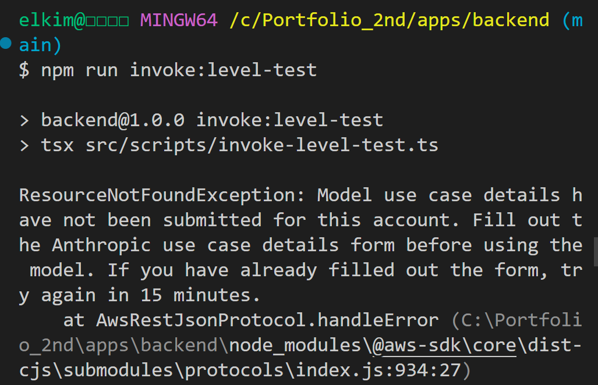

# Troubleshooting: Amazon Bedrock Anthropic 모델 Use Case 미제출로 AI 호출 실패

## 1. 개요

KoreanMate 프로젝트에서 Amazon Bedrock을 사용해 한국어 학습 기능의 실제 AI 응답을 생성하는 과정에서 일부 API 호출이 실패했다.

이번 트러블슈팅의 핵심은 백엔드 코드, JSON 파싱, API 응답 구조 문제가 아니라 **Anthropic Claude 모델을 처음 사용하기 위해 필요한 use case details가 AWS 계정에 제출되지 않았던 것**이었다.

---

## 2. 작업 환경

| 항목 | 내용 |
|---|---|
| Project | KoreanMate |
| Backend | Node.js / TypeScript |
| Runtime target | Node.js 20 |
| Local Shell | Git Bash on Windows |
| Cloud Provider | AWS |
| Region | `ap-northeast-2` |
| AI Service | Amazon Bedrock |
| Model | Anthropic Claude 3 Haiku |
| Model ID | `anthropic.claude-3-haiku-20240307-v1:0` |
| 주요 기능 | Correction / Conversation / Level Test |

---

## 3. 연동하려던 기능

Bedrock을 통해 실제 AI 응답을 생성하려던 기능은 다음 3개였다.

| 기능 | 설명 |
|---|---|
| Correction | 사용자가 입력한 한국어 문장을 교정 |
| Conversation | 주제에 맞는 한국어 회화 예시 생성 |
| Level Test | 사용자의 한국어 입력을 기반으로 레벨 평가 |

세 기능은 모두 공통 Bedrock 클라이언트인 `generateText()`를 통해 Bedrock Runtime API를 호출하도록 구성했다.

```text
correctionService.ts
conversationService.ts
levelTestService.ts
        ↓
bedrockClient.ts
        ↓
Amazon Bedrock Claude 3 Haiku
```

---

## 4. 최초 발생한 오류

`conversation` 기능을 로컬 invoke로 테스트했을 때 API 응답은 단순히 500으로만 표시되었다.

```bash
npm run invoke:conversation
```

아래 화면은 `conversation` 기능에서 500 에러가 발생한 장면이다.


응답 결과:

```text
Status Code: 500
Body: {"message":"Failed to generate conversation"}
```

처음에는 다음 중 하나가 원인일 수 있다고 판단했다.

1. `conversationService.ts`의 JSON 파싱 실패
2. Bedrock 응답 형식 불일치
3. prompt가 JSON schema를 제대로 따르지 않음
4. Bedrock 모델 호출 권한 문제
5. 모델 접근 설정 문제

---

## 5. 문제 판단

처음 API 응답만 봤을 때는 내부 원인을 알 수 없었다.

따라서 `conversation` handler의 catch 블록에 에러 로그를 추가했다.

```ts
console.error("Conversation handler error:", error);
```

로그를 추가한 뒤 실제 원인을 확인했다.

```text
ResourceNotFoundException:
Model use case details have not been submitted for this account.
Fill out the Anthropic use case details form before using the model.
If you have already filled out the form, try again in 15 minutes.

httpStatusCode: 404
```

핵심 문구는 다음이었다.

```text
Model use case details have not been submitted for this account.
```

이 결과를 통해 문제는 애플리케이션 로직이 아니라 **AWS Bedrock에서 Anthropic 모델을 사용하기 위한 계정 단위 사전 제출 조건**이라는 것을 확인했다.

---

## 6. 원인 분석

Amazon Bedrock의 일부 모델은 첫 사용 시 자동으로 활성화되지만, Anthropic 모델은 처음 사용하는 계정에서 use case details 제출이 필요할 수 있다.

이번 경우에는 `bedrock:InvokeModel` 호출 자체는 코드상 정상적으로 구성되어 있었지만, 계정에서 Anthropic 모델 사용 사례 제출이 완료되지 않아 Bedrock Runtime 호출이 실패했다.

특히 에러의 HTTP status code가 404였기 때문에 처음에는 모델 ID나 리전 문제처럼 보일 수 있었다.

하지만 실제 메시지는 다음을 명확히 가리켰다.

```text
Fill out the Anthropic use case details form before using the model.
```

즉, 최종 원인은 다음과 같다.

```text
Anthropic Claude 모델 사용을 위한 use case details가 AWS 계정에 제출되지 않았음
```

---

## 7. 해결 과정

### 7.1 Bedrock Playground에서 모델 접근 상태 확인

Bedrock 콘솔에서 Claude 3 Haiku 모델을 확인했다.

아래 화면은 Amazon Bedrock Playground에서 Claude 3 Haiku 모델이 선택된 상태이다.


기존의 `Model access` 페이지는 retired 상태였기 때문에, 모델 접근 확인과 use case 제출은 Model catalog 또는 Playground 흐름에서 진행해야 했다.

---

### 7.2 Anthropic use case details 제출

Bedrock 콘솔에서 Anthropic use case details 제출 폼을 열었다.

아래 화면은 Anthropic 모델 사용을 위한 use case details 제출 화면이다.


입력한 내용은 다음과 같다.

| 항목 | 입력값 |
|---|---|
| Company name | `KoreanMate` |
| Company website URL | GitHub profile URL |
| Industry | `Other` / `portfolio` |
| Intended users | External users |
| Use case | Korean language learning web application |

Use case description:

```text
I am building a Korean language learning web application for educational and portfolio purposes. 
The application uses Amazon Bedrock to generate Korean writing corrections, Korean conversation practice examples, 
and Korean level test feedback for language learners.
```

---

### 7.3 반영 대기 후 재시도

에러 메시지에 아래 안내가 있었기 때문에 제출 직후 바로 재시도하지 않고 잠시 기다렸다.

```text
If you have already filled out the form, try again in 15 minutes.
```

이후 로컬 invoke 테스트를 다시 실행했다.

```bash
npm run invoke:conversation
```

---

## 8. 해결 결과

### 8.1 Conversation 기능 성공

아래 화면은 `conversation` 기능이 정상적으로 Bedrock 응답을 반환한 장면이다.


결과:

```text
Status Code: 200
```

응답에는 실제 AI가 생성한 회화 결과가 포함되었다.

```json
{
  "type": "conversation",
  "inputText": "ordering food at a restaurant",
  "result": {
    "situation": "Ordering food at a restaurant",
    "lines": [
      {
        "role": "teacher",
        "korean": "안녕하세요. 무엇을 드시겠습니까?",
        "englishMeaning": "Hello. What would you like to order?"
      }
    ]
  }
}
```

---

### 8.2 Level Test 기능 재확인

`level-test` 기능에서도 동일한 use case 미제출 문제가 발생했었다.

아래 화면은 `level-test` 호출 중 Anthropic use case details 미제출로 실패한 장면이다.



일부 테스트에서는 handler 응답으로 500이 반환되었다.


use case details 제출 후 다시 실행했다.

```bash
npm run invoke:level-test
```

아래 화면은 `level-test` 기능이 정상적으로 200 응답을 반환한 장면이다.


결과:

```text
statusCode: 200
```

최종적으로 `correction`, `conversation`, `level-test` 기능 모두 Bedrock 실제 AI 응답 호출에 성공했다.

---

## 9. 최종 결과

최종 상태는 다음과 같다.

| 기능 | 결과 |
|---|---|
| Correction | 성공 |
| Conversation | 성공 |
| Level Test | 성공 |
| Bedrock Runtime 호출 | 성공 |

---

## 10. 재발 방지 체크리스트

Bedrock 모델 연동 전에는 다음 순서로 확인한다.

```bash
aws sts get-caller-identity
```

확인할 항목:

| 항목 | 확인 내용 |
|---|---|
| AWS 인증 | 현재 CLI가 올바른 계정을 바라보는지 |
| Region | `AWS_REGION`과 Bedrock 콘솔 리전이 일치하는지 |
| Model ID | `BEDROCK_MODEL_ID`가 해당 리전에서 사용 가능한지 |
| IAM 권한 | `bedrock:InvokeModel` 권한이 있는지 |
| Anthropic use case | use case details 제출이 필요한지 |
| 반영 시간 | 제출 직후 5~15분 후 재시도했는지 |
| Handler log | 500만 반환하지 않고 실제 에러 로그를 남기는지 |

---

## 11. 배운 점

이번 문제는 백엔드 코드 오류가 아니라 AWS 서비스 사용 조건 문제였다.

Bedrock Runtime 호출 에러가 발생했을 때는 단순히 HTTP status code만 보면 안 되고, AWS SDK가 반환하는 실제 에러 메시지를 확인해야 한다.

특히 Anthropic 모델은 최초 사용 시 use case details 제출이 필요할 수 있으므로, Bedrock 연동 초기 단계에서 모델 호출 권한과 모델 사용 조건을 함께 확인해야 한다.

또한 API handler에서 단순히 500 응답만 반환하면 원인 파악이 어렵기 때문에, 개발 환경에서는 `console.error()`를 통해 실제 에러 객체를 확인하는 방식이 필요하다.

---

## 12. 포트폴리오용 요약

Amazon Bedrock을 KoreanMate 백엔드에 연동하는 과정에서 `conversation`과 `level-test` API가 500 에러를 반환했다.  
핸들러 로그를 보강하여 실제 원인이 애플리케이션 로직이나 JSON 파싱 문제가 아니라 Anthropic Claude 모델의 use case details 미제출임을 확인했다.  
Bedrock 콘솔에서 Anthropic use case details를 제출하고 반영 후 재시도하여 `correction`, `conversation`, `level-test` 기능 모두 실제 Claude 3 Haiku 응답을 정상적으로 반환하도록 검증했다.
