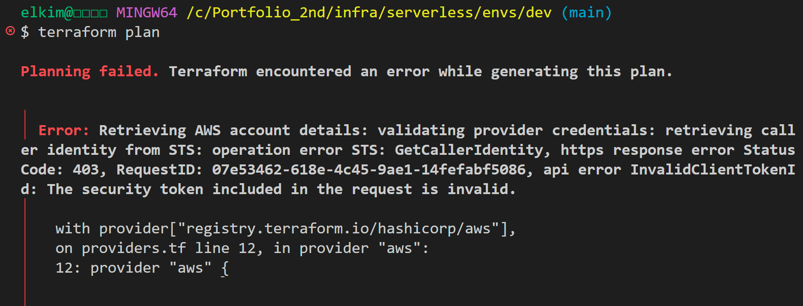
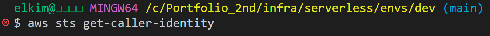
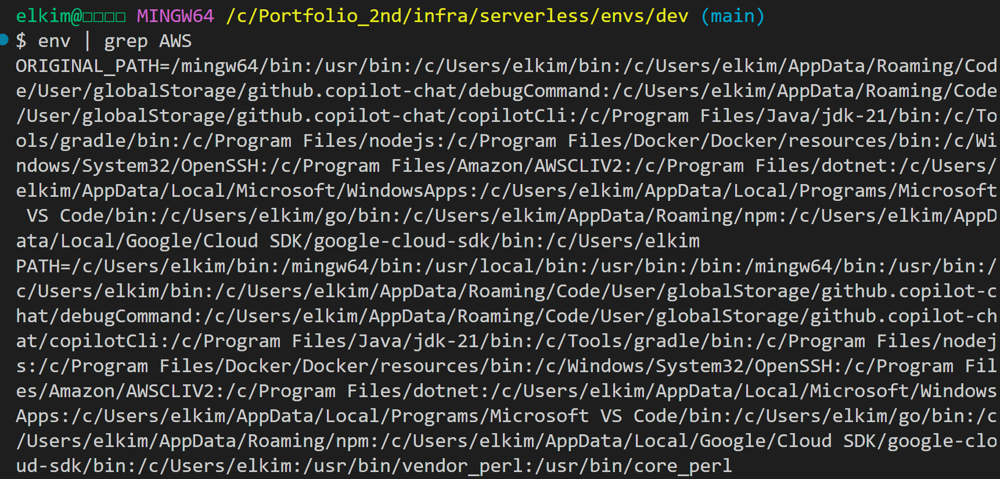
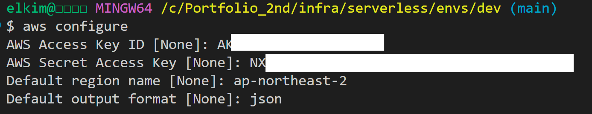
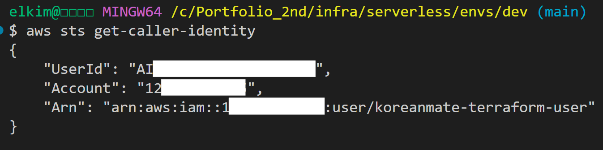
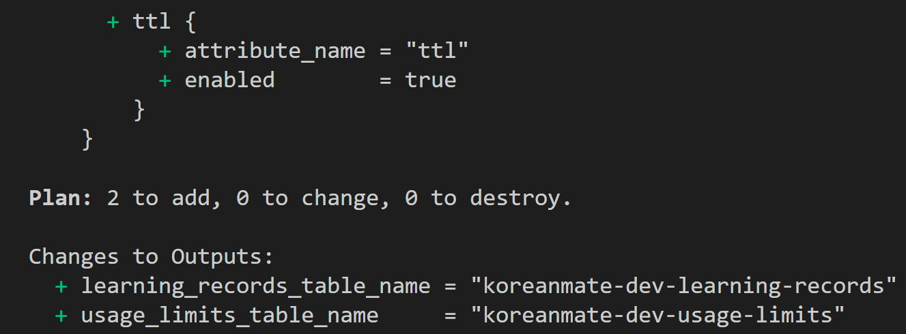
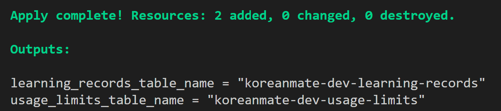
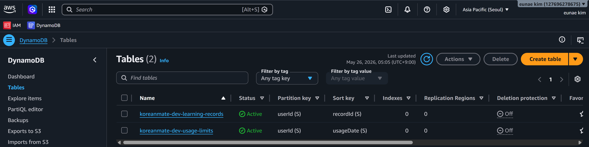

# Troubleshooting: Terraform AWS Credentials 오류로 DynamoDB 생성 실패

## 1. 개요

KoreanMate 프로젝트에서 Terraform을 사용해 AWS DynamoDB 테이블을 생성하는 과정에서 AWS 인증 오류가 발생했다.

이번 트러블슈팅의 핵심은 Terraform 코드 자체의 문제가 아니라, 로컬 AWS CLI가 참조하던 AWS Credential이 유효하지 않아 Terraform AWS Provider가 AWS 계정 정보를 확인하지 못한 것이었다.

---

## 2. 작업 환경

| 항목 | 내용 |
|---|---|
| Project | KoreanMate |
| Infra tool | Terraform |
| Cloud Provider | AWS |
| Region | ap-northeast-2 |
| Local Shell | Git Bash on Windows |
| 작업 위치 | `infra/serverless/envs/dev` |
| 대상 리소스 | DynamoDB 2개 테이블 |

---

## 3. 생성하려던 AWS 리소스

Terraform으로 생성하려던 DynamoDB 테이블은 다음 2개였다.

| Table name | Partition key | Sort key | Billing mode | TTL |
|---|---|---|---|---|
| `koreanmate-dev-learning-records` | `userId` | `recordId` | On-demand | 없음 |
| `koreanmate-dev-usage-limits` | `userId` | `usageDate` | On-demand | `ttl` |

---

## 4. 최초 발생한 오류

아래 화면은 `terraform plan` 실행 중 AWS STS 인증 오류로 인해 Terraform plan이 실패한 장면이다.



이어 AWS STS 인증 오류가 발생했다.

```text
Error: Retrieving AWS account details: validating provider credentials:
retrieving caller identity from STS:
operation error STS: GetCallerIdentity,
https response error StatusCode: 403,
api error InvalidClientTokenId:
The security token included in the request is invalid.
```

---

## 5. 문제 판단

처음에는 Terraform provider 설정 문제처럼 보였지만, 실제 핵심은 아래 오류였다.

```text
InvalidClientTokenId:
The security token included in the request is invalid.
```

Terraform AWS Provider는 리소스를 생성하기 전에 AWS STS `GetCallerIdentity`를 호출하여 현재 인증 정보가 유효한지 확인한다.

따라서 Terraform 문제인지 AWS 인증 문제인지 분리하기 위해 AWS CLI에서 직접 STS 호출을 실행했다.

아래 화면은 Terraform 외부에서 AWS CLI 인증 상태를 직접 확인한 결과이다.  
동일하게 `InvalidClientTokenId`가 발생했기 때문에 문제 원인이 Terraform 코드가 아니라 AWS Credential이라는 것을 확인할 수 있었다.



이 결과를 통해 Terraform 문제가 아니라 AWS CLI 인증 정보 자체가 잘못되었다고 판단했다.

---

## 6. 원인 분석

아래 화면은 환경변수에 AWS 인증 정보가 남아 있는지 확인한 결과이다.



결과적으로 `AWS_ACCESS_KEY_ID`, `AWS_SECRET_ACCESS_KEY`, `AWS_SESSION_TOKEN`, `AWS_PROFILE` 같은 인증 관련 환경변수는 없었다.

가능성이 높은 원인은 다음과 같았다.

1. 기존 Access Key가 잘못됨
2. 기존 Access Key가 삭제 또는 비활성화됨
3. 오래된 AWS Credential 파일이 남아 있음
4. 만료된 Session Token이 남아 있음
5. 잘못된 Profile을 사용 중임

이번 경우에는 기존 로컬 AWS Credential이 유효하지 않은 상태였고, AWS CLI가 그 값을 계속 참조하고 있었다.

---

## 7. 해결 과정

### 7.1 기존 AWS CLI 설정 백업

기존 로컬 AWS 설정 파일을 바로 삭제하지 않고 백업했다.

```bash
mkdir -p ~/.aws/backup
mv ~/.aws/credentials ~/.aws/backup/credentials.bak
mv ~/.aws/config ~/.aws/backup/config.bak
```

파일이 없는 경우에는 해당 메시지를 무시하고 진행했다.

---

### 7.2 AWS 콘솔에서 IAM User용 Access Key 재발급

AWS 콘솔에서 Terraform 실행용 IAM User를 생성하거나 기존 IAM User를 선택한 뒤 Access Key를 새로 발급했다.

진행 경로:

```text
AWS Console
→ IAM
→ Users
→ Terraform용 IAM User 선택
→ Security credentials
→ Access keys
→ Create access key
→ Command Line Interface (CLI)
```

발급받은 값:

```text
Access key ID
Secret access key
```

`Secret access key`는 생성 시점에만 확인할 수 있으므로 즉시 안전한 위치에 저장했다.

---

### 7.3 로컬 AWS CLI 재설정

아래의 장면은 새로 발급받은 Access Key를 로컬에 등록을 성공한 장면이다.



---

### 7.4 AWS 인증 정상 확인

Terraform을 다시 실행하기 전에 AWS CLI 인증이 정상인지 먼저 확인했다.

정상적으로 AWS 계정 정보가 출력되면 인증 문제가 해결된 것이다.

아래 화면은 AWS CLI Credential을 재설정한 뒤 STS 호출이 정상적으로 성공한 장면이다.  
이 단계가 성공해야 Terraform AWS Provider도 정상적으로 AWS 계정 정보를 조회할 수 있다.


---

## 8. Terraform 재실행

AWS CLI 인증이 정상화된 뒤 Terraform을 다시 실행했다.

아래 화면은 AWS Credential 문제 해결 후 Terraform plan이 정상적으로 생성된 장면이다.  
`Plan: 2 to add, 0 to change, 0 to destroy`로 표시되어 DynamoDB 테이블 2개만 생성될 예정임을 확인했다.



아래 화면은 Terraform apply를 통해 DynamoDB 테이블 2개가 실제로 생성된 장면이다.  
`Resources: 2 added, 0 changed, 0 destroyed`로 표시되어 의도한 리소스만 생성되었음을 확인했다.



---

## 9. 최종 결과

아래 화면은 Terraform apply 이후 AWS DynamoDB 콘솔에서 테이블 2개가 `Active` 상태로 생성된 것을 확인한 장면이다.



최종 상태:

```text
DynamoDB Tables: 2개 생성 완료
Status: Active
Region: ap-northeast-2
ManagedBy: Terraform
```

---

## 10. 재발 방지 체크리스트

Terraform 실행 전 AWS 인증 상태를 먼저 확인한다.

```bash
aws sts get-caller-identity
```

정상 응답이 나오지 않으면 Terraform을 실행하지 않는다.

AWS Credential 문제 발생 시 다음 순서로 확인한다.

```bash
aws configure list
env | grep AWS
cat ~/.aws/credentials
cat ~/.aws/config
```

확인할 항목:

| 항목 | 확인 내용 |
|---|---|
| `AWS_ACCESS_KEY_ID` | 잘못된 환경변수 값이 남아 있는지 |
| `AWS_SECRET_ACCESS_KEY` | 잘못된 환경변수 값이 남아 있는지 |
| `AWS_SESSION_TOKEN` | 만료된 세션 토큰이 남아 있는지 |
| `AWS_PROFILE` | 잘못된 profile을 가리키는지 |
| `~/.aws/credentials` | 오래된 키가 저장되어 있는지 |
| `~/.aws/config` | region/profile 설정이 올바른지 |

---

## 11. 배운 점

이번 문제는 Terraform 코드 오류가 아니라 AWS 인증 오류였다.

Terraform AWS Provider는 AWS 리소스를 생성하기 전에 STS `GetCallerIdentity`를 호출해 현재 인증 정보를 검증한다. 따라서 `aws sts get-caller-identity`가 실패하면 Terraform도 정상적으로 동작할 수 없다.

앞으로 AWS 기반 Terraform 작업 전에는 다음 순서로 확인한다.

```bash
aws sts get-caller-identity
terraform plan
terraform apply
```

---

## 12. 포트폴리오용 요약

Terraform으로 DynamoDB 리소스를 생성하는 과정에서 로컬 AWS CLI의 오래된 Credential로 인해 STS `InvalidClientTokenId` 오류가 발생했다. `aws sts get-caller-identity`로 Terraform 외부에서 인증 문제를 분리했고, 로컬 AWS credentials/config를 초기화한 뒤 IAM User Access Key를 재발급하여 문제를 해결했다. 이후 Terraform plan/apply를 통해 DynamoDB 테이블 2개를 정상 생성했다.

